# Lab - Manage Microsoft Entra ID Identities

## Lab Overview

In this lab, you will explore identity management in Microsoft Entra ID by creating and configuring both standard and guest user accounts. You will assign essential attributes such as job title, department, and usage location to define user properties. You’ll also create and manage security groups to organize access and permissions. By completing this lab, you’ll understand how Entra ID forms the foundation of secure and efficient identity and access management in the cloud.

## Lab Objectives
In this lab, you will complete the following tasks:

+ Task 1: Create and configure user accounts.
+ Task 2: Create groups and add members.

### Task 1: Create and configure user accounts.

In this task, you will create new user accounts in Microsoft Entra ID and configure essential user details to meet organizational requirements.

1. In the Azure portal, search for **Microsoft Entra ID (1)** and select **Microsoft Entra ID (2)**.

    

1. Select the **Overview** blade and then the **Manage tenants** tab. 

    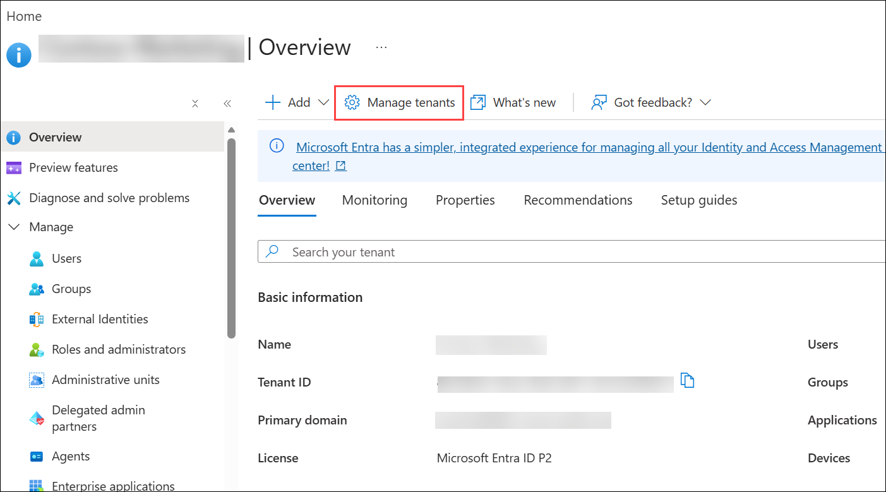

    >**Did you know?** A tenant is a specific instance of Microsoft Entra ID containing accounts and groups. Depending on your situation, you can create more tenants and **Switch** between them. 

1. Return to the **Entra ID** page by pressing back in the browser or selecting the option in the breadcrumb menu.

1. As you have time, explore other options such as **Licenses** and **Password reset**.

1. Expand **Manage (1)** and select **Users (2)**.

     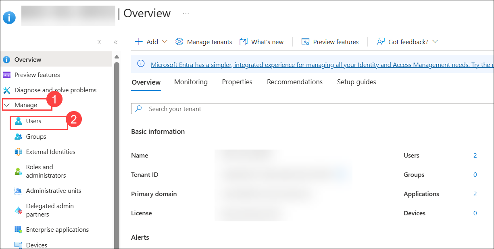

1. On **Users - All users** blade, and then click **+ New user (1)** then select **+ Create new user (2)**.

     

1. Create a new user on the **Basics (1)** tab with the following settings (leave others with their defaults) and select **Next: properties (6) >**.

    | Setting | Value |
    | --- | --- |
    | User principal name | **`az104-user1` (2)**  |
    | Display Name | **`az104-user1` (3)** |
    | Auto-generate password | unchecked **(4)** |
    | Password | **Provide a secure password (5)** |
    | Account enabled | **Checked (7)** |
    
      >**Note:** **Copy to clipboard** the full **User Principal Name** (user name plus domain) and record the password. You will need it later in this task.
    
      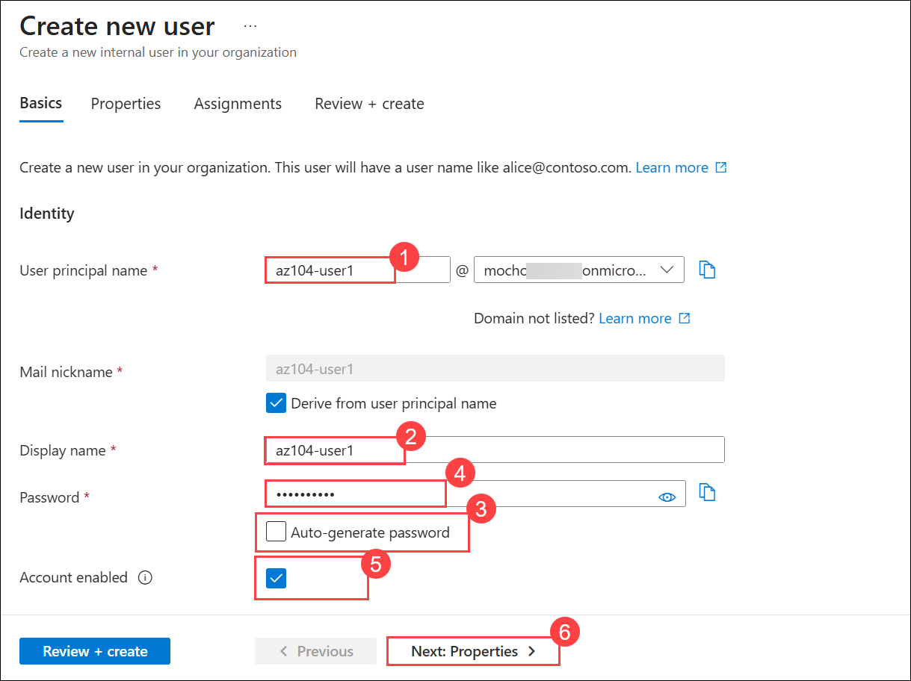
    
 1. On  the **Properties** tab specify the following settings (leave others with their defaults):  

    | Setting | Value |
    | --- | --- |
    | Job title  | **IT Lab Administrator (1)** |
    | Department | **IT (2)** |
    | Usage location | **United States (3)** |
    
      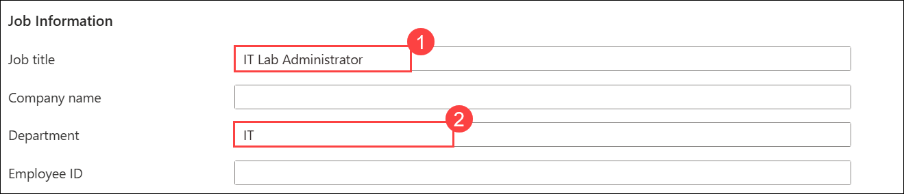
     
      
    
1. Click on **Review + create (4)** and then **Create**.

    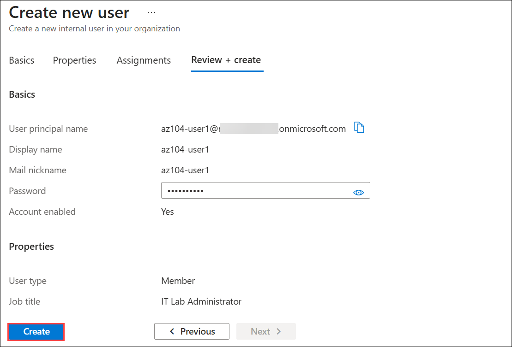

1. Refresh the page and confirm your new user was created. 

   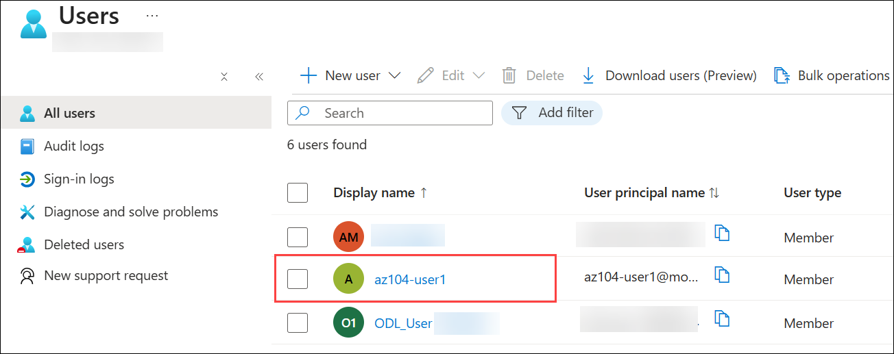

1. Navigate back to the **Users - All users** blade, and then click **+ New user (1)** then select **+ Invite external user (2)**.

     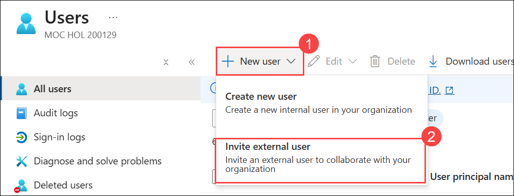

1. Create a new user on the **Basics** tab with the following settings (leave others with their defaults) and select **Next: properties (6) >**.

    | Setting | Value |
    | --- | --- |
    | Email | your email address **(1)** |
    | Display name | your name **(2)**|
    | Send invite message | **check the box (3)** |
    | Message | `Welcome to Azure and our group project` **(4)** |

    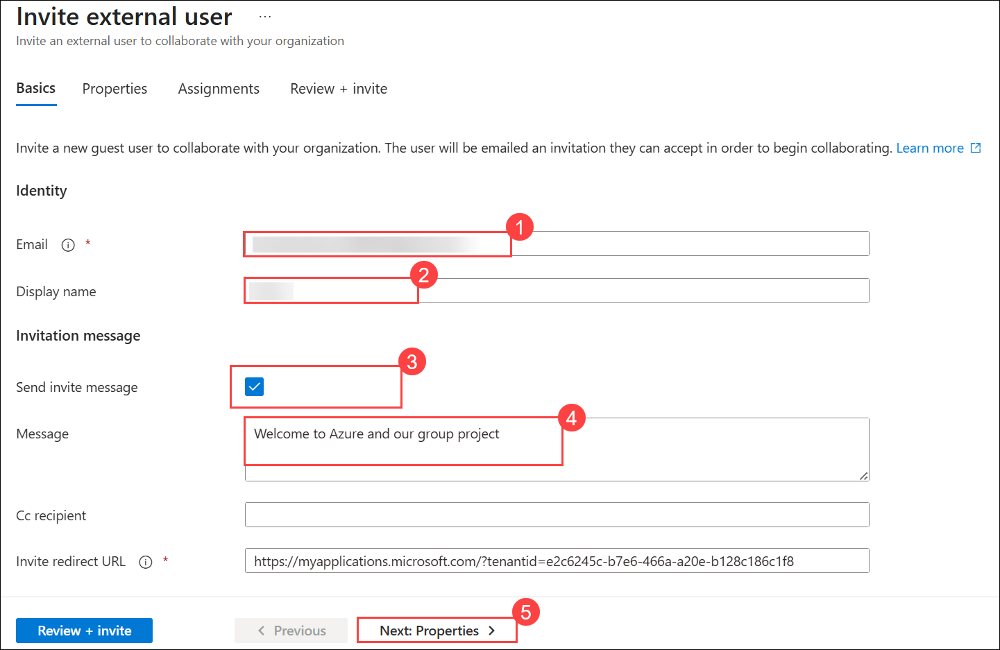

1. Move to the **Properties** tab. Complete the basic information, including these fields. 

    | Setting | Value |
    | --- | --- |
    | Job title  | `IT Lab Administrator` **(1)** |
    | Department  | `IT` **(2)** |
    | Usage location (Properties tab) | **United States (3)** |

     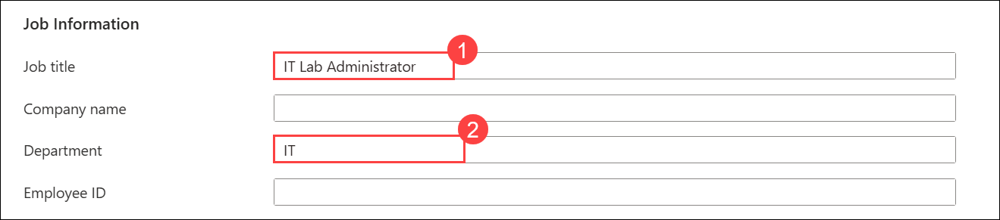

     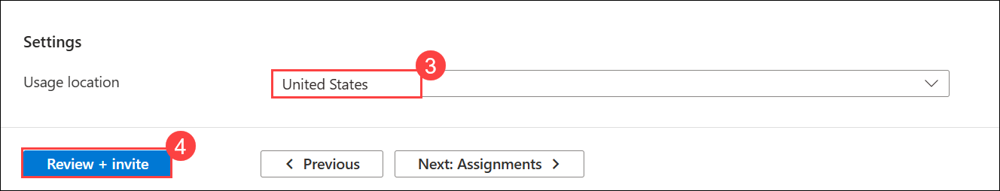

1. Select **Review + invite (4)**, and then **Invite**.

     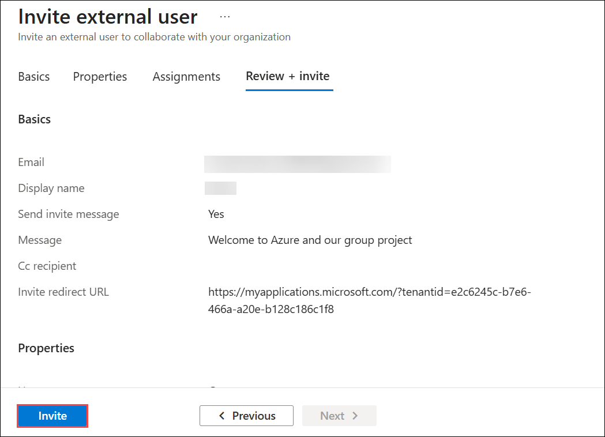

1. **Refresh** the page and confirm the invited user was created. You should receive the invitation email shortly. 

    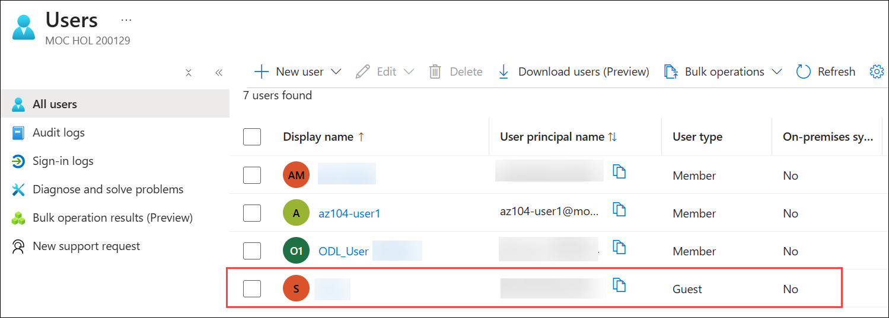

    >**Note:** It is unlikely you will be creating user accounts individually. Do you know how your organization plans to create and manage user accounts?

### Task 2: Create groups and add members

In this task, you will create a group account. Group accounts can include user accounts or devices. These are two basic ways members are assigned to groups: Statically and Dynamically. Static groups require administrators to add and remove members manually. Dynamic groups update automatically based on the properties of a user account or device. For example, job title.
        
1. In the Azure portal, navigate back to the **Entra ID tenant** blade and under **manage (1)** click **Groups (2)**.

               

1. Take a minute to familiarize yourself with the group settings in the left pane.

   + **Expiration** lets you configure a group lifetime in days. After that time the group must be renewed by the owner.
   + **Naming policy** lets you configure blocked words and add a prefix or suffix to group names.

1. In the **All groups** blade, select **+ New group** and create a new group.     

    | Setting | Value |
    | --- | --- |
    | Group type | **Security (1)** |
    | Group name | **IT Lab Administrators (2)** |
    | Group description | **Administrators that manage the IT lab (3)** |
    | Membership type | **Assigned (4)** |
   
     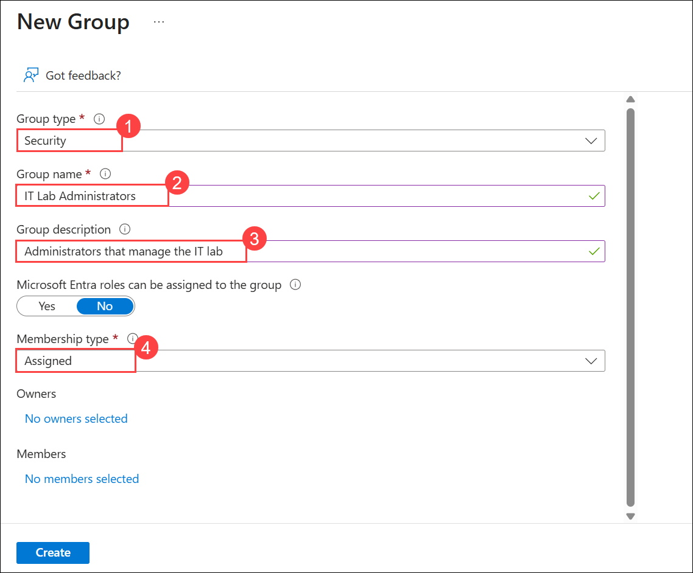

     >**Note**: An Entra ID Premium P1 or P2 license is required for dynamic membership. If other **Membership types** are available, the options will show up in the drop-down. 

    - Select **No owners selected (5)**.

    - In the **Add owners** page, search for **<inject key="AzureAdUserEmail"></inject>** and select **<inject key="AzureAdUserEmail"></inject> (7)** (shown in the top right corner) as the owner. Notice you can have more than one owner. 

      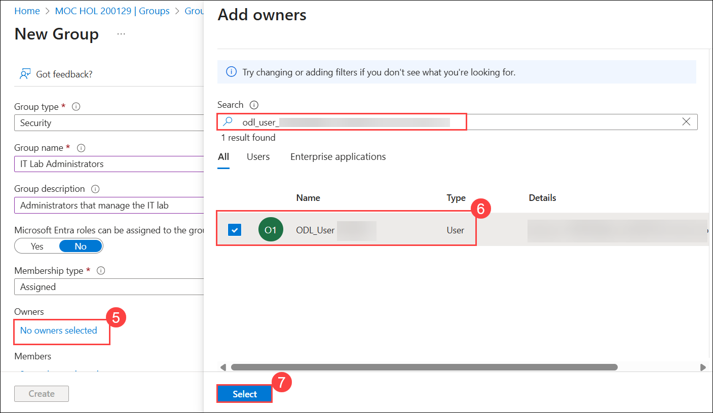

    - Select **No members selected (8)**.

    - In the **Add members** pane, search and **select** the **az104-user1 (9)** and the **guest user** **(10)** you invited, Add both of the users to the group, click on **Select (11)**,

      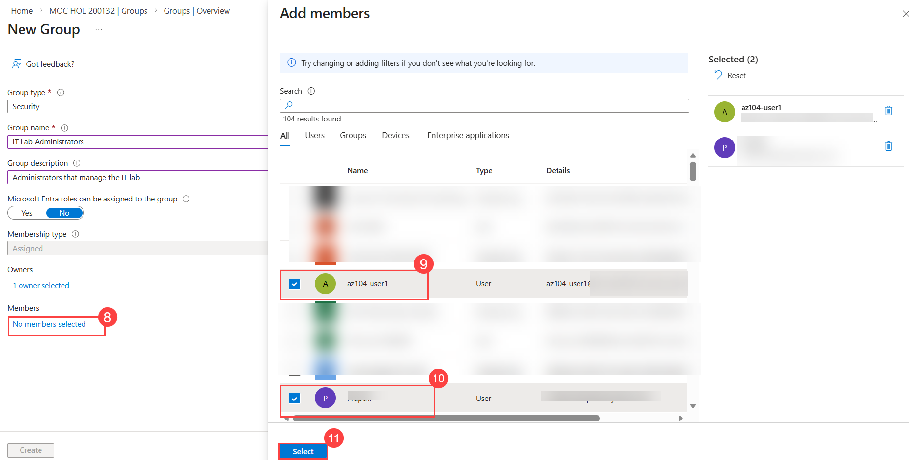
   
    - Select **Create** to deploy the group.

      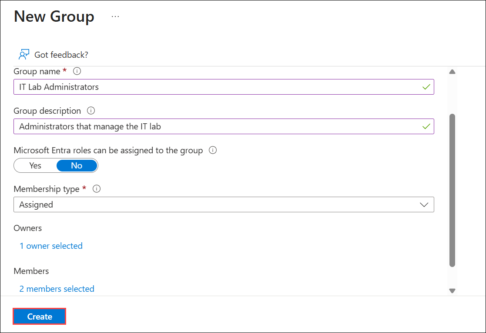

1. Select **All groups (1)** and then **Refresh** the page and ensure your group was created **(2)**.

     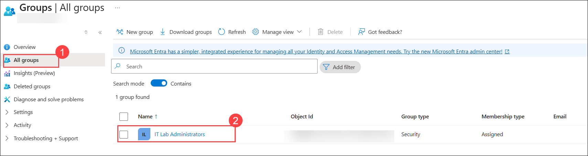

1. Select the new group and review the **Members** and **Owners** information.

     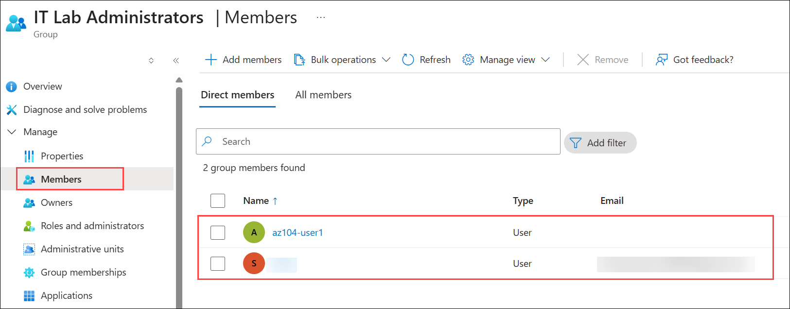

     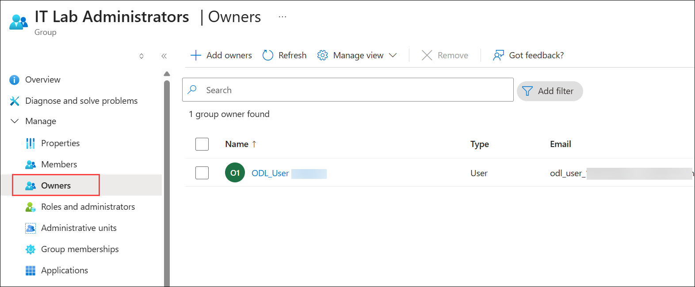

>**Note:** You may be managing a large number of groups. Does your organization have a plan for creating groups and adding members?

### Review

In this lab, you have completed the following tasks:

- Created and configured Microsoft Entra ID user accounts, including both standard and guest users, and set essential properties such as job title, department, and usage location.
- Created a security group, assigned ownership, and added members to organize access and manage identities efficiently within the Entra ID tenant.

## Extend your learning with Copilot

Copilot can assist you in learning how to use the Azure scripting tools. Copilot can also assist in areas not covered in the lab or where you need more information. Open an Edge browser and choose Copilot (top right) or navigate to *copilot.microsoft.com*. Take a few minutes to try these prompts.
+ What are the Azure PowerShell and CLI commands to create a security group called IT Admins? Provide the official command reference page.  
+ Provide a step-by-step strategy for managing users and groups in Microsoft Entra ID.
+ What are the steps in the Azure portal to bulk create users and groups?
+ Provide a comparison table of internal and external Microsoft Entra ID user accounts. 

## Learn more with self-paced training

+ [Understand Microsoft Entra ID](https://learn.microsoft.com/training/modules/understand-azure-active-directory/). Compare Microsoft Entra ID to Active Directory DS, learn about Microsoft Entra ID P1 and P2, and explore Microsoft Entra Domain Services for managing domain-joined devices and apps in the cloud.
+ [Create Azure users and groups in Microsoft Entra ID](https://learn.microsoft.com//training/modules/create-users-and-groups-in-azure-active-directory/). Create users in Microsoft Entra ID. Understand different types of groups. Create a group and add members. Manage business-to-business guest accounts.
+ [Allow users to reset their password with Microsoft Entra self-service password reset](https://learn.microsoft.com/training/modules/allow-users-reset-their-password/). Evaluate self-service password reset to allow users in your organization to reset their passwords or unlock their accounts. Set up, configure, and test self-service password reset.

## Key takeaways

Congratulations on completing the lab. Here are some main takeways for this lab:

+ A tenant represents your organization and helps you to manage a specific instance of Microsoft cloud services for your internal and external users.
+ Microsoft Entra ID has user and guest accounts. Each account has a level of access specific to the scope of work expected to be done.
+ Groups combine together related users or devices. There are two types of groups including Security and Microsoft 365.
+ Group membership can be statically or dynamically assigned.

### You have successfully completed the lab
