# Lab : Manage Subscriptions,RBAC and Governance

## Lab Overview

In this lab, you will explore Role-Based Access Control (RBAC) and Azure Management Groups to implement structured governance across multiple subscriptions. You’ll start by organizing subscriptions under a management group, then assign built-in and custom roles to control access with precision. By the end of the lab, you’ll also learn how to monitor and audit these role assignments using the Azure Activity Log, ensuring transparency and accountability in your environment.

## Lab objectives
In this lab, you will complete the following tasks:

+ Task 1: Implement management groups.
+ Task 2: Review and assign a built-in Azure role.
+ Task 3: Create a custom RBAC role.
+ Task 4: Monitor role assignments with the Activity Log.

### Task 1: Implement Management Groups

In this task, you will create and organize management groups to streamline Azure subscription governance. This setup enables efficient policy enforcement and access management across your organization.

1. On the Azure portal, in **Search resources, services and docs (G+/)** box at the top of the portal search for **Microsoft Entra ID (1)** and select **Microsoft Entra ID (2)**.

    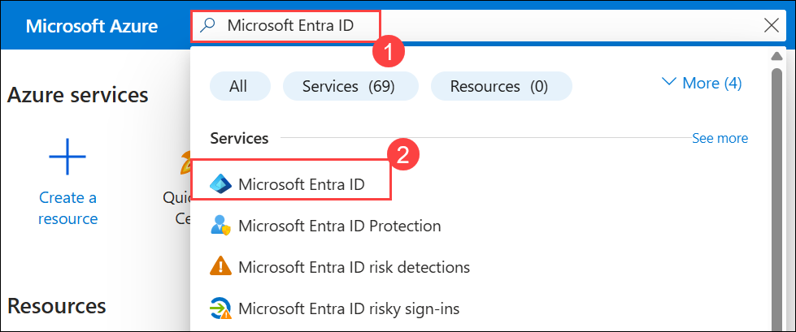 
    
1.  On the blade displaying properties of your tenant, in the vertical menu on the left side, in the **Manage** section, select **Properties**.
  
    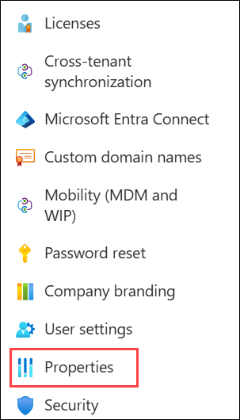
    
1.  On the **Properties** blade of your tenant, in the **Access management for Azure resources** section, select **Yes (1)** and then select **Save (2)**.

    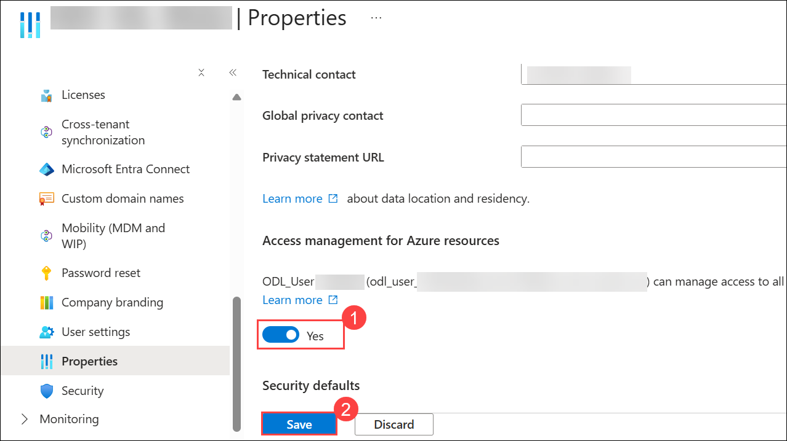 

1. On the Azure Portal page, in **Search resources, services and docs (G+/)** box at the top of the portal, enter **Management groups (1)**, and then select **Management groups (2)** under services.

    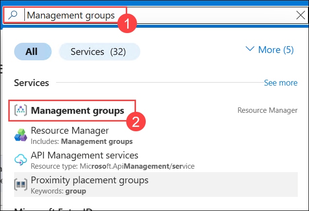 
    
     >**Note:** The Management Group page may take some-time to load. Please try to refresh the browser in the VM periodically until the Management group page loads.
  
1. On the **Management groups** blade, click **+ Create**.

     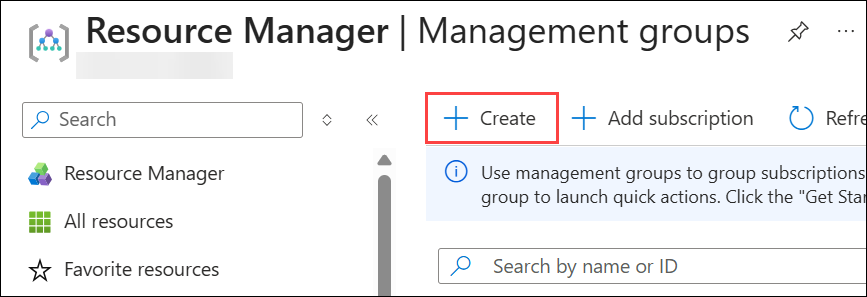 

1. On **Create a management** group blade specify the following settings and click **Submit (3)**.

      | Setting | Value |
      | --- | --- |
      | Management group ID | **`az104-mg1` (1)** |
      | Management group display name | **`az104-mg1` (2)** |

      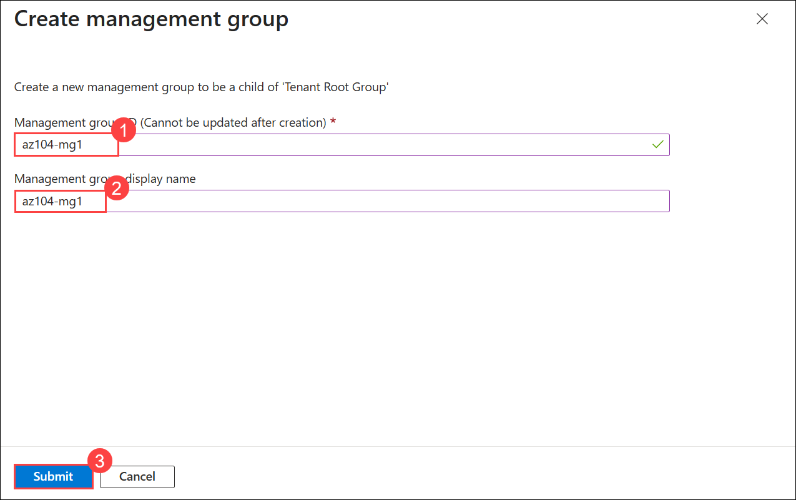

      > **Note:** If you get a message stating that the management group with this name already exists, you can cancel the creation of the management group and proceed further.
   
 1. **Refresh** the management group page to ensure your new management group displays. This may take a minute. 

    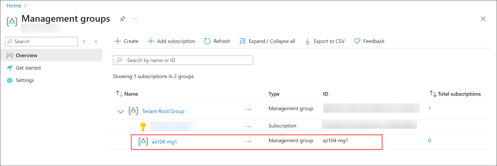

    >**Note:** Did you notice the root management group? The root management group is built into the hierarchy to have all management groups and subscriptions fold up to it. This root management group allows for global policies and Azure role assignments to be applied at the directory level. After creating a management group, you would add any subscriptions that should be included in the group. 

   
## Task 2: Review and assign a built-in Azure role

In this task, you will review the built-in roles and assign the VM Contributor role to a member of the Help Desk. Azure provides a large number of [built-in roles](https://learn.microsoft.com/azure/role-based-access-control/built-in-roles). 

1. In the Azure portal, navigate back to the Entra ID tenant blade and click **Groups**.

    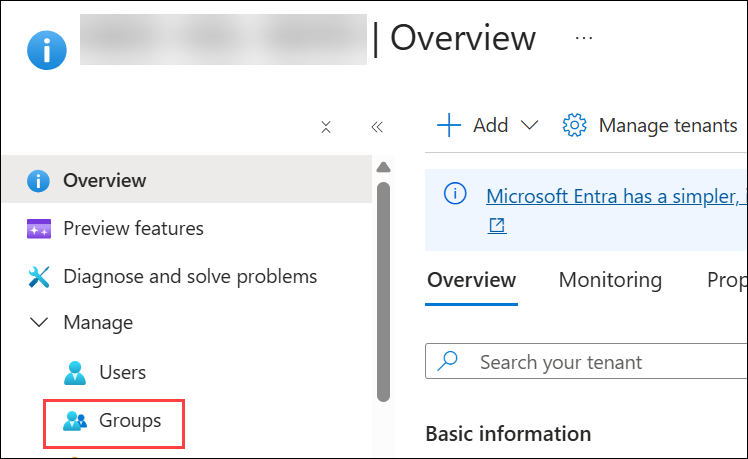

1. Use the **+ New group** button to create a new group with the following settings and click **Create (4)**.

    | Setting | Value |
    | --- | --- |
    | Group type | **Security (1)** |
    | Group name | **helpdesk  (2)** |
    | Group description | **helpdesk  (3)** |

     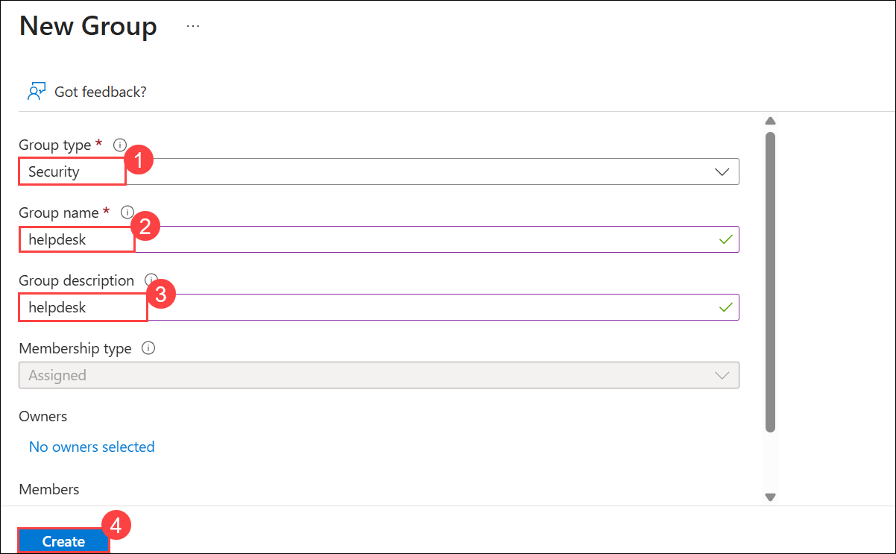

1. Navigate back to the management group and select the **az104-mg1** management group.

1. Select the **Access control (IAM)** blade **(1)**, and then the **Roles (2)** tab.

    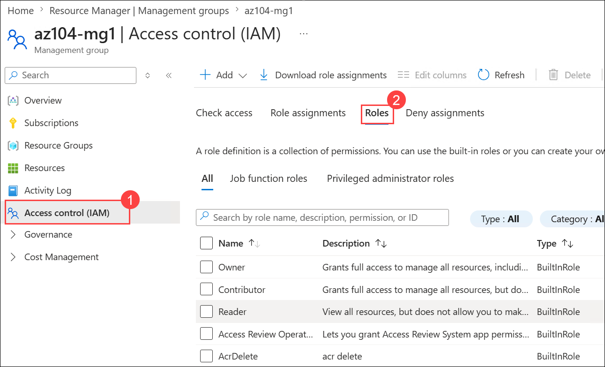

1. Scroll through the built-in role definitions that are available. **View** a role to get detailed information about the **Permissions**, **JSON**, and **Assignments**. You will often use *owner*, *contributor*, and *reader*. 

1. Select the **Access control (IAM)** blade **(1)**, and then the select **+ Add (2)**, from the drop-down menu, select **Add role assignment (3)**. 

    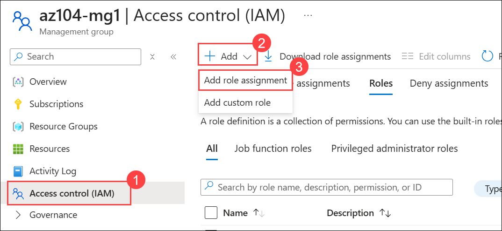 

1. On the **Add role assignment** blade, search for and select the **Virtual Machine Contributor (2)**. The Virtual machine contributor role lets you manage virtual machines, but not access their operating system or manage the virtual network and storage account they are connected to. Select **Next (3)**.

    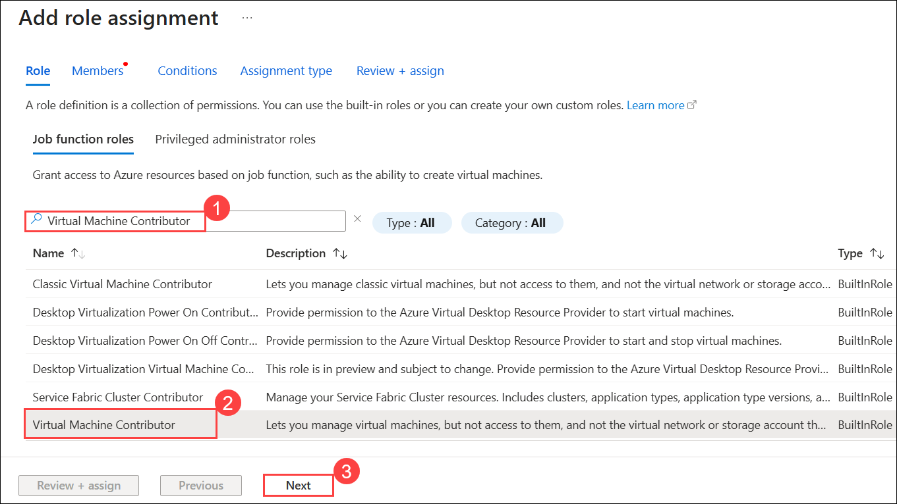 

    >**Did you know?** Azure originally provided only the **Classic** deployment model. This has been replaced by the **Azure Resource Manager** deployment model. As a best practice, do not use classic resources. 

1. On the **Members** tab, select **+ Select members (1)**.

1. Search for and select the **helpdesk (2)** group and click on **Select (3)**. 

     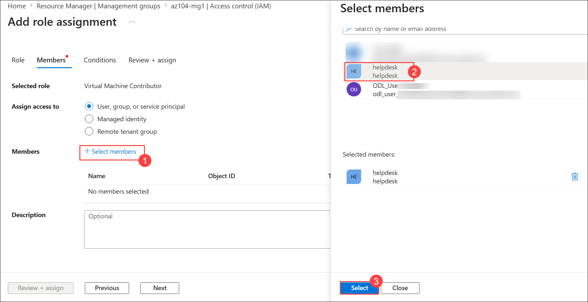 

1. Click **Review + assign** twice to create the role assignment.

     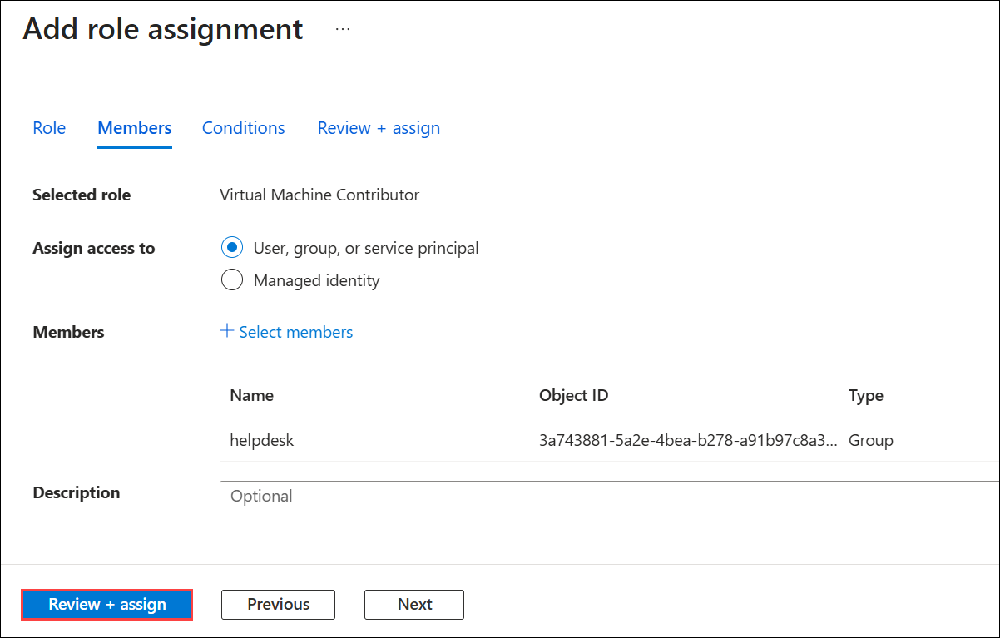 

1. Continue on the **Access control (IAM)** blade. On the **Role assignments (1)** tab, confirm the **helpdesk (2)** group has the **Virtual Machine Contributor** role. 

    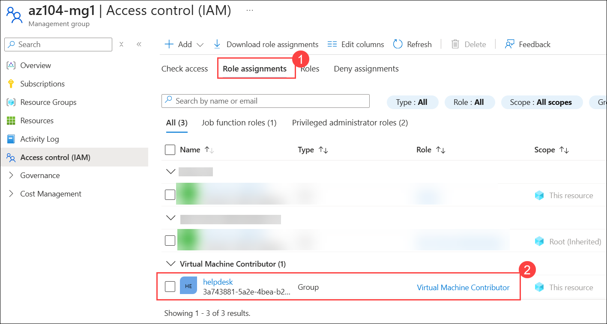 

    >**Note:** As a best practice always assign roles to groups not individuals. 

    >**Did you know?** This assignment might not actually grant you any additional privileges. If you already have the Owner role, that role includes all permissions associated with the VM Contributor role.
    
    
## Task 3: Create a custom RBAC role

In this task, you will create a custom RBAC role. Custom roles are a core part of implementing the principle of least privilege for an environment. Built-in roles might have too many permissions for your scenario. We will also create a new role and remove permissions that are not be necessary. Do you have a plan for managing overlapping permissions?

1. Continue working on your management group. Navigate to the **Access control (IAM)** blade.

1. Select **+ Add**, from the drop-down menu, select **Add custom role**.

   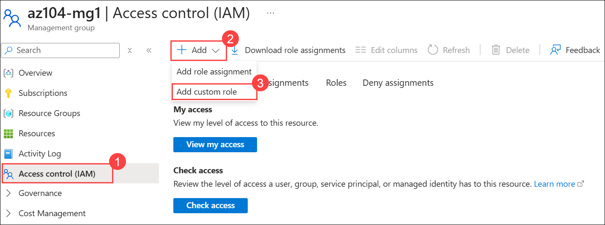 

1. On the Basics tab specify the following configuration and select **Next (5)**. 

    | Setting | Value |
    | --- | --- |
    | Custom role name | `Custom Support Request` **(1)** |
    | Description | `A custom contributor role for support requests.` **(2)** |
    | Baseline permissions | select **Clone a role (3)**|
    | Role to clone drop-down menu | select **Support Request Contributor (4)** |

     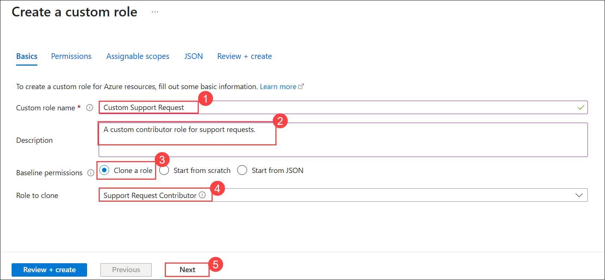

1. On **Permissions** tab, and then select **+ Exclude permissions**.

   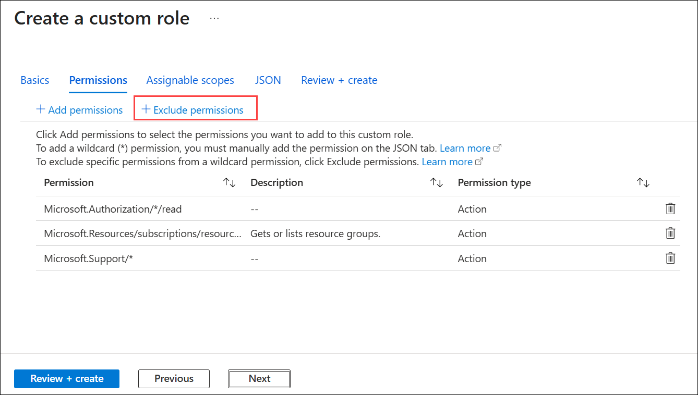
   
1. In the resource provider search field, enter `.Support` **(1)** and select **Microsoft.Support (2)**.

   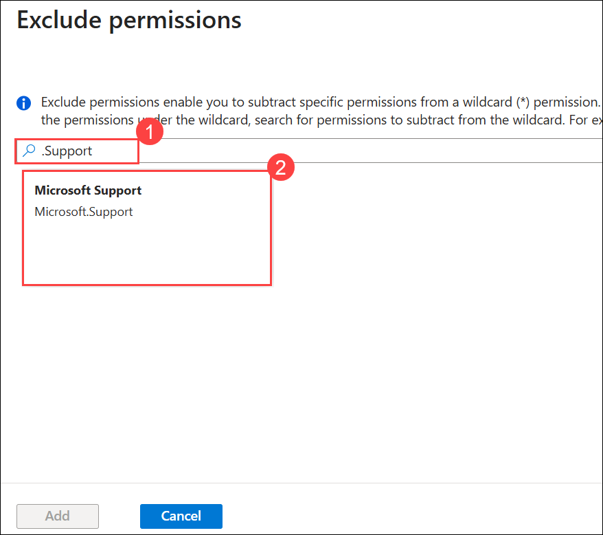

1. In the list of permissions, place a checkbox next to **Other: Registers Support Resource Provider (1)** and then select **Add (2)** and then click  **Next**. The role should be updated to include this permission as a *NotAction*.

    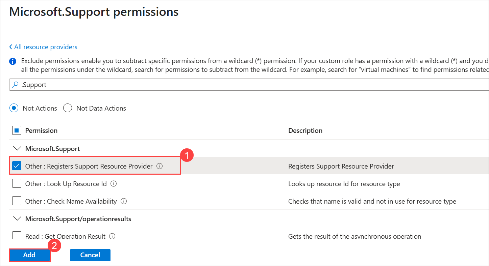

    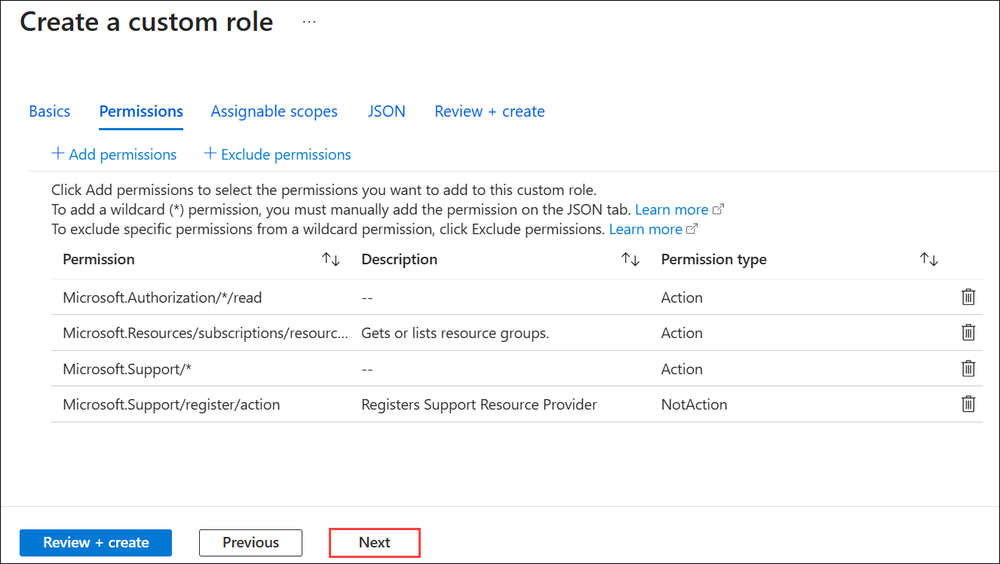
   
    >**Note:** An Azure resource provider is a set of REST operations that enable functionality for a specific Azure service. We do not want the Help Desk to be able to have this capability, so it is being removed from the cloned role. 

1. On the **Assignable scopes** tab, ensure your management group is listed **(1)**, then click **Next (2)**.

      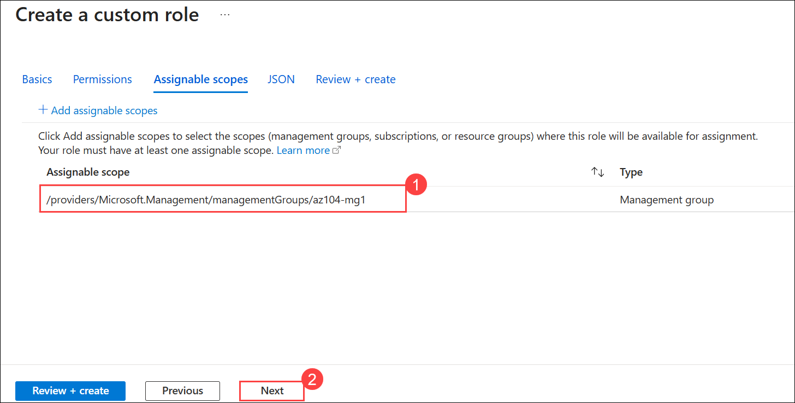 

1. Review the JSON for the *Actions*, *NotActions*, and *AssignableScopes* that are customized in the role.

1. Select **Review + create**, and then select **Create**.  

     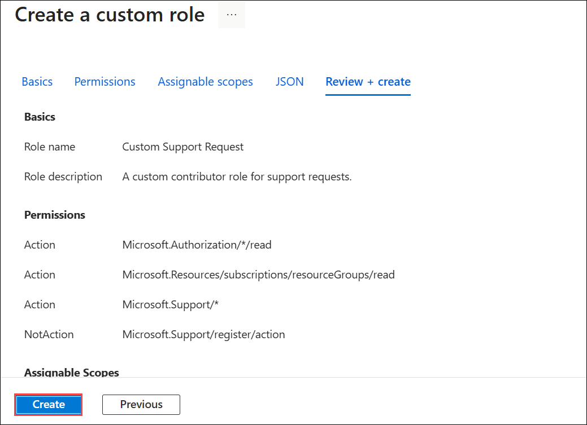 

     - Select **OK** when you see the pop up **You have successfully created the custom role "Custom Support Request". It may take the system a few minutes to display your role everywhere**.

1. At this point, you have created a custom role and assigned it to the management group. 

## Task 4: Monitor role assignments with the Activity Log

In this task, you will review the Azure activity log to check for any actions indicating the creation of a new role. This helps ensure proper tracking and auditing of role-based changes within your Azure environment.

1. In the Azure portal, navigate back to the Management group and and select **az104-02-mg1**. The activity log provides insight into subscription-level events. 

1. Select **Activity Log (1)**  from the left navigation pane and click on **Quick Insights (2)** from the list that appears and select **Role assignment (3)**.

    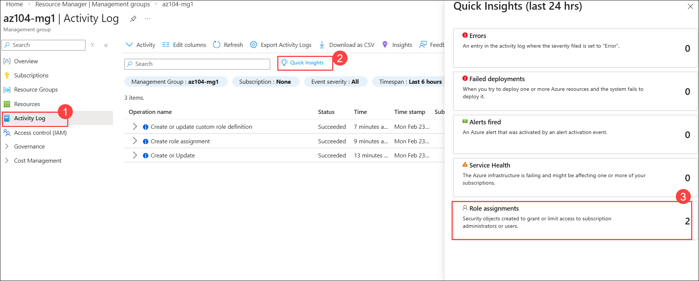 

1. The activity log can be filtered for specific operations and review the activites for role assignments.  

    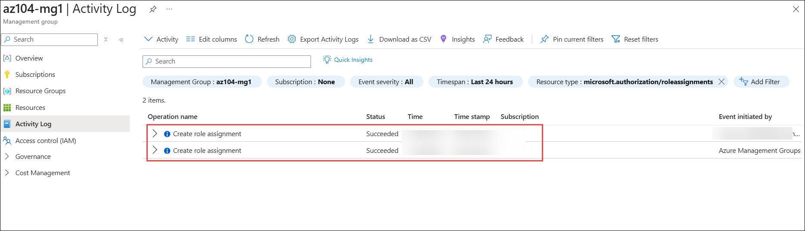 

### Review
In this lab, you have completed:

- Implemented management groups to structure and organize Azure subscriptions, enabling centralized governance and consistent policy enforcement.
- Reviewed and assigned built-in Azure roles to delegate specific permissions while following best practices for group-based role assignments.
- Created a custom RBAC role to tailor permissions according to organizational needs, applying the principle of least privilege for enhanced security.
- Monitored role assignments using the Activity Log to audit access changes and ensure transparency and compliance within your Azure environment.

## Extend your learning with Copilot

Copilot can assist you in learning how to use the Azure scripting tools. Copilot can also assist in areas not covered in the lab or where you need more information. Open an Edge browser and choose Copilot (top right) or navigate to *copilot.microsoft.com*. Take a few minutes to try these prompts.
+ Create two tables highlighting important PowerShell and CLI commands to get information about organization subscriptions on Azure and explain each command in the column “Explanation”. 
+ What is the format of the Azure RBAC JSON file?
+ What are the basic steps for creating a custom Azure RBAC role?
+ What is the difference between Azure RBAC roles and Microsoft Entra ID roles? 

## Learn more with self-paced training

+ [Secure your Azure resources with Azure role-based access control (Azure RBAC)](https://learn.microsoft.com/training/modules/secure-azure-resources-with-rbac/). Use Azure RBAC to manage access to resources in Azure.
+ [Create custom roles for Azure resources with role-based access control (RBAC)](https://learn.microsoft.com/training/modules/create-custom-azure-roles-with-rbac/). Understand the structure of role definitions for access control. Identify the role properties to use that define your custom role permissions. Create an Azure custom role and assign to a user.

## Key takeaways

 Here are the main takeaways for this lab: 

+ Management groups are used to logically organize subscriptions.
+ The built-in root management group includes all the management groups and subscriptions.
+ Azure has many built-in roles. You can assign these roles to control access to resources.
+ You can create new roles or customize existing roles.
+ Roles are defined in a JSON formatted file and include *Actions*, *NotActions*, and *AssignableScopes*.
+ You can use the Activity Log to monitor role assignments.

### You have successfully completed the lab
