# Lab - Implement Virtual Networking

## Lab Overview

This lab focuses on applying security best practices while demonstrating advanced Azure networking concepts.You'll create virtual networks and subnets in Azure to establish a secure, scalable networking environment. You'll implement Application Security Groups (ASGs) and Network Security Groups (NSGs) to manage and enforce access controls, and configure both public and private DNS zones for effective name resolution. 

## Lab Objectives

In this lab, you will complete the following tasks:
- Task 1: Create a virtual network with subnets using the portal.
- Task 2: Create a virtual network and subnets using a template.
- Task 3: Create and configure communication between an Application Security Group and a Network Security Group.
- Task 4: Configure public and private Azure DNS zones

### Task 1: Create a virtual network with subnets using the portal

The organization plans a large amount of growth for core services. In this task, you create the virtual network and the associated subnets to accommodate the existing resources and planned growth. In this task, you will use the Azure portal. 

1. In the Azure portal, search for `Virtual Networks` **(1)** and select `Virtual Networks` **(2)** from the results.

     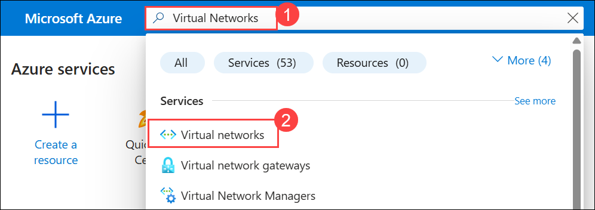

1. Select **+ Create** on the **Network foundation | Virtual networks** page.

     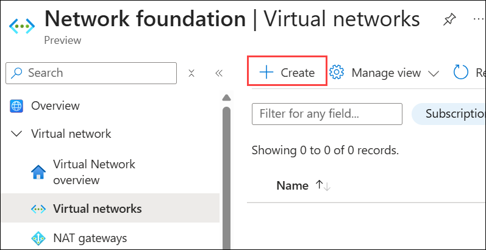

1. Complete the **Basics** tab with the following details and then click **Next (5)**:

    |  **Option**         | **Value**            |
    | ------------------ | -------------------- |
    | Subscription       | Choose the default subscription **(1)** | 
    | Resource Group     | **az104-04-rg1-<inject key="DeploymentID" enableCopy="false" /> (2)**|
    | Name               | **az104-04-vnet1 (3)**|
    | Region             |  **<inject key="Region" enableCopy="false" /> (4)** |

     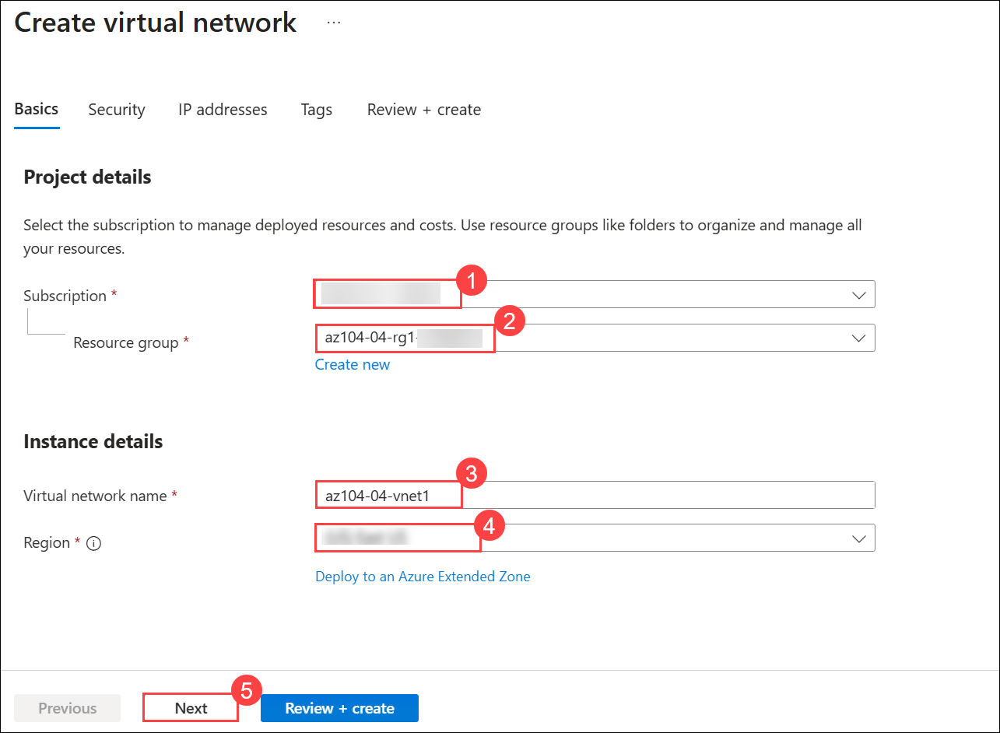

1. Subsequently click on **Next** again to move to the **Addresses space** tab.

    | Setting | Value |
    | --- | --- |
    | IPv4 address space | Replace the prepopulated IPv4 address space with **10.20.0.0/16 (1)** (separate the entries) |
    | |delete the default subnet **(2)** |

    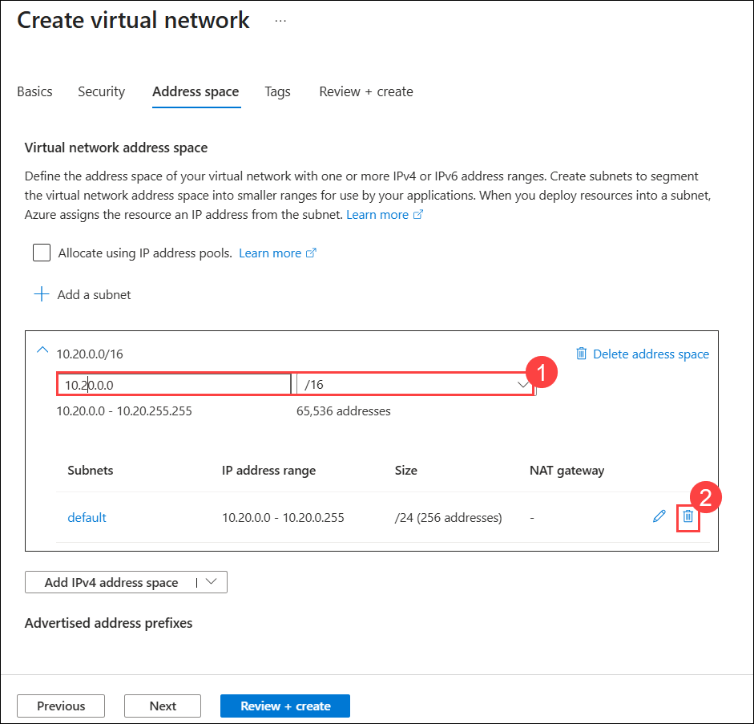

1. Select **+ Add a subnet (1)**. Complete the name and address information for each subnet. Be sure to select **Add (5)** for each new subnet. 

    | **Subnet**             | **Option**           | **Value**              |
    | ---------------------- | -------------------- | ---------------------- |
    | SharedServicesSubnet   | Subnet name          | `SharedServicesSubnet` **(2)** |
    |                        | Starting address	    | `10.20.10.0` **(3)**          |
    |			     | Size		    | `/24`	    **(4)**         |

    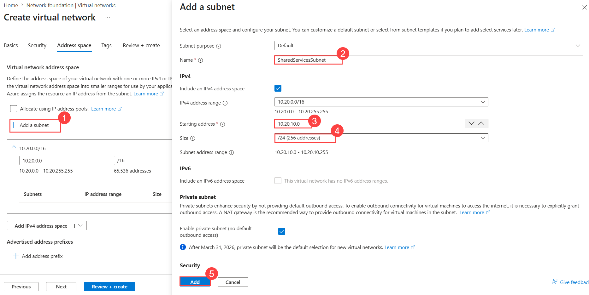

1. Select **+ Add a subnet**.

1. Provide the following details and the **Add (4)**.

    | **Subnet**             | **Option**           | **Value**              |
    | ---------------------- | -------------------- | ---------------------- |
    |         |
    | DatabaseSubnet         | Subnet name          | `DatabaseSubnet` **(1)**      |
    |                        | Starting address	    | `10.20.20.0` **(2)**          |
    |			     | Size		    | `/24`	       **(3)**      |

    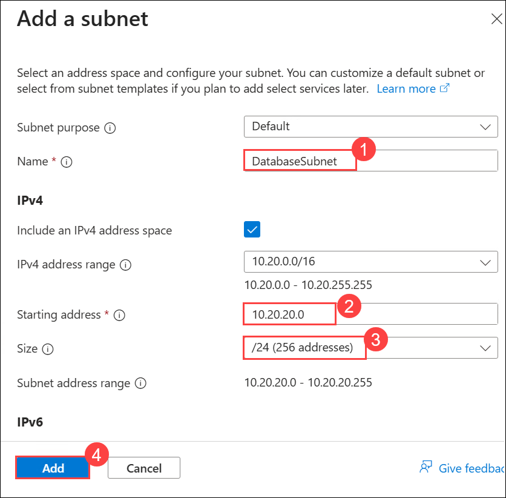

    >**Note:** Every virtual network must have at least one subnet. Reminder that five IP addresses will always be reserved, so consider that in your planning. 

1. Select **Review + create**.

     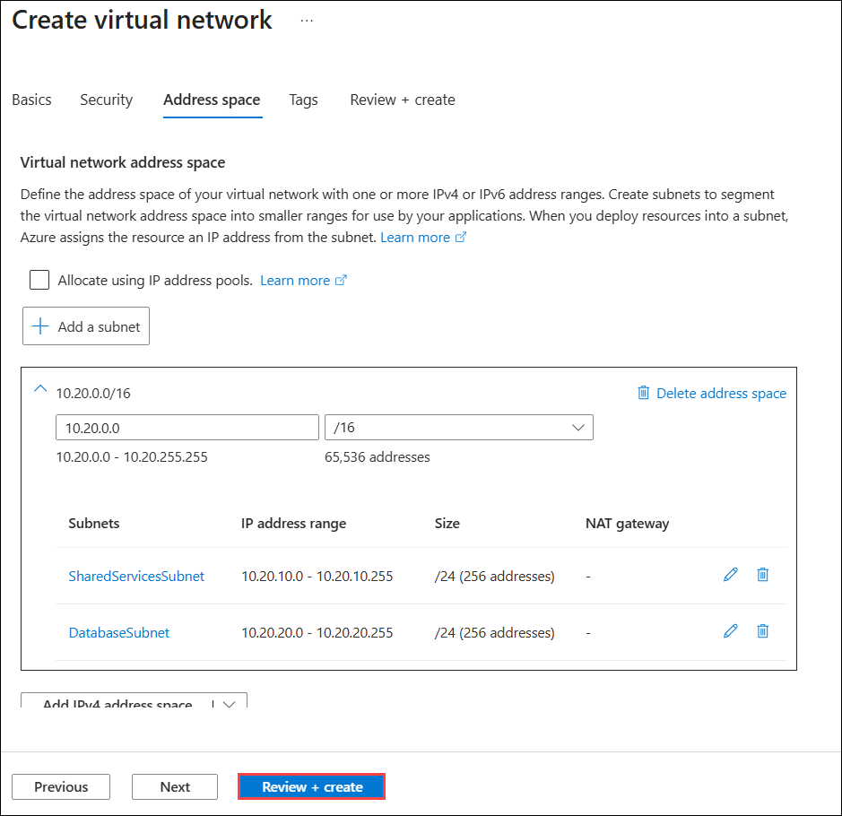

1. Verify your configuration passed validation, and then select **Create**.

     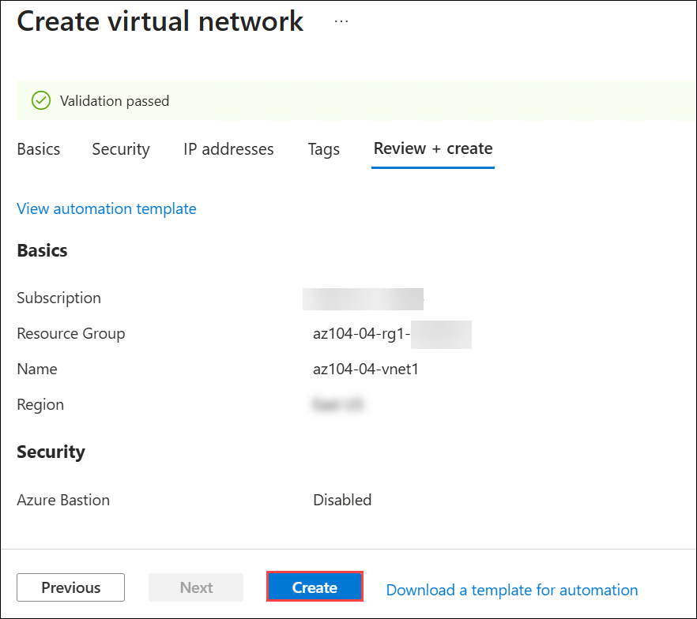

1. Wait for the virtual network to deploy and then select **Go to resource**.

    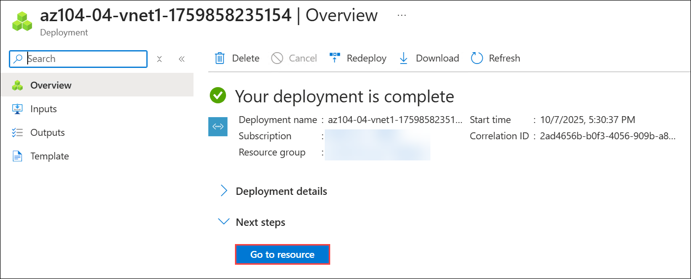
   
1. Take a minute to verify the **Address space** and the **Subnets**. Notice your other choices in the **Settings** blade. 
   
    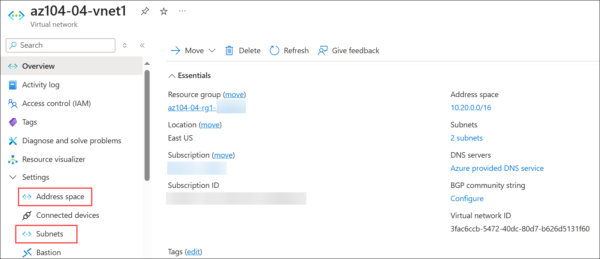

    > **Congratulations** on completing the task! Now, it's time to validate it. Here are the steps:
    > - Hit the Validate button for the corresponding task. If you receive a success message, you can proceed to the next task. 
    > - If not, carefully read the error message and retry the step, following the instructions in the lab guide.
    > - If you need any assistance, please contact us at cloudlabs-support@spektrasystems.com. We are available 24/7 to help
    
    <validation step="3a2d8eeb-5292-4449-9459-ec4e7aca9f8d" />

### Task 2: Create a virtual network and subnets using a template

In this task, you create the ManufacturingVnet virtual network and associated subnets. The organization anticipates growth for the manufacturing offices so the subnets are sized for the expected growth. For this task, you use a template to create the resources. 

1. In your Lab VM, navigate to **C:\AllFiles\AZ-104-MicrosoftAzureAdministrator-Lab-Files\Allfiles\Labs\04** where you will find the template and parameter file named 
   **az-104-04template** and **az-104-04parameters** that will be used for the custom deployment.

1. In Search resources, services, and docs (G+/) box at the top of the portal, enter **Deploy a custom template (1)**, and then select **Deploy a custom template (2)** from the results.

    

1. Select **Build your own template in the editor**.

    

1. Then **Load file** in the top navigation pane.    

    

1. In the **Open** dialog box, navigate to `C:\AllFiles\AZ-104-MicrosoftAzureAdministrator-Lab-Files\Allfiles\Labs\04` **(1)**, select the `az-104-04template` **(2)** file, and click **Open (3)**.

     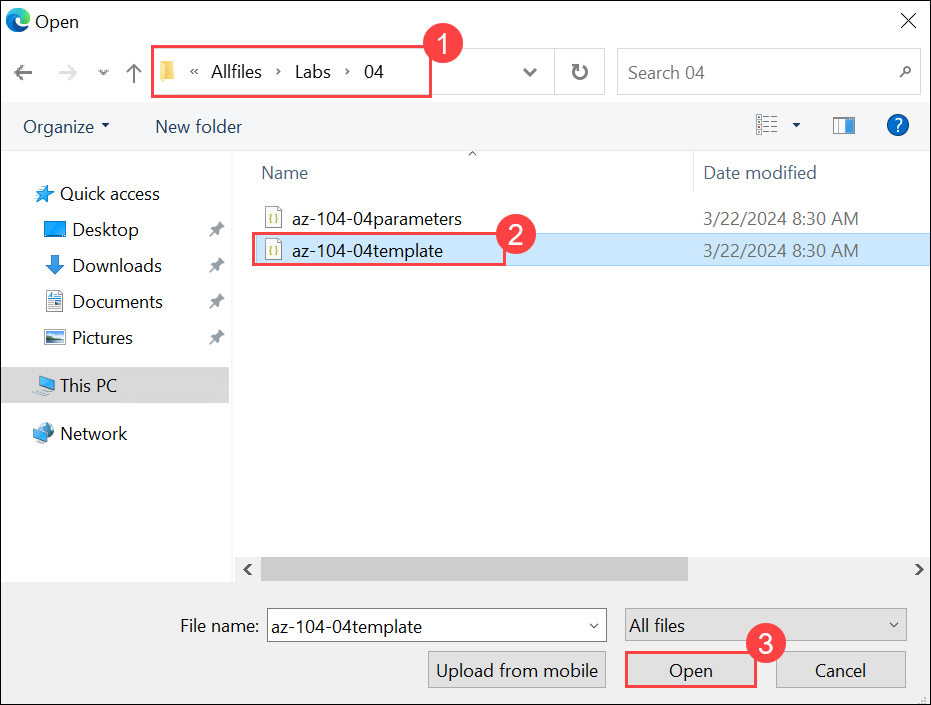

1. Then select **Save**.  

1. Click on the **Edit Parameters** section. 

    

1. Click on **Load File**.

1. Then upload the **az-104-04parameters.json** file and subsequently, click on **Save**
    
1. In the **Basics** tab, select **az104-04-rg1-<inject key="DeploymentID" enableCopy="false" /> (1)** resource group and then select **Review + create (2)**.
    
    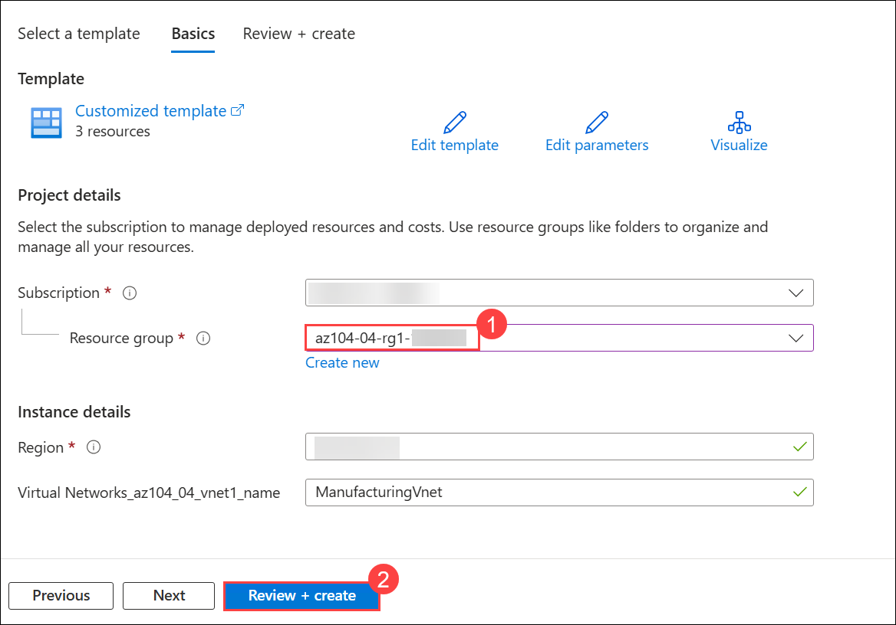

1. Then **Create**.

     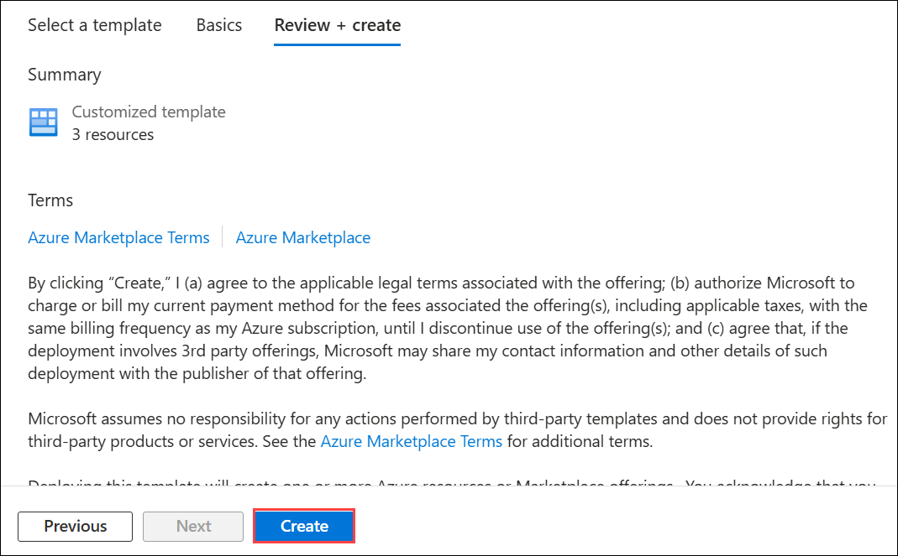

1. Wait for the template to deploy, then confirm (in the portal) the Manufacturing virtual network and subnets were created.
   
     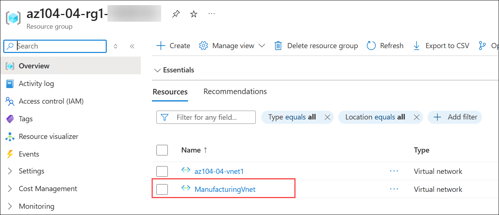

  > **Congratulations** on completing the task! Now, it's time to validate it. Here are the steps:
  > - Hit the Validate button for the corresponding task. If you receive a success message, you can proceed to the next task. 
  > - If not, carefully read the error message and retry the step, following the instructions in the lab guide.
  > - If you need any assistance, please contact us at cloudlabs-support@spektrasystems.com.com. We are available 24/7 to help
  
  <validation step="1d12c35d-eeac-45a9-97f4-c0c07b7aff9f" />

### Task 3: Create and configure communication between an Application Security Group and a Network Security Group

In this task, we create an Application Security Group and a Network Security Group. The NSG will have an inbound security rule that allows traffic from the ASG. The NSG will also have an outbound rule that denies access to the internet. 

### Create the Application Security Group (ASG)

1. In the Azure portal, search for **Application security groups (1)** and select **Application security groups (2)** from results.

     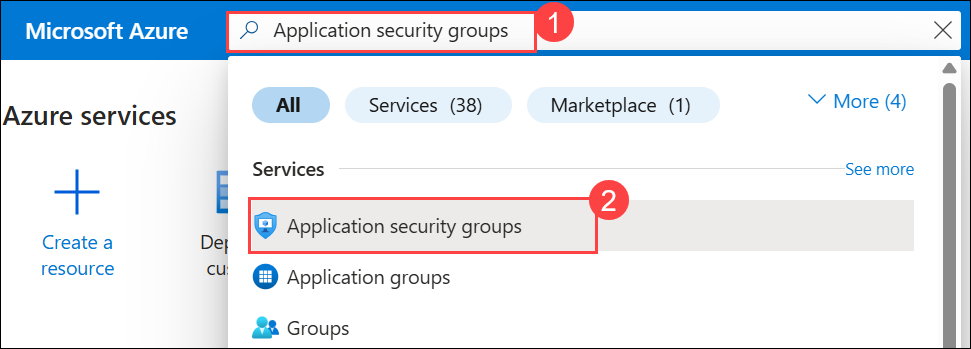

1. Click **Create**.

1. Provide the basic information and then click **Review + create (5)**.

    | Setting | Value |
    | -- | -- |
    | Subscription | **your subscription (1)** |
    | Resource group | **az104-04-rg1-<inject key="DeploymentID" enableCopy="false" /> (2)** |
    | Name | **asg-web (3)** |
    | Region |  **<inject key="Region" enableCopy="false" /> (4)**  |

    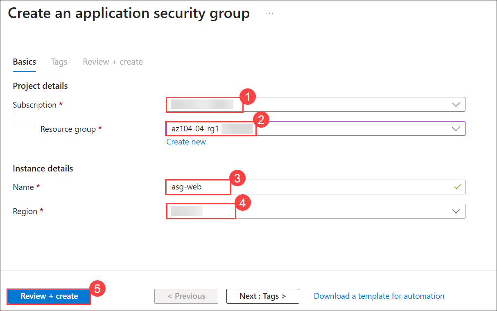

1. After the validation click **Create**.

### Create the Network Security Group and associate it with the ASG subnet

1. In the Azure portal, search for **Network security groups (1)** and select **Network security groups (2)** from results.

     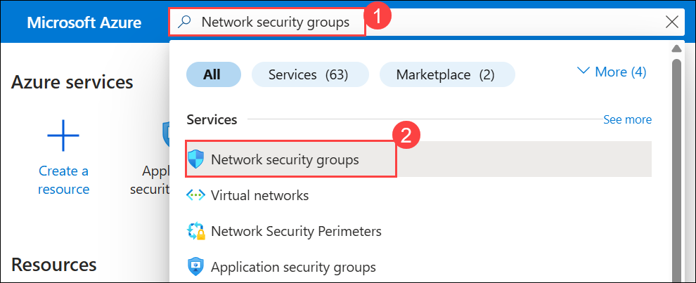

1. Select **+ Create** and provide information on the **Basics** tab and then click **Review + create (5)**.

    | Setting | Value |
    | -- | -- |
    | Subscription | **your subscription (1)** |
    | Resource group |  **az104-04-rg1-<inject key="DeploymentID" enableCopy="false" /> (2)**  |
    | Name | **myNSGSecure (3)** |
    | Region | **<inject key="Region" enableCopy="false" /> (4)**  |

     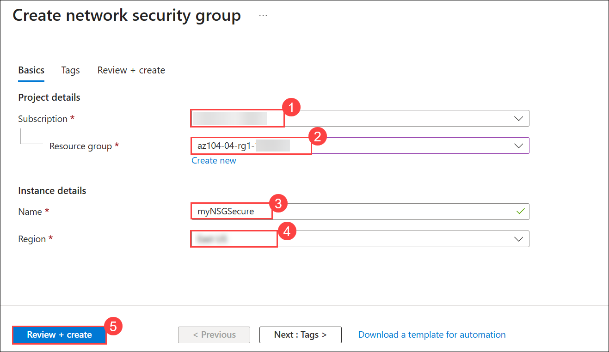

1. Then after the validation click **Create**.

     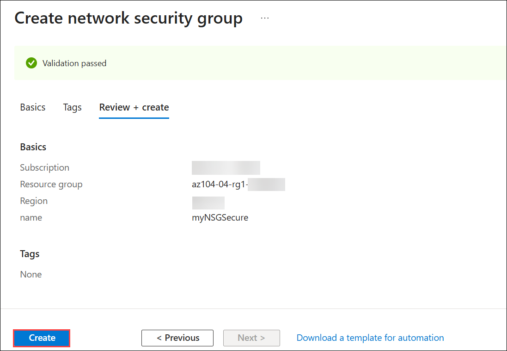

1. After the NSG is deployed, click **Go to resource**.

     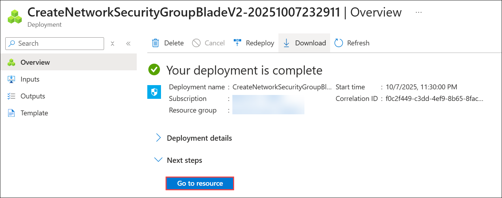

1. Under **Settings (1)** click **Subnets (2)** and then **+ Associate (3)**.

    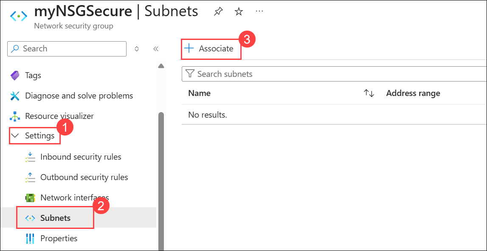

1. On the **Associate Subnet**, provide the following details and then **OK (3)**    

    | Setting | Value |
    | -- | -- |
    | Virtual network | **az104-04-vnet1 (1)** |
    | Subnet | **SharedServicesSubnet (2)** |

    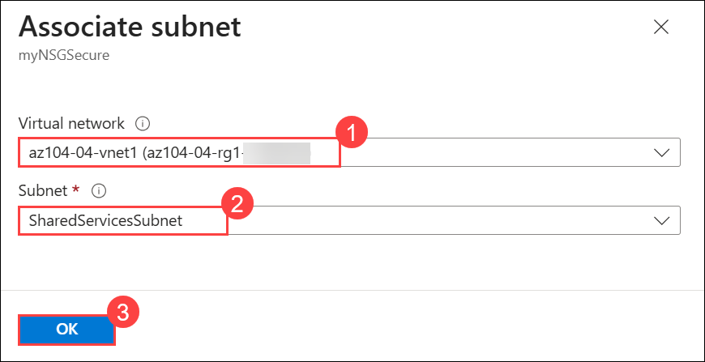

### Configure an inbound security rule to allow ASG traffic

1. Continue working with your NSG. In the left navigation pane in the **Settings** section, select **Inbound security rules (1)**.

     - Review the default inbound rules. Notice that only other virtual networks and load balancers are allowed access.

     - Select **+ Add (2)**.

       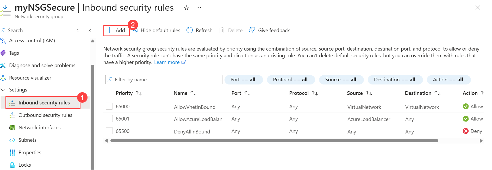

1. On the **Add inbound security rule** blade, use the following information to add an inbound port rule. This rule allows ASG traffic. When you are finished, select 
   **Add (11)**.

    | Setting | Value |
    | -- | -- |
    | Source | **Application security group (1)** |
    | Source application security groups | **asg-web (2)** |
    | Source port ranges |  * **(3)** |
    | Destination | **Any (4)** |
    | Service | **Custom** (notice your other choices) **(5)**|
    | Destination port ranges | **80,443 (6)**|
    | Protocol | **TCP (7)** |
    | Action | **Allow (8)** |
    | Priority | **100 (9)** |
    | Name | **AllowASG (10)** |

    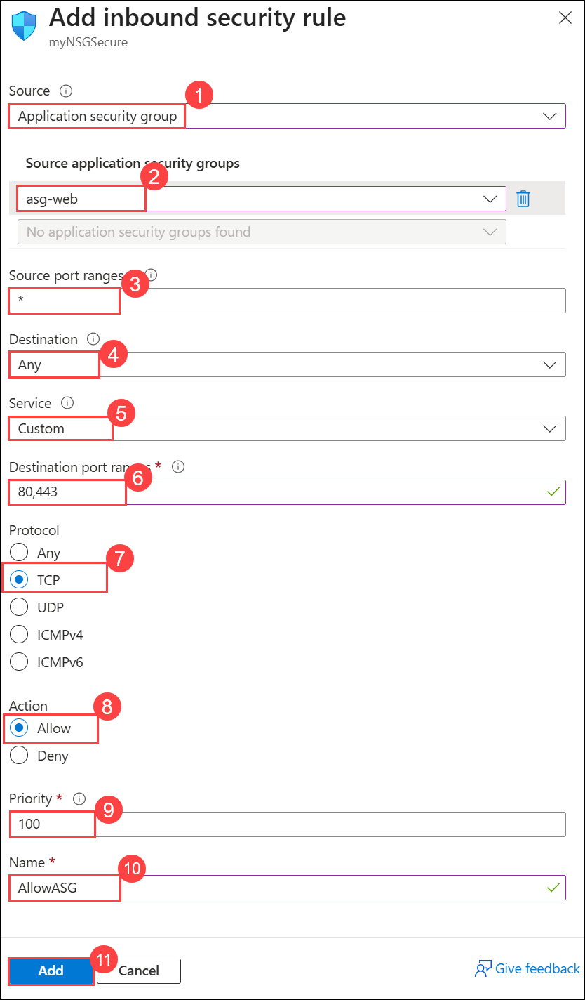
 
### Configure an outbound NSG rule that denies Internet access

1. After creating your inbound NSG rule, select **Outbound security rules (1)** from the left navigation pane. 

     - Notice the **AllowInternetOutbound** rule. Also notice the rule cannot be deleted and the priority is 65001.
     - Select **+ Add (2)** 

       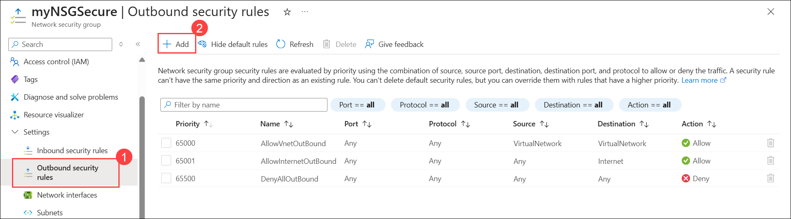

1. Configure an outbound rule that denies access to the internet. When you are finished, select **Add (11)**.

    | Setting | Value |
    | -- | -- |
    | Source | **Any (1)** |
    | Source port ranges |  * **(2)** |
    | Destination | **Service tag (3)** |
    | Destination service tag | **Internet (4)** |
    | Service | **Custom (5)** |
    | Destination port ranges | **8080 (6)** |
    | Protocol | **Any (7)** |
    | Action | **Deny (8)** |
    | Priority | **4096 (9)** |
    | Name | **DenyAnyCustom8080Outbound (10)** |

     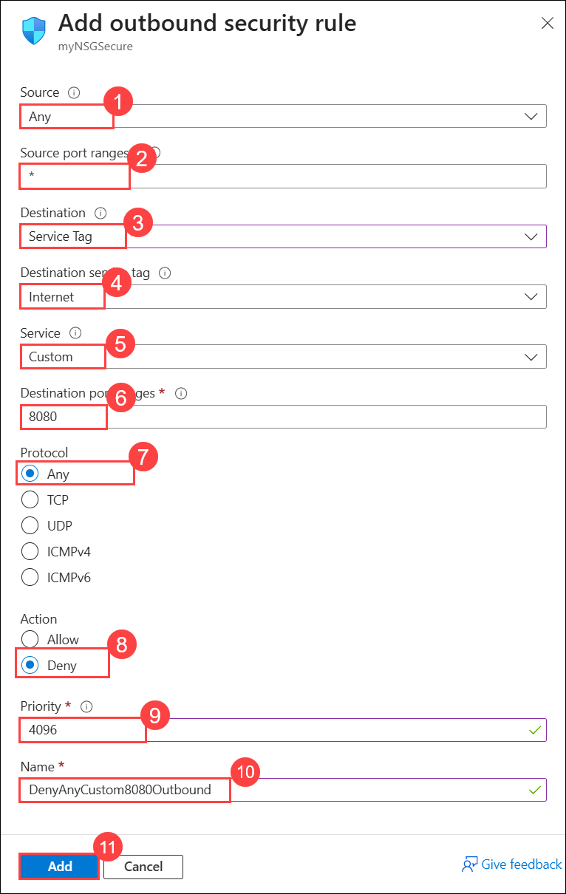

> **Congratulations** on completing the task! Now, it's time to validate it. Here are the steps:
> - Hit the Validate button for the corresponding task. If you receive a success message, you can proceed to the next task. 
> - If not, carefully read the error message and retry the step, following the instructions in the lab guide.
> - If you need any assistance, please contact us at cloudlabs-support@spektrasystems.com. We are available 24/7 to help

<validation step="0dc2eabf-2ff0-4f74-990f-82cb1f0dfb93" />

### Task 4: Configure public and private Azure DNS zones

In this task, you will create and configure public and private DNS zones to enable efficient name resolution for resources in Azure. Public DNS zones will handle domain name resolution accessible over the internet, while private DNS zones will facilitate name resolution within your private virtual network, ensuring seamless communication between internal resources.

### Configure a public DNS zone

You can configure Azure DNS to resolve host names in your public domain. For example, if you purchased the contoso.xyz domain name from a domain name registrar, you can configure Azure DNS to host the `contoso.com` domain and resolve www.contoso.xyz to the IP address of your web server or web app.

1. In the Azure portal, search for **DNS zones (1)** and select **DNS zones (2)** from results.

     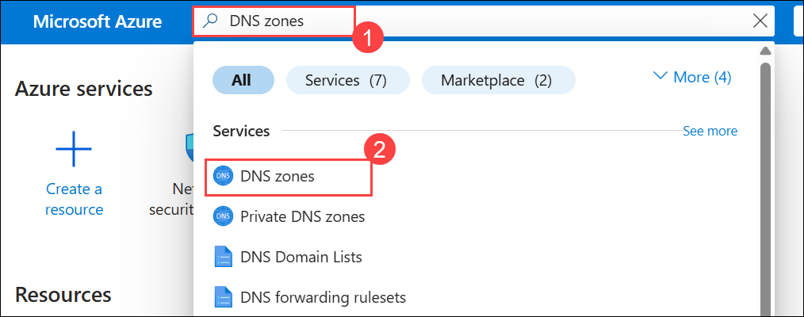

1. Select **+ Create**.

     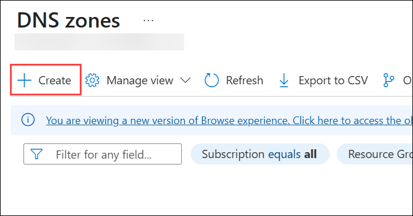

1. Configure the **Basics** tab and then select **Review create (4)**.

    | Property | Value    |
    |:---------|:---------|
    | Subscription | **Select your subscription  (1)**|
    | Resource group |  **az104-04-rg1-<inject key="DeploymentID" enableCopy="false" /> (2)** |
    | Name | **contoso<inject key="DeploymentID" enableCopy="false" />.com (3)**|
    | Region | **<inject key="Region" enableCopy="false" />**|

    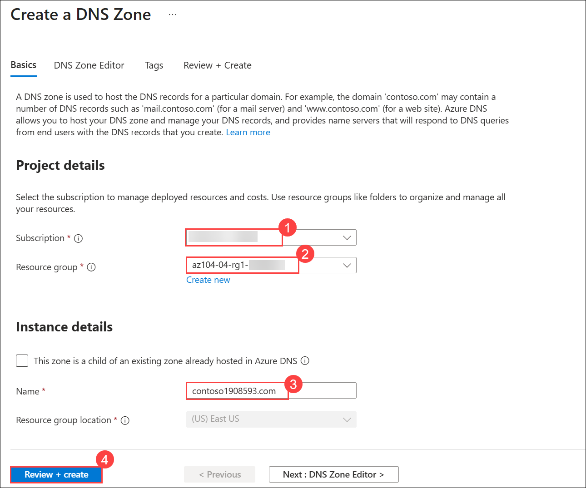

1. Then **Create**.
   
1. Wait for the DNS zone to deploy and then select **Go to resource**.

     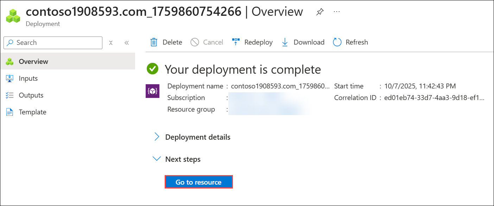

1. On the **Overview** blade  select **Recordsets** and notice the names of the four Azure DNS name servers assigned to the zone.

     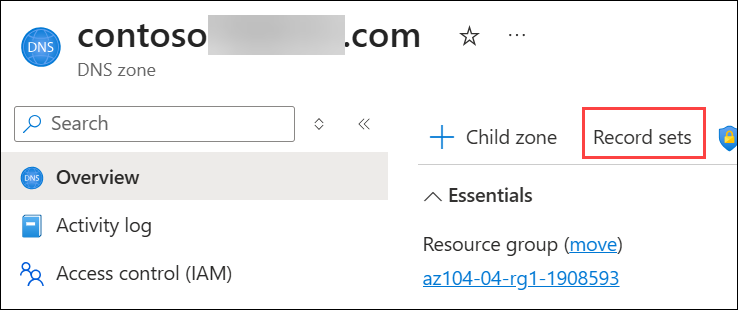

1. **Copy** one of the name server addresses. You will need it in a future step for the nslookup command below.

    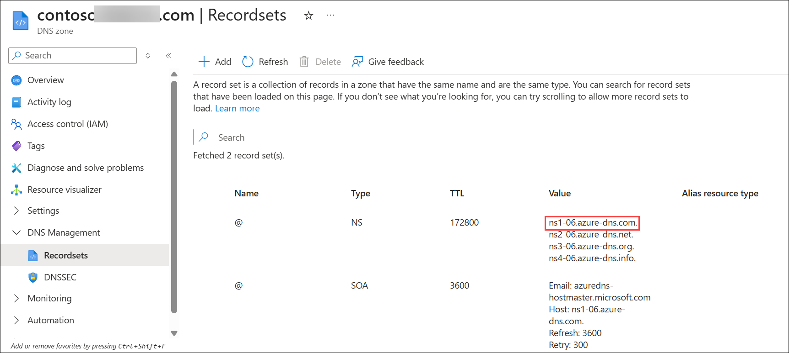

1. Select **+ Add**.

     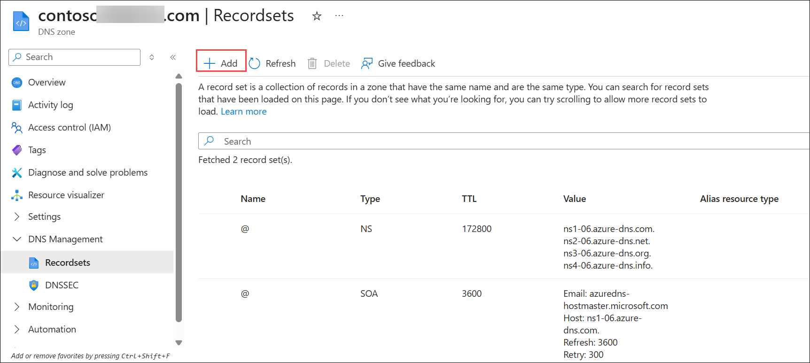

1. You add a virtual network link record for each virtual network that needs private name-resolution support and then **Add (5)**.

    | Property | Value    |
    |:---------|:---------|
    | Name | **www (1)** |
    | Type | **A - IPv4 Address records (2)** |
    | TTL | **1 (3)** |
    | IP address | **10.1.1.4 (4)** |        

     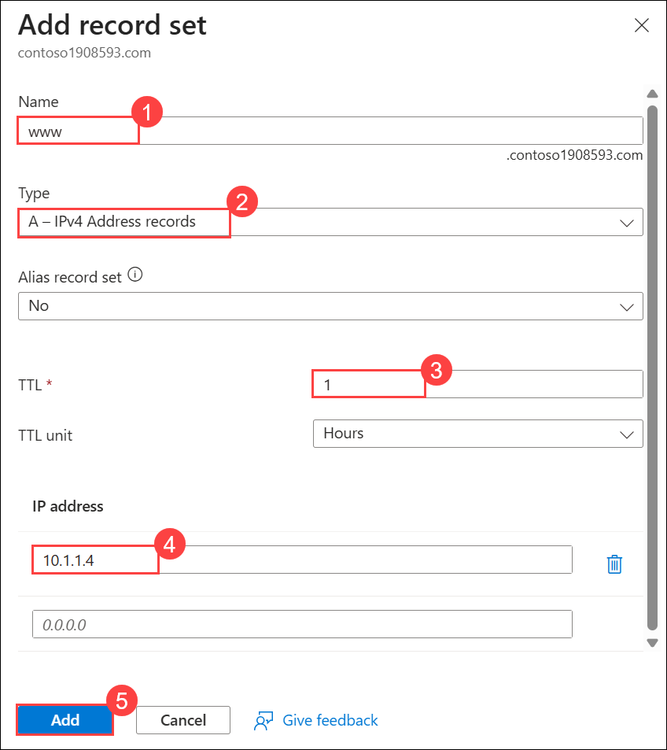

     >**Note:**  In a real-world scenario, you'd enter the public IP address of your web server.

1. Verify **contoso<inject key="DeploymentID" enableCopy="false" />.com** has an A record set named **www**.

   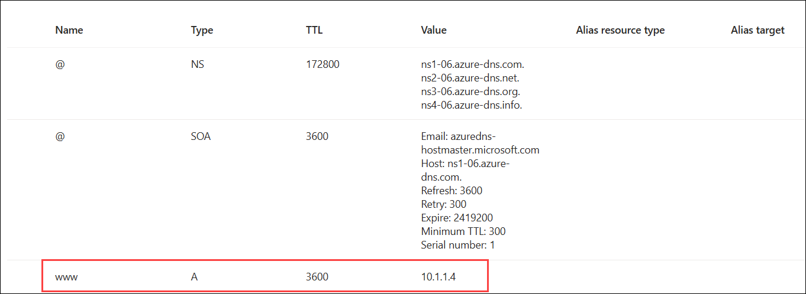

1. In the **Start** menu, type `cmd` in the search bar **(1)**, then click on **Command Prompt** from the search results **(2)**.

     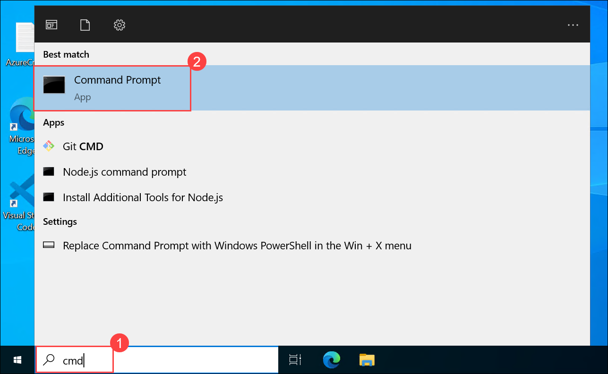

1. On command prompt, run the following command: In the below code, replace `[DID]` with **<inject key="DeploymentID" enableCopy="false" />** and `[name server name]` with the **name server name** you copied in the previous step.
 
    ```sh
   nslookup www.contoso[DID].com [name server name]
   ```
1. Verify the host name **www.contoso<inject key="DeploymentID" enableCopy="false" />.com** resolves to the IP address you provided. This confirms name resolution is working correctly.

    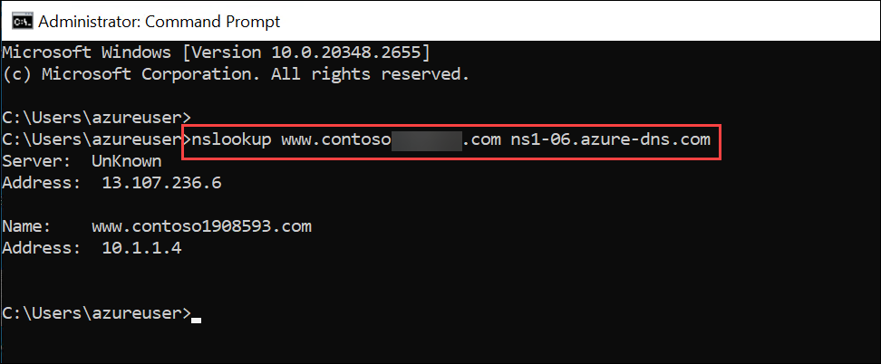

###  Configure a private DNS zone

A private DNS zone provides name resolution services within virtual networks. A private DNS zone is only accessible from the virtual networks that it is linked to and can't be accessed from the internet. 

1. In the portal, search for **Private dns zones (1)** and select **Private dns zones (2)** resource.

     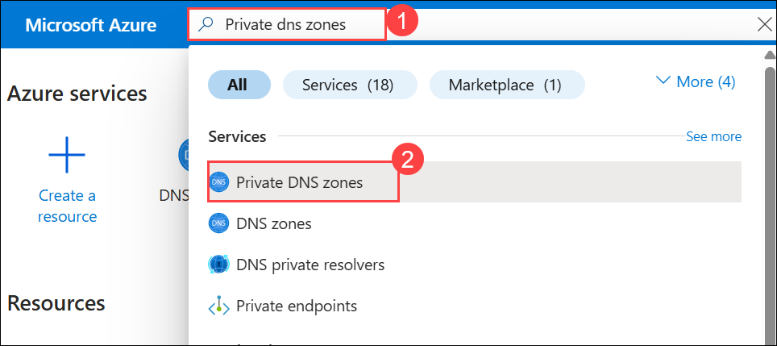

1. Select **+ Create**.

1. On the **Basics** tab of Create private DNS zone, enter the information as listed in the table below and select **Review create (4)**.

    | Property | Value    |
    |:---------|:---------|
    | Subscription | **Select your subscription (1)** |
    | Resource group | **az104-04-rg1-<inject key="DeploymentID" enableCopy="false" /> (2)** |
    | Name | `private.contoso.com` **(3)** (adjust if you have to rename) |
    | Region | **<inject key="Region" enableCopy="false" />** |

     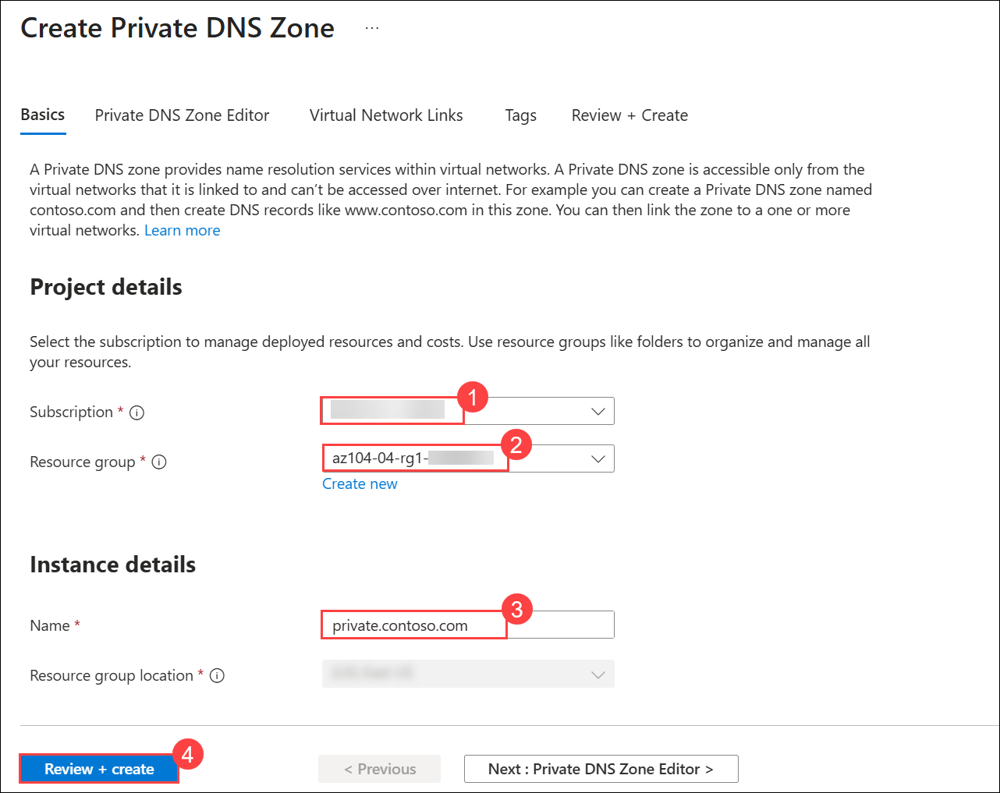

1. Then **Create**.
   
     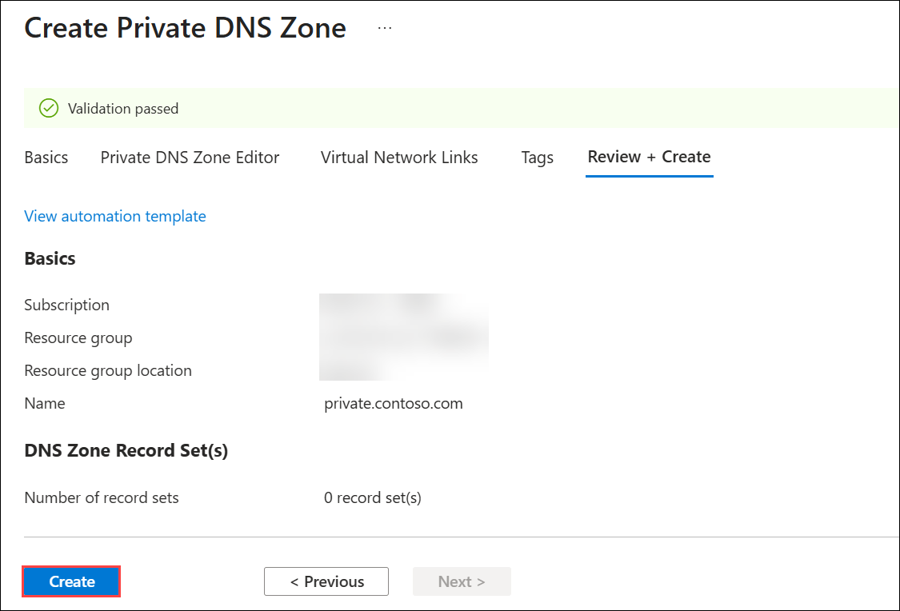

1. Wait for the DNS zone to deploy and then select **Go to resource**.

     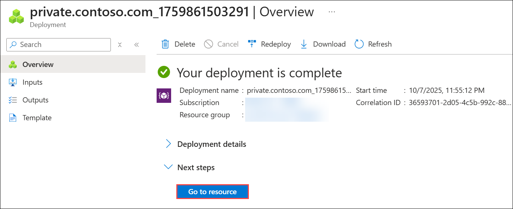

1. Notice on the **Overview** blade there are no name server records. 

1. In the left navigation pane under **DNS Management (1)**, select **Virtual network links (2)** from the left navigation pane and then select **+ Add (3)**.

     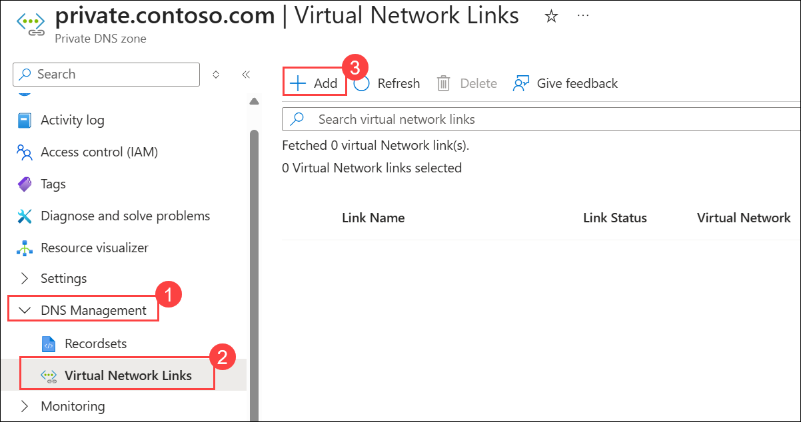

    | Property | Value    |
    |:---------|:---------|
    | Link name | **manufacturing-link (1)**|
    | Virtual network |**ManufacturingVnet (2)**|

     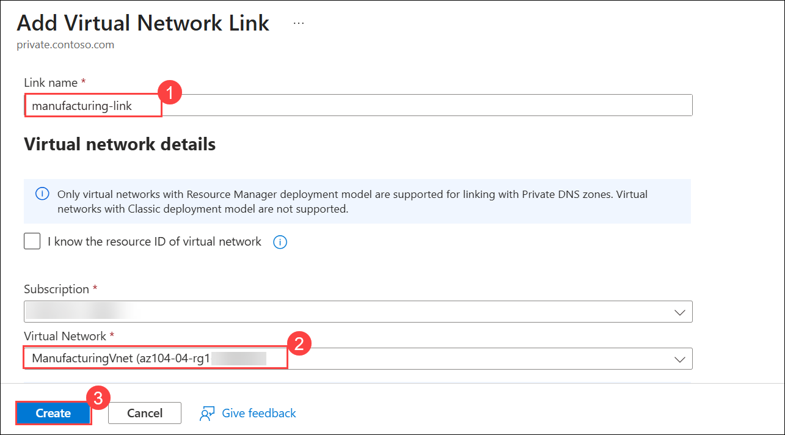

1. Select **Create (3)** and wait for the link to create. 

1. From the left navigation pane, under **DNS Management** click on **Record Set (1)**. Click on **+ Add (2)** to  add a record for each virtual machine that needs private name-resolution support.

    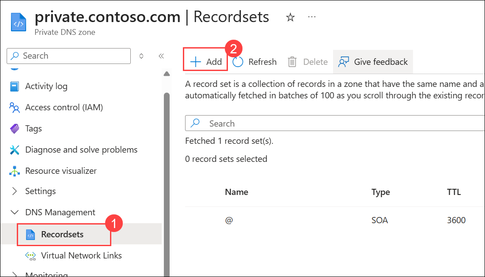

1. On the **Add record set**, provide the following details and the **Add (5)**:    

    | Property | Value    |
    |:---------|:---------|
    | Name | **sensorvm (1)** |
    | Type | **A (2)** |
    | TTL | **1 (3)** |
    | IP address | **10.1.1.4 (4)** |
   
     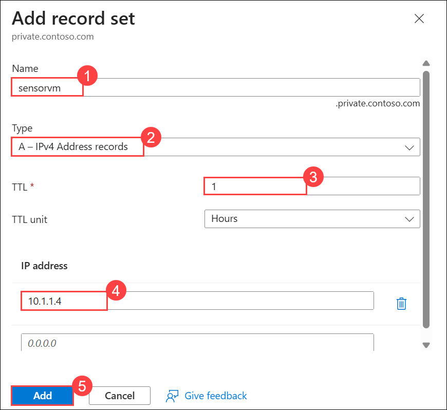

    >**Note:**  In a real-world scenario, you'd enter the IP address for a specific manufacturing virtual machine
  
### Review

In this lab, you have completed the following:

- Created a virtual network with subnets using the Azure portal, demonstrating manual configuration.
- Created a virtual network and subnets using a deployment template, showcasing automation capabilities in Azure.
- Established and configured secure communication between an Application Security Group (ASG) and a Network Security Group (NSG).
- Configured both public and private Azure DNS zones to facilitate effective name resolution for resources in Azure.

## Extend your learning with Copilot

Copilot can assist you in learning how to use the Azure scripting tools. Copilot can also assist in areas not covered in the lab or where you need more information. Open an Edge browser and choose Copilot (top right). Take a few minutes to try these prompts.
+ Share the top 10 best practices when deploying and configuring a virtual network in Azure.
+ How do I use Azure PowerShell and Azure CLI commands to create a virtual network with a public IP address and one subnet. 
+ Explain Azure Network Security Group inbound and outbound rules and how they are used.
+ What is the difference between Azure Network Security Groups and Azure Application Security Groups? Share examples of when to use each of these groups. 
+ Give a step-by-step guide on how to troubleshoot any network issues we face when deploying a network on Azure. Also share the thought process used for every step of the troubleshooting.

## Learn more with self-paced training

+ [Introduction to Azure Virtual Networks](https://learn.microsoft.com/training/modules/introduction-to-azure-virtual-networks/). Design and implement core Azure Networking infrastructure such as virtual networks, public and private IPs, DNS, virtual network peering, routing, and Azure Virtual NAT.
+ [Design an IP addressing scheme](https://learn.microsoft.com/training/modules/design-ip-addressing-for-azure/). Identify the private and public IP addressing capabilities of Azure and on-premises virtual networks.
+ [Secure and isolate access to Azure resources by using network security groups and service endpoints](https://learn.microsoft.com/training/modules/secure-and-isolate-with-nsg-and-service-endpoints/). Network security groups and service endpoints help you secure your virtual machines and Azure services from unauthorized network access.
+ [Host your domain on Azure DNS](https://learn.microsoft.com/training/modules/host-domain-azure-dns/). Create a DNS zone for your domain name. Create DNS records to map the domain to an IP address. Test that the domain name resolves to your web server.

### You have successfully completed the lab
