# Lab 05: Implement Intersite Connectivity

## Lab Overview

In this lab you explore communication between virtual networks. You implement virtual network peering and test connections. You will also create a custom route. 

## Lab Objectives

In this lab, you will complete the following tasks:

+ Task 1:  Create a core services virtual machine and virtual network
+ Task 2: Create a virtual machine in a different virtual network
+ Task 3: Use Network Watcher to test the connection between virtual machines
+ Task 4: Configure virtual network peerings between different virtual networks
+ Task 5: Use Azure PowerShell to test the connection between virtual machines
+ Task 6: Create a custom route

## Task 1:  Create a core services virtual machine and virtual network

In this task, you create a core services virtual network with a virtual machine.

1. From the Azure Portal, search for **Virtual Machines (1)** and select **Virtual Machines (2)**.

    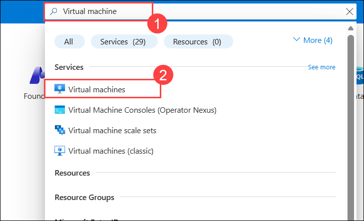

1. From the virtual machines page, select **Create (1)** then select **Virtual machine (2)**.

    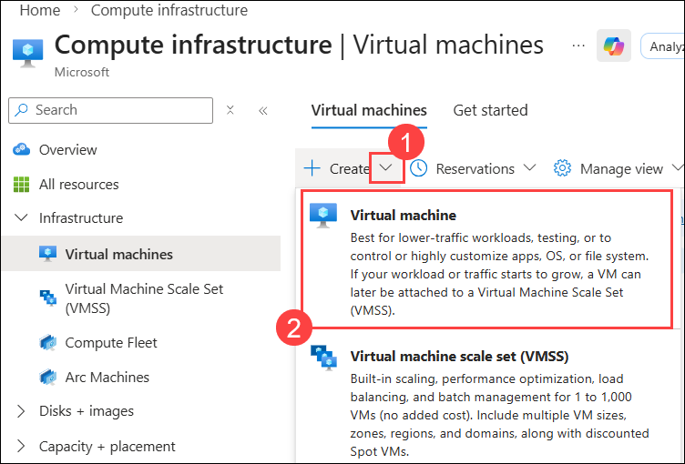

1. On the Basics tab, use the following information to complete the form, and then select **Next : Disks > (13)**. For any setting not specified, leave the default value.
 
    | Setting | Value | 
    | --- | --- |
    | Subscription |  **Leave the default Subscription (1)** |
    | Resource group |  **az104-05-rg0-<inject key="DeploymentID" enableCopy="false" /> (2)** |
    | Virtual machine name |    **CoreServicesVM<inject key="DeploymentID" enableCopy="false" /> (3)** |
    | Region | **<inject key="Region" enableCopy="false" /> (4)** |
    | Availability options | **No infrastructure redundancy required (5)** |
    | Security type | **Standard (6)** |
    | Image (See all images) | **Windows Server 2025 Datacenter - x64 Gen2 (7)** (notice your other choices) |
    | Size | **Standard_D2s_v3 (8)** |
    | Username | `azureuser` **(9)** | 
    | Password | **Pa55w.rd1234 (10)** |
    | Confirm Password | **Pa55w.rd1234 (11)** |    
    | Public inbound ports | **None (12)** |

    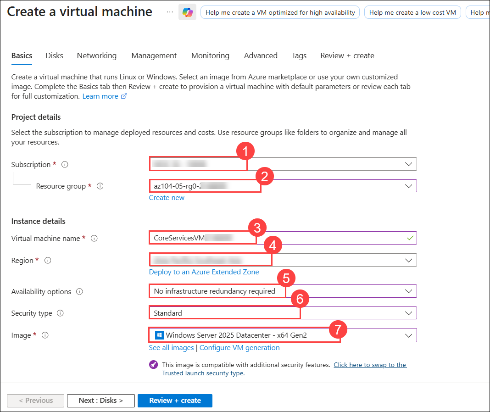
    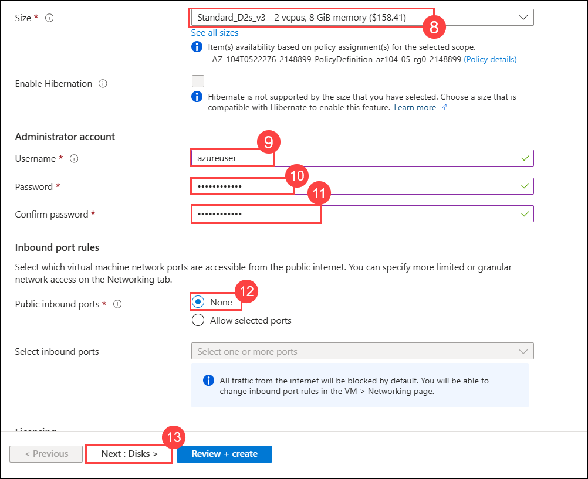        

1. On the **Disks** tab take the defaults and then select **Next : Networking >**.

1. On the **Networking** tab, for Virtual network, select **Create new**.

    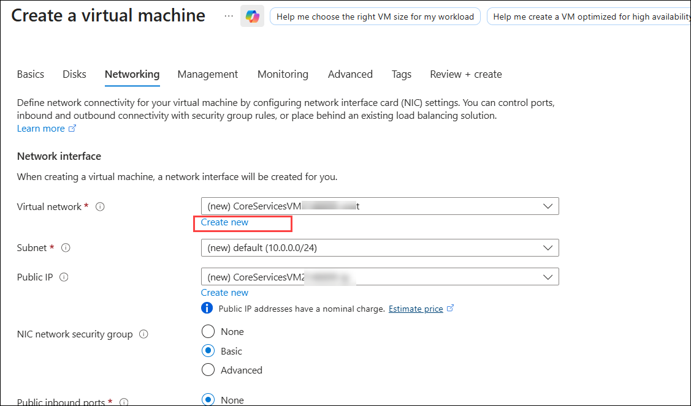 

1. Use the following information to configure the virtual network, and then select **OK (5)**. If necessary, remove or replace the existing information.

    | Setting | Value | 
    | --- | --- |
    | Name | `CoreServicesVnet` (Create or edit) **(1)** |
    | Address range | `10.0.0.0/16` **(2)** |
    | Subnet Name | `Core` **(3)** (Edit the **Default**) | 
    | Subnet address range | `10.0.0.0/24` **(4)** |

    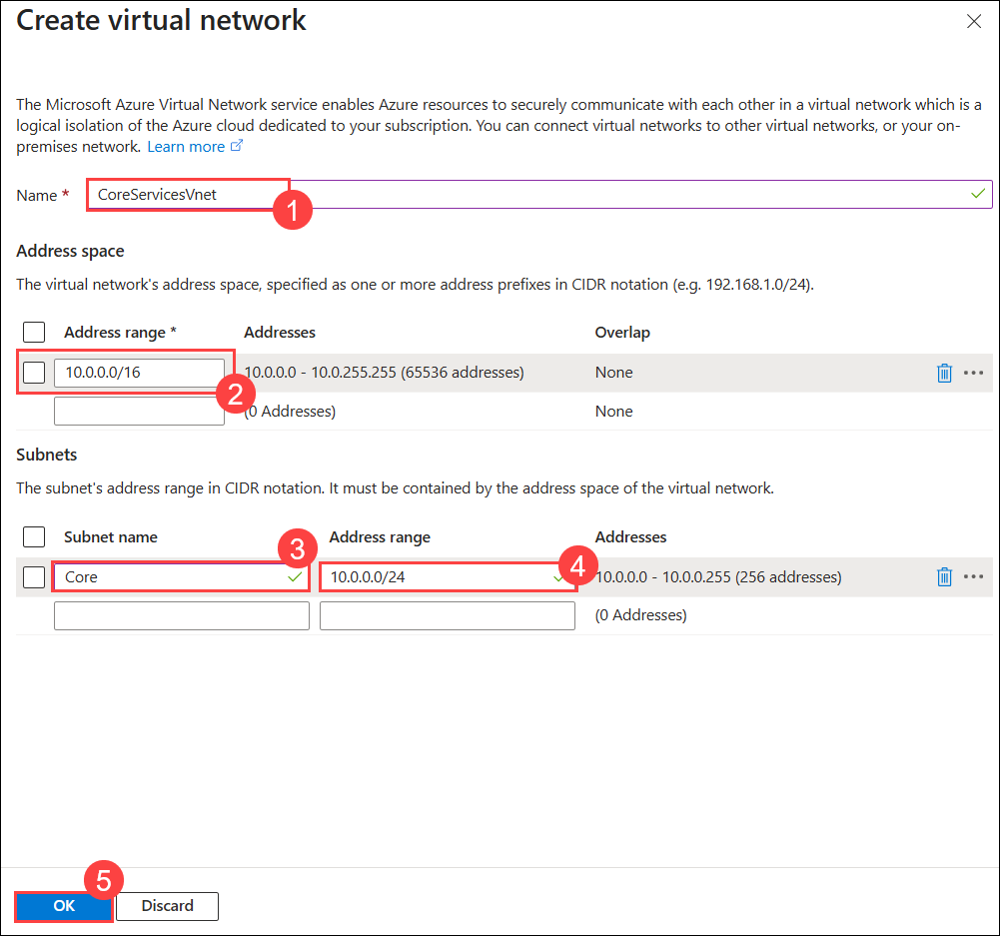     

1. Select the **Monitoring (1)** tab. For Boot diagnostics, select **Disable (2)** and then select **Review + create (3)**.

    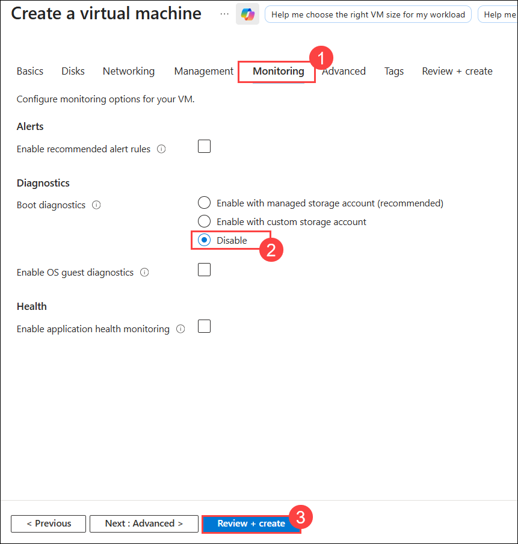 

1. Then select **Create**.

1. **You do not need to wait for the resources to be created. Continue on to the next task.**

    > **Congratulations** on completing the task! Now, it's time to validate it. Here are the steps:
    > - Hit the Validate button for the corresponding task. If you receive a success message, you can proceed to the next task. 
    > - If not, carefully read the error message and retry the step, following the instructions in the lab guide.
    > - If you need any assistance, please contact us at cloudlabs-support@spektrasystems.com. We are available 24/7 to help
    
    <validation step="09f1095d-1edd-426d-bc09-7561f935d043" />

## Task 2: Create a virtual machine in a different virtual network

In this task, you create a manufacturing services virtual network with a virtual machine. 

1. From the Azure Portal, search for **Virtual Machines (1)** and select **Virtual Machines (2)**.

    

1. From the virtual machines page, select **Create (1)** then select **Virtual machine (2)**.

    

1. On the Basics tab, use the following information to complete the form, and then select **Next : Disks > (13)**. For any setting not specified, leave the default value.
 
    | Setting | Value | 
    | --- | --- |
    | Subscription |  **Leave the default Subscription (1)** |
    | Resource group |  **az104-05-rg0-<inject key="DeploymentID" enableCopy="false" /> (2)** |
    | Virtual machine name |    **ManufacturingVM<inject key="DeploymentID" enableCopy="false" /> (3)** |
    | Region | **<inject key="Region" enableCopy="false" /> (4)** |
    | Availability options | **No infrastructure redundancy required (5)** |
    | Security type | **Standard (6)** |
    | Image (See all images) | **Windows Server 2025 Datacenter - x64 Gen2 (7)** (notice your other choices) |
    | Size | **Standard_D2s_v3 (8)** |
    | Username | `azureuser` **(9)** | 
    | Password | **Pa55w.rd1234 (10)** |
    | Confirm Password | **Pa55w.rd1234 (11)** |    
    | Public inbound ports | **None (12)** |

    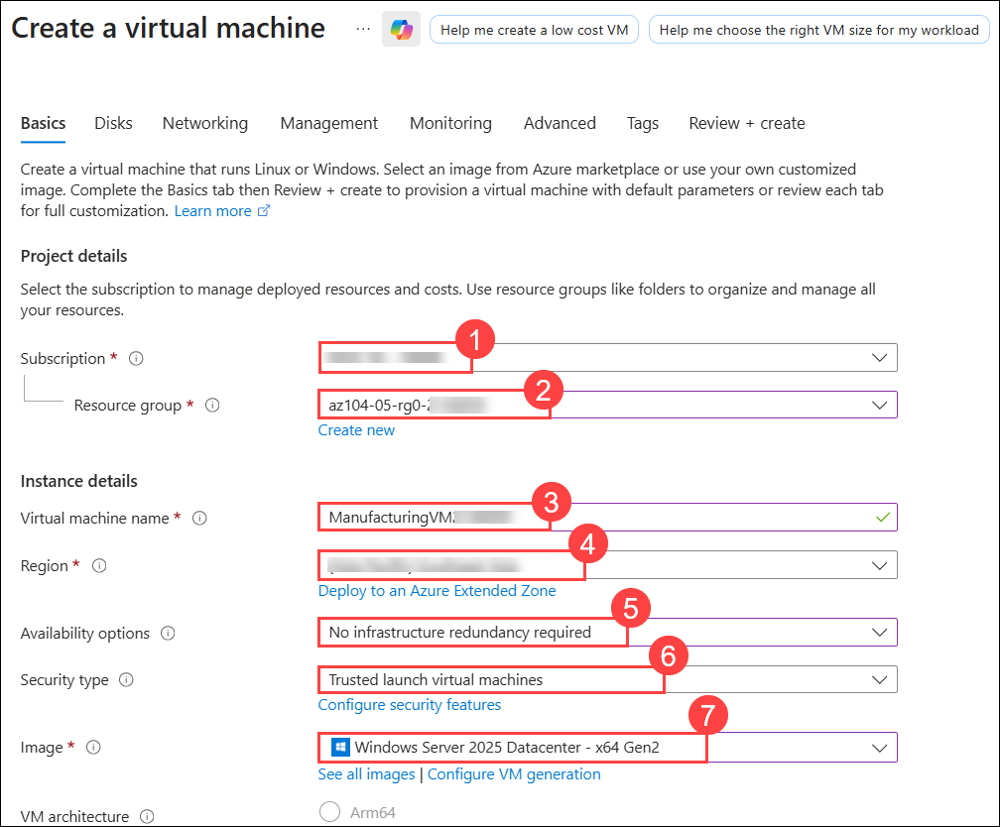
     

1. On the **Disks** tab take the defaults and then select **Next : Networking >**.

1. On the Networking tab, for Virtual network, select **Create new**.

    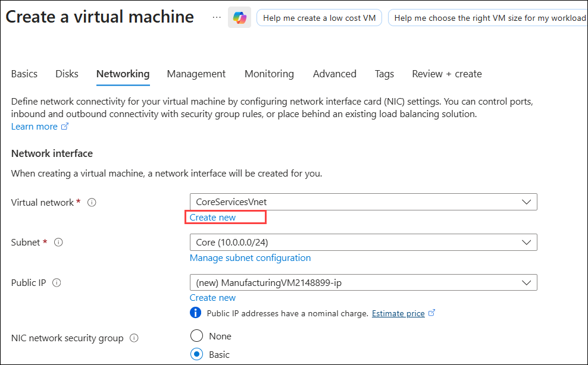

1. Use the following information to configure the virtual network, and then select **OK (5)**.  If necessary, remove or replace the existing address range.

    | Setting | Value | 
    | --- | --- |
    | Name | `ManufacturingVnet` **(1)** |
    | Address range | `172.16.0.0/16` **(2)** |
    | Subnet Name | `Manufacturing` **(3)** |
    | Subnet address range | `172.16.0.0/24` **(4)** |

    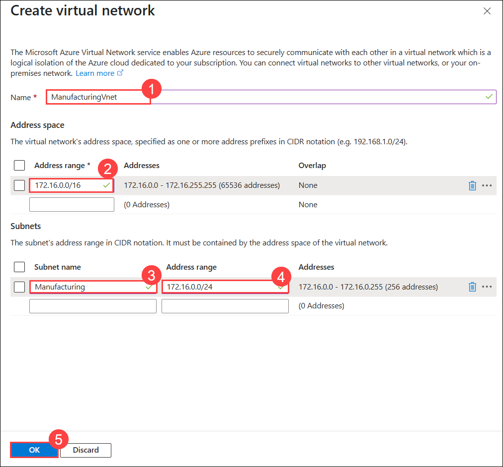    

1. Select the **Monitoring** tab. For Boot Diagnostics, select **Disable** and then elect **Review + create**.

     

1. Then select **Create**.

1. Wait for the resources to be created, it may take some time to create.

1. Once the resource is created, navigate to **Virtual Machines** 
   and ensure that both virtual machines are successfully created 
   and in the **Running** state.

   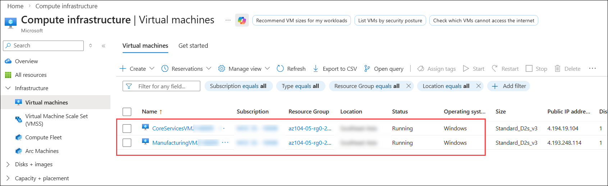

   > **Congratulations** on completing the task! Now, it's time 
   > to validate it. Here are the steps:
   >
   > - Hit the **Validate** button for the corresponding task. 
   >   If you receive a success message, you can proceed to the 
   >   next task.
   > - If not, carefully read the error message and retry the 
   >   step, following the instructions in the lab guide.
   > - If you need any assistance, please contact us at 
   >   cloudlabs-support@spektrasystems.com. We are available 
   >   24/7 to help.

   <validation step="09364bbd-444c-448b-b0c5-6a64024f1644" />

## Task 3: Use Network Watcher to test the connection between virtual machines

In this task, you verify that resources in peered virtual networks 
can communicate with each other. Network Watcher will be used to 
test the connection. Before continuing, ensure both virtual machines 
have been deployed and are running.

1. From the Azure portal, search for **Network Watcher (1)** and 
   select **Network Watcher (2)**.

   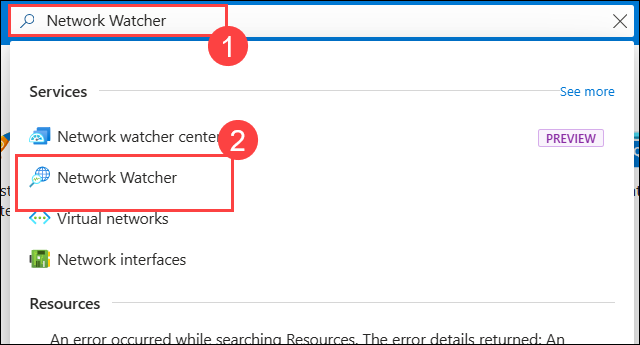

1. From Network Watcher, in the **Network diagnostic tools (1)** menu, select **Connection troubleshoot (2)**.

    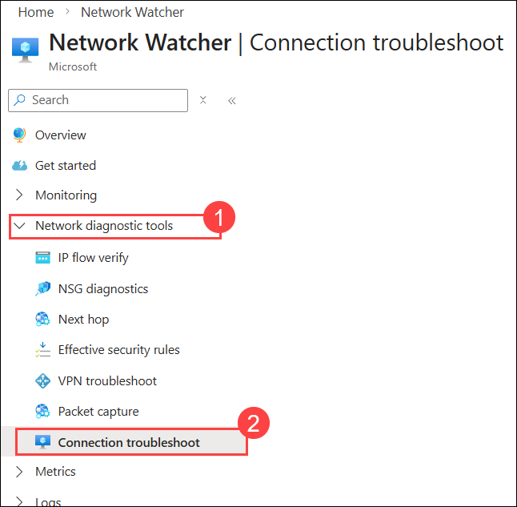

1. Use the following information to complete the fields on the **Connection troubleshoot** page.

    | Field | Value | 
    | --- | --- |
    | Source type           | **Virtual machine (1)**   |
    | Virtual machine       | **CoreServicesVM<inject key="DeploymentID" enableCopy="false" /> (2)**    | 
    | Destination type      | **Select a virtual machine (3)**   |
    | Virtual machine       | **ManufacturingVM<inject key="DeploymentID" enableCopy="false" /> (4)**   | 
    | Preferred IP Version  | **Both (5)**              | 
    | Protocol              | **TCP (6)**               |
    | Destination port      | `3389` **(7)**               |  
    | Source port           | *Blank*   **(8)**      |
    | Diagnostic tests      | *Defaults*  **(9)**    |

    - Select **Run diagnostic tests (10)**

      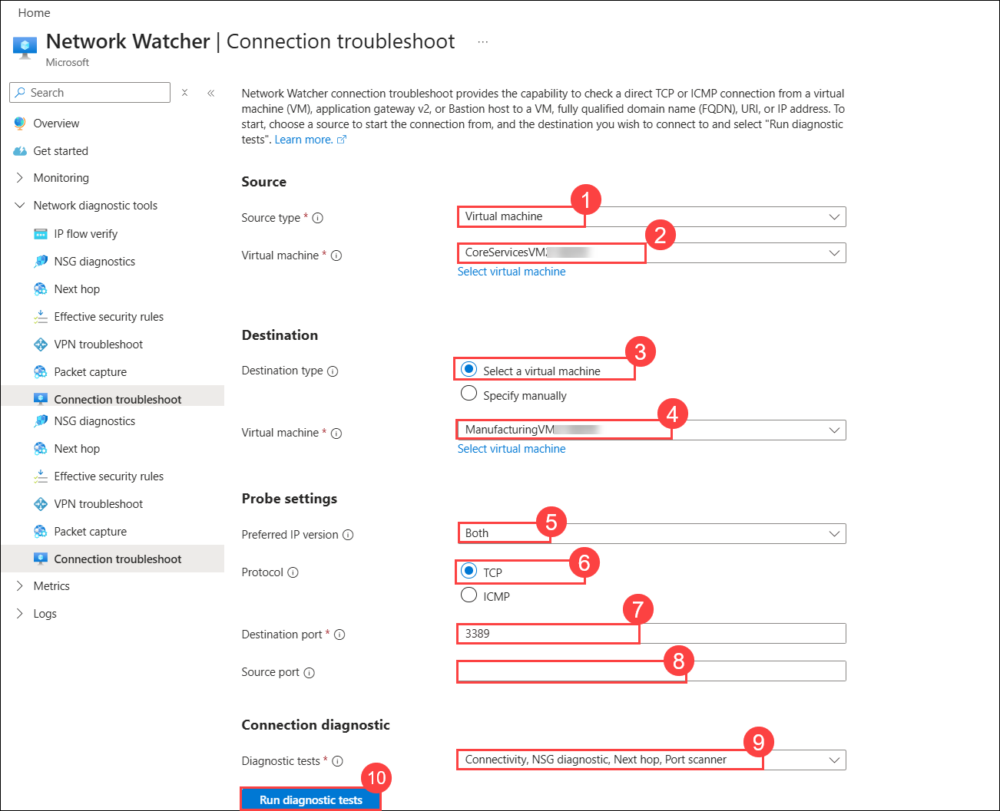

1. It may take a couple of minutes for the results to be returned. The screen selections will be greyed out while the results are being collected.

1. Notice the **Connectivity test** shows **Unreachable**. This makes sense because the virtual machines are in different virtual networks. 

    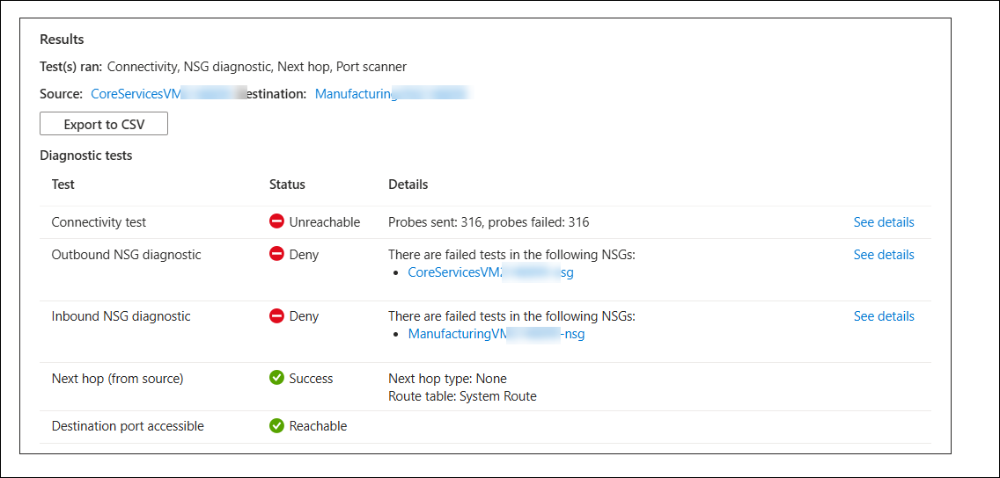

     
## Task 4: Configure virtual network peerings between virtual networks

In this task, you create a virtual network peering to enable communications between resources in the virtual networks. 

1. In the Azure portal, search for **Virtual network (1)** and then select **Virtual network (2)**.

    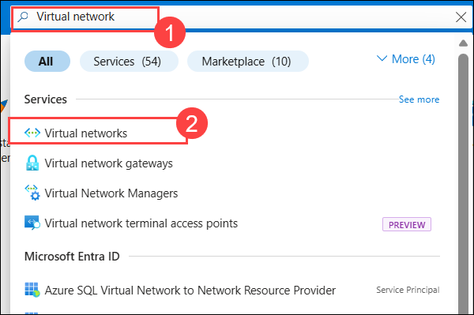

1. Select the `CoreServicesVnet` virtual network.

    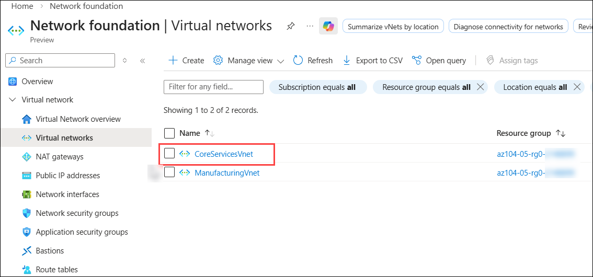

1. In CoreServicesVnet, under **Settings**, select **Peerings**.

1. On CoreServicesVnet, under Peerings, select **+ Add**.

    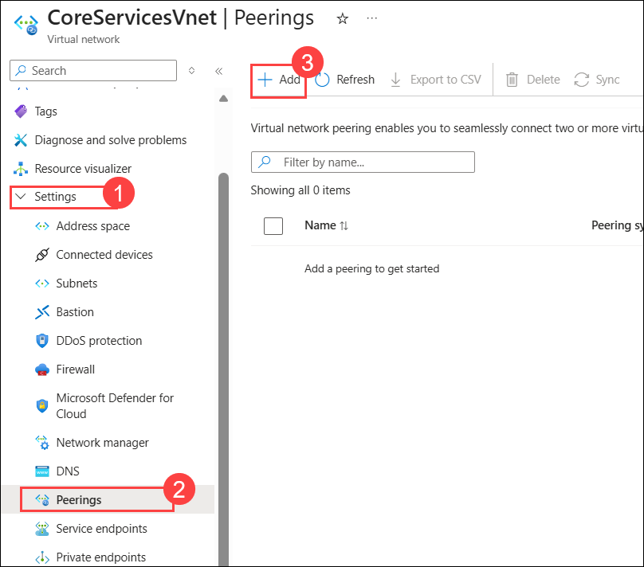

1. Add the following details, if not specified, take the default and then click **Add (8)**: 

    | **Parameter**                                    | **Value**                             |
    | --------------------------------------------- | ------------------------------------- |
    | Peering link name                             | `ManufacturingVnet-to-CoreServicesVnet` **(1)** |
    | Virtual network    | **ManufacturingVnet (az104-05-rg0-<inject key="DeploymentID" enableCopy="false" />) (2)**  |
    | Allow 'ManufacturingVnet' to access 'CoreServicesVnet'  | **selected (default) (3)** |
    | Allow 'ManufacturingVnet' to receive forwarded traffic from 'CoreServicesVnet' | **selected (4)**  |    
    | Peering link name                             | `CoreServicesVnet-to-ManufacturingVnet` **(5)** |
    | Allow 'CoreServicesVnet' to access 'ManufacturingVnet'            | **selected (default) (6)** |
    | Allow 'CoreServicesVnet' to receive forwarded traffic from 'ManufacturingVnet' | **selected (7)** |

    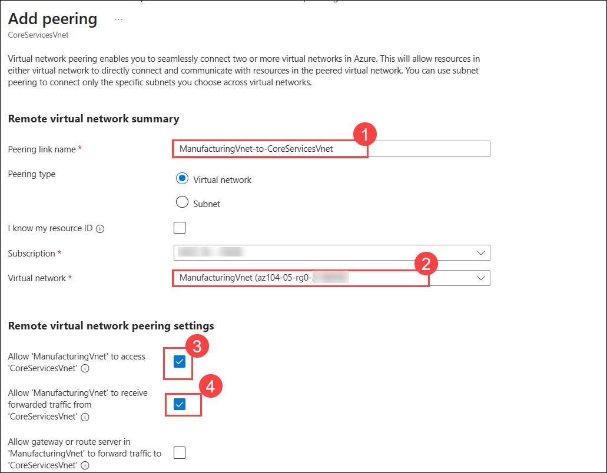
    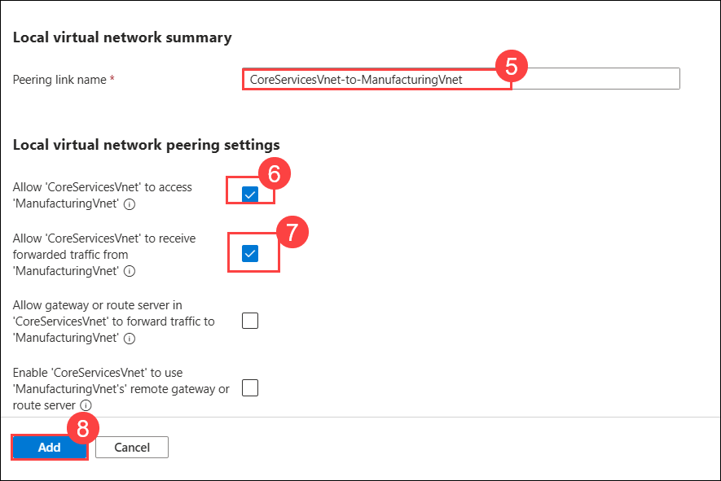        

1. In CoreServicesVnet, under Peerings, verify that the **CoreServicesVnet-to-ManufacturingVnet** peering is listed. Refresh the page to ensure the **Peering status** is **Connected**.

    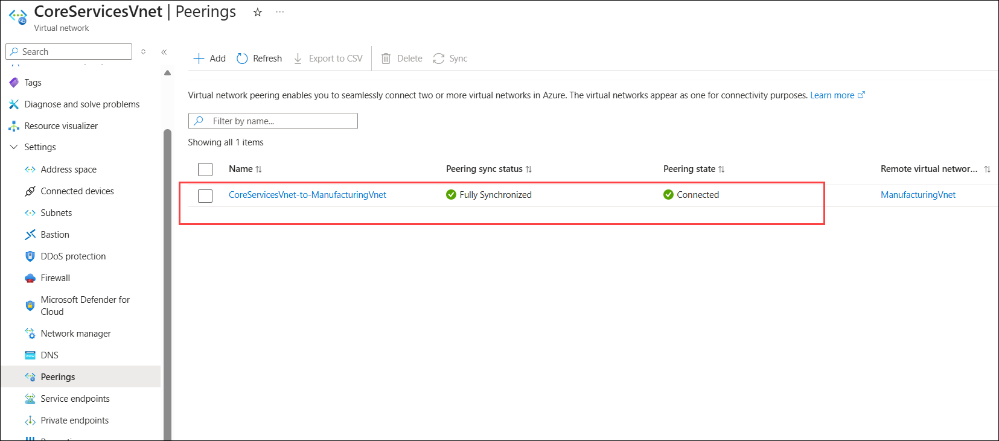

1. Switch to the **ManufacturingVnet**.

    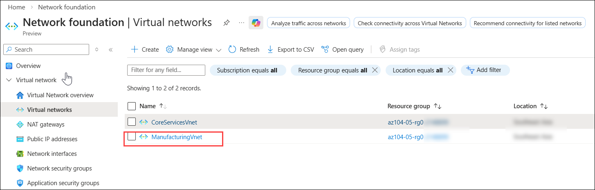

1. Select **Peerings** under Settings. Verify **ManufacturingVnet-to-CoreServicesVnet** peering is listed. Ensure the **Peering status** is **Connected**. You may need to **Refresh** the page. 

    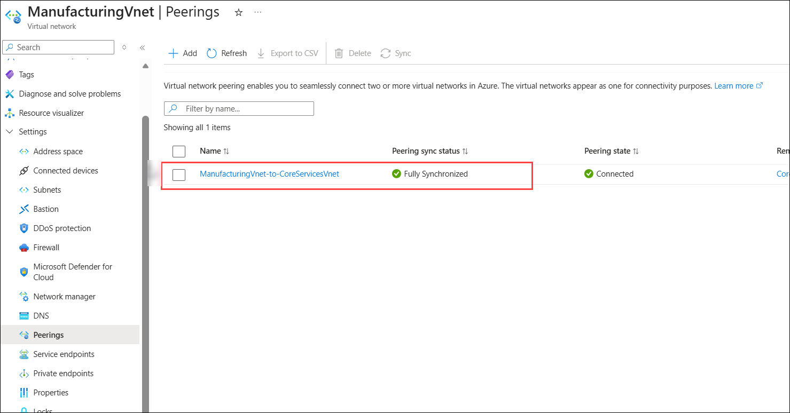

## Task 5: Use Azure PowerShell to test the connection between virtual machines

In this task, you retest the connection between the virtual machines in different virtual networks. 

1. From the Azure portal, search for and select the **CoreServicesVM<inject key="DeploymentID" enableCopy="false" />** virtual machine.

    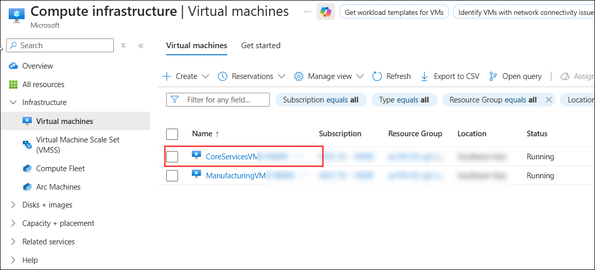

1. On the **Overview** blade, in the **Networking** section, select **Network settings (1)** and then record the **Private IP address (2)** of the machine. You need this information to test the connection.

    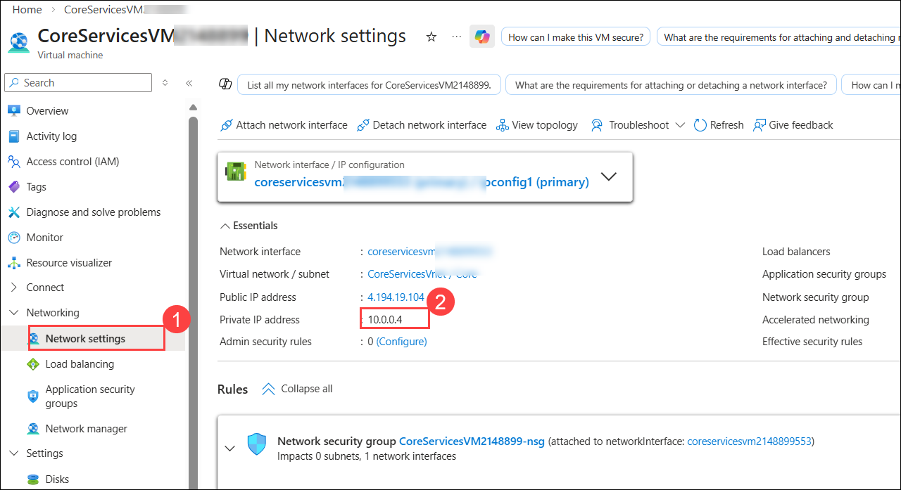
   
     >**Did you know?** There are many ways to check connections. In this task, you use **Run command**. You could also continue to use Network Watcher. Or you could use a [Remote Desktop Connection](https://learn.microsoft.com/azure/virtual-machines/windows/connect-rdp#connect-to-the-virtual-machine) to the access the virtual machine. Once connected, use **test-connection**. As you have time, give RDP a try. 

1. To Test the connection to the CoreServicesVM from the **ManufacturingVM**.Switch to the `ManufacturingVM` virtual machine.

    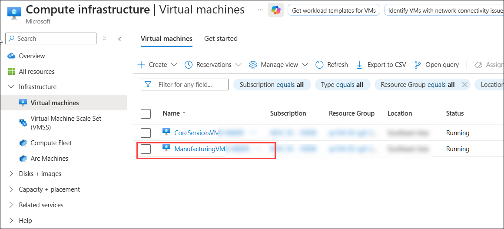

1. In the **Operations (1)** blade, select the **Run command (2)** blade and select **RunPowerShellScript (3)**.

    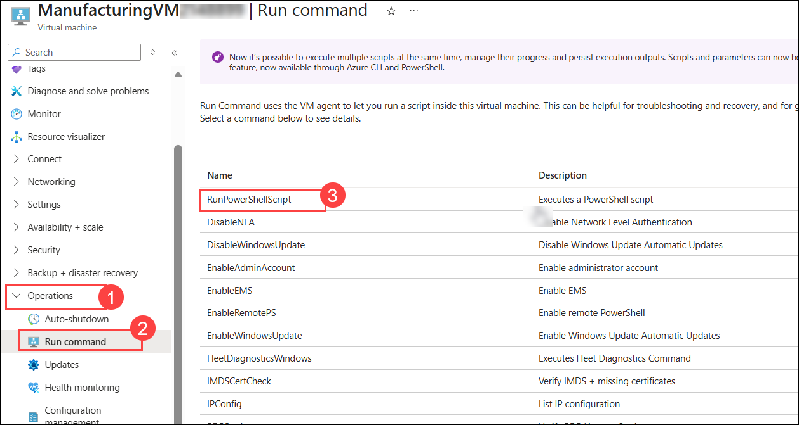

1. Run the **Test-NetConnection** command. Be sure to use the private IP address of the **CoreServicesVM**. Replace `<CoreServicesVM private IP address>` with the private IP address of the **CoreServicesVM** that you have copied in the previous step. 

    ```Powershell
    Test-NetConnection <CoreServicesVM private IP address> -port 3389
    ```

    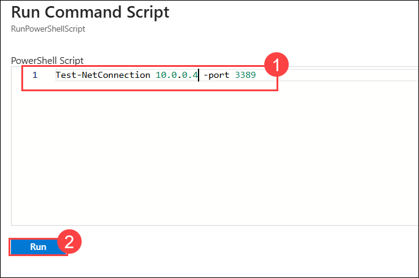

1. It may take a couple of minutes for the script to time out. The top of the page shows an informational message **Script execution in progress...**.

    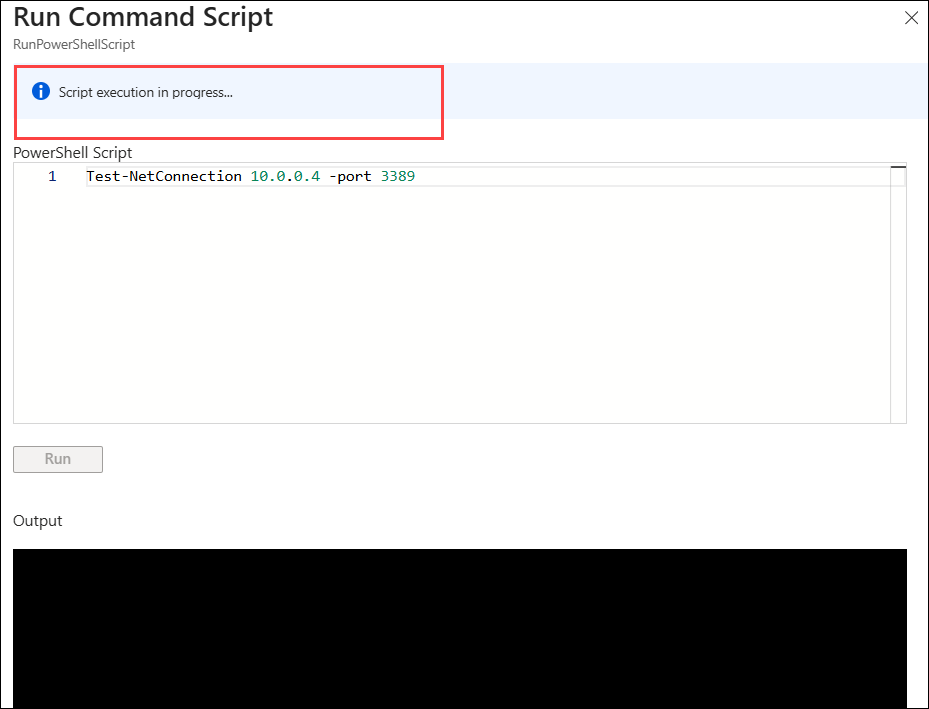
   
1. The test connection should succeed because peering has been configured. Your computer name and remote address in this graphic may be different. 
   
    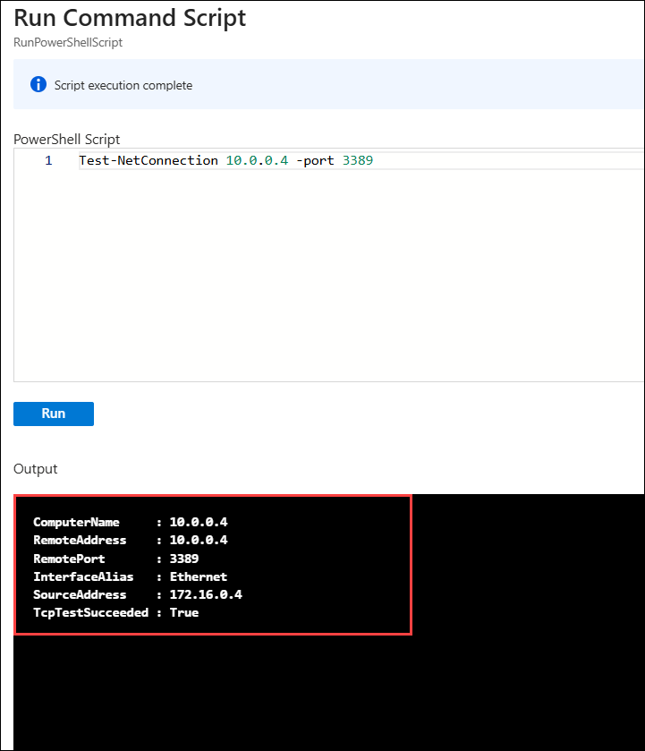


## Task 6: Create a custom route 

In this task, you want to control network traffic between the perimeter subnet and the internal core services subnet. A virtual network appliance will be installed in the perimeter subnet and all traffic should be routed there. 

1. In the Azure portal, search for **Virtual network (1)** and then select **Virtual network (2)**.

    

1. Select the `CoreServicesVnet` virtual network.

    

1. Under **Settings (1)**, select **Subnets (2)** and then **+ Subnet (3)**.

    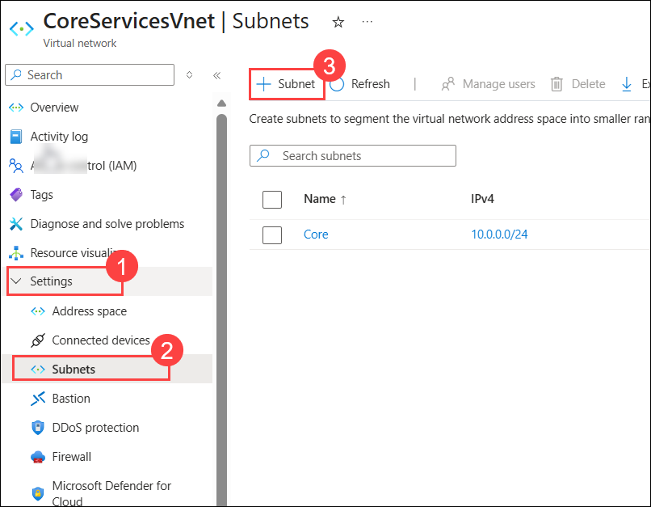

1. Be sure to select **Add (4)** to save your changes. 

    | Setting | Value | 
    | --- | --- |
    | Name | `perimeter` **(1)** |
    | Starting address | `10.0.1.0` **(2)** |
    | Size | `24` **(3)** |    

    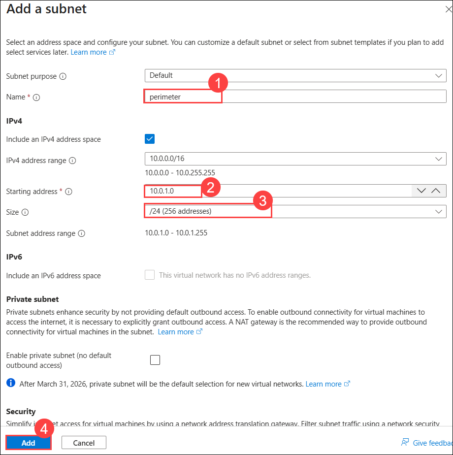
   
1. In the Azure portal, search for **Route tables (1)** and select `Route tables` **(2)**.

    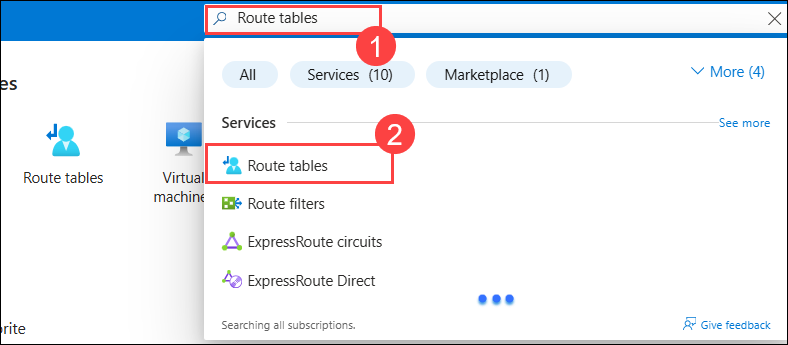

1. Select **+ Create**.

1. Enter the following details, select **Review + create (6)**:

    | Setting | Value | 
    | --- | --- |
    | Subscription | your subscription |
    | Resource group **(1)** | **az104-05-rg0-<inject key="DeploymentID" enableCopy="false" /> (2)**  |
    | Region | **<inject key="Region" enableCopy="false" /> (3)** |
    | Name | **rt-CoreServices<inject key="DeploymentID" enableCopy="false" /> (4)** |
    | Propagate gateway routes | **No (5)** |

    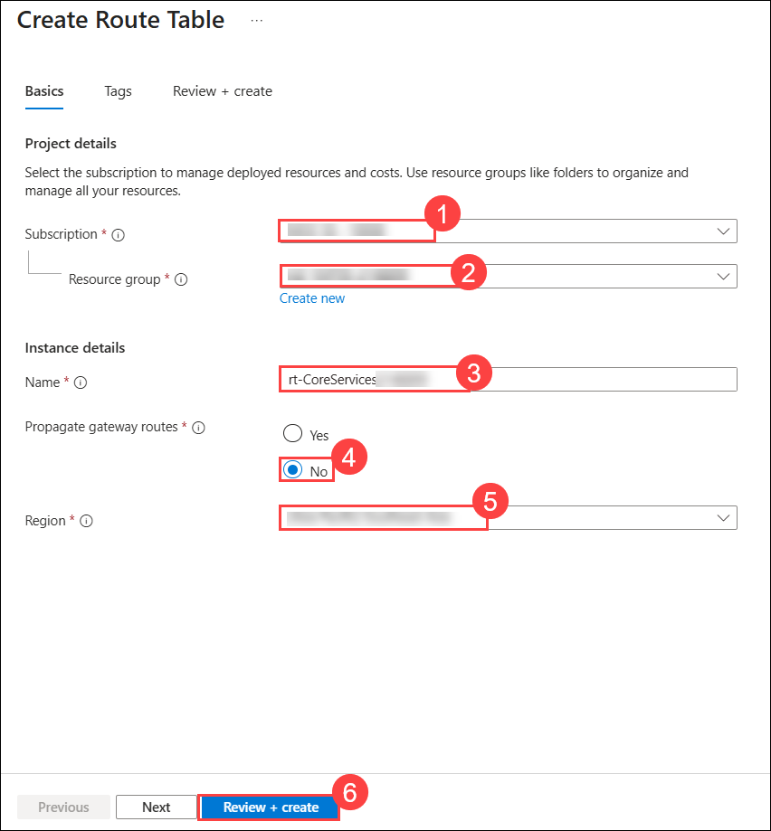    

1. Then select **Create**.     

1. After the route table deploys, select **Go to resources**.

    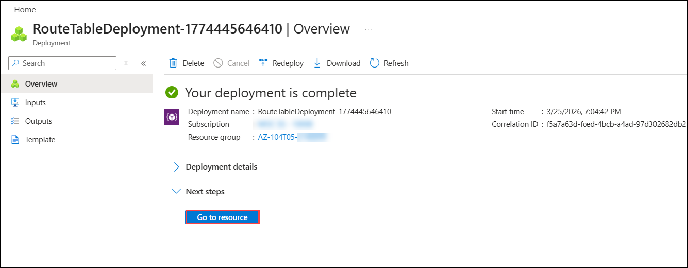 
   
1. Select **Routes (1)** and then **+ Add (2)**.

    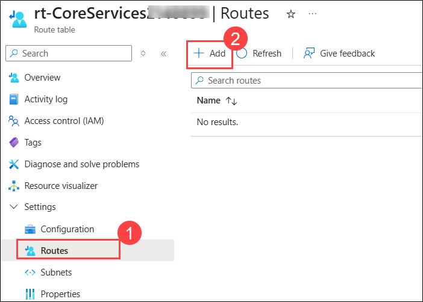 

1. Create a route from a future Network Virtual Appliance (NVA) to the CoreServices virtual network. 

    | Setting | Value | 
    | --- | --- |
    | Route name | `PerimetertoCore` **(1)** |
    | Destination type | **IP Addresses (2)** |
    | Destination IP addresses | `10.0.0.0/16` **(3)** (core services virtual network) |
    | Next hop type | **Virtual appliance (4)** (notice your other choices) |
    | Next hop address | `10.0.1.7` **(5)** (future NVA) |

    - Select **Add (6)**

    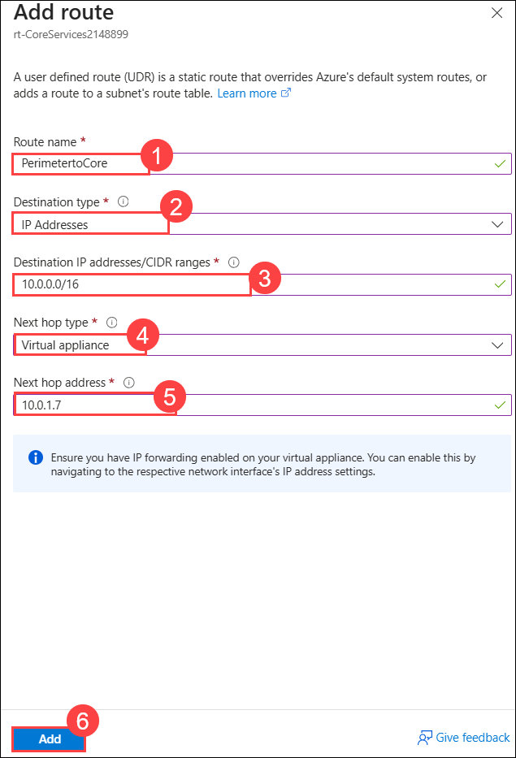 

1. The last thing to do is associate the route with the subnet. Select **Subnets (1)** and then **+ Associate (2)**. Complete the configuration.

    | Setting | Value | 
    | --- | --- |
    | Virtual network | **CoreServicesVnet (az104-05-rg0-<inject key="DeploymentID" enableCopy="false" />) (3)** |
    | Subnet | **Core (4)** |  
    
    - Select **OK (5)**

      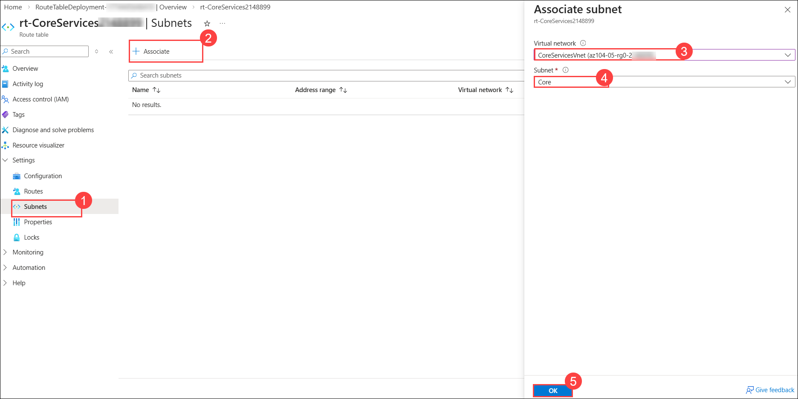       

       >**Note**: You have created a user defined route to direct traffic from the DMZ to the new NVA.
       
    > **Congratulations** on completing the task! Now, it's time to validate it. Here are the steps:
    > - Hit the Validate button for the corresponding task. If you receive a success message, you can proceed to the next task. 
    > - If not, carefully read the error message and retry the step, following the instructions in the lab guide.
    > - If you need any assistance, please contact us at cloudlabs-support@spektrasystems.com. We are available 24/7 to help
    
    <validation step="57cfeac0-1b62-4274-a476-f8fd8fa27802" />   


### Review

In this lab, you have completed the following:

- Created a core services virtual machine and virtual network
- Created a virtual machine in a different virtual network
- Used Network Watcher to test the connection between virtual machines
- Configured virtual network peerings between different virtual networks
- Used Azure PowerShell to test the connection between virtual machines
- Created a custom route

### You have successfully completed the lab
