# Lab : Implement Web Apps

## Lab Overview

In this lab, you will learn to create and configure Azure Web Apps to host websites, including setting the runtime stack and application settings. 

## Lab Objectives

In this lab, you will complete the following tasks:

+ Task 1: Create and configure an Azure web app.
+ Task 2: Create and configure a deployment slot.
+ Task 3: Configure web app deployment settings.
+ Task 4: Swap deployment slots.
+ Task 5: Configure and test autoscaling of the Azure web app.

## Exercise 1: Implement Web Apps

This exercise involves creating, configuring, and managing Azure Web Apps for hosting websites with continuous integration, delivery, and autoscaling capabilities.

### Task 1: Create an Azure web app

In this task, you will create an Azure Web App, which is a platform-as-a-service (PaaS) offering that allows you to deploy and manage web applications in a cloud environment. 

1. In the Azure portal, search for **App services (1)** and select **App services (2)** from results.

   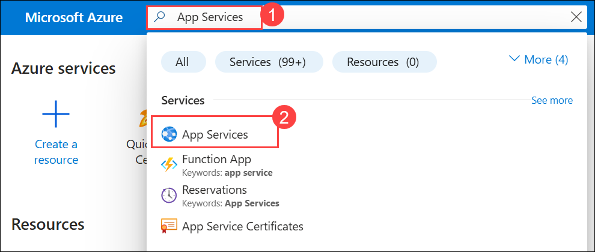

1. On the **App Services** blade. Click **+ Create (1)** and choose **+ Web App (2)**

   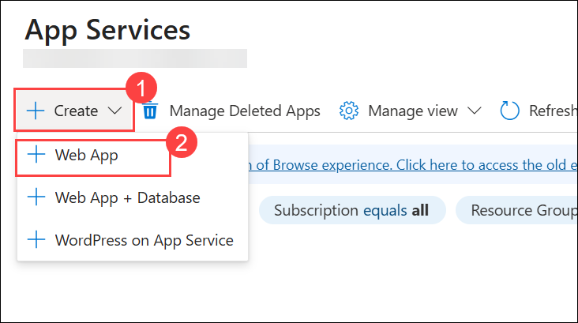
   
1. On the **Basics** tab, specify the following settings (leave others with their default values):

    | Setting | Value |
    | --- | ---|
    | Subscription | the name of the Azure subscription you are using in this lab **(1)** |
    | Resource group | Select **az104-09a-rg1 (2)** |
    | Web app name | webapp<inject key="DeploymentID" enableCopy="false" /> **(3)** |
    | Publish | **Code (4)** |
    | Runtime stack | **PHP 8.2 (5)** |
    | Operating system | **Linux (6)** |
    | Region | **<inject key="Region" enableCopy="false"/> (7)** |

    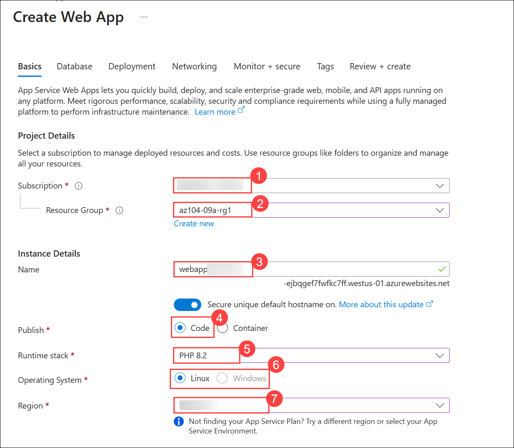

    | Setting | Value |
    | --- | ---|
    | Pricing plans | Click on **Explore  pricing plan (8)** |   

    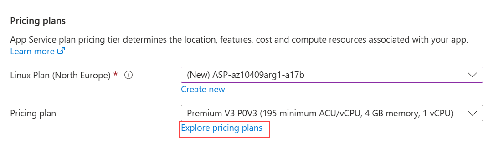

     - Select **Premium V3 P1V3 (1)**
 and **Select (2)** 

       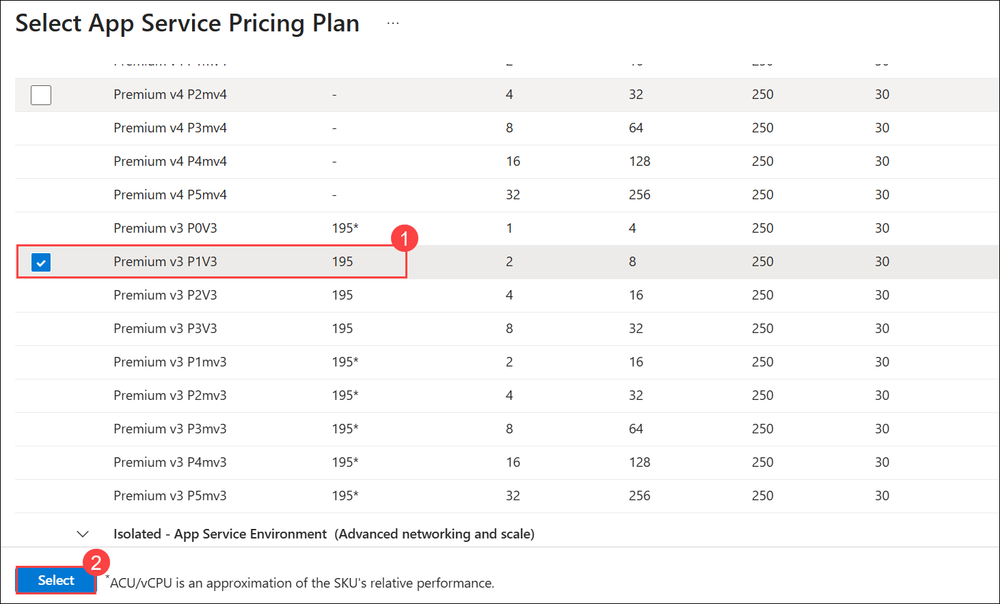

     - Click **Review + create**.

       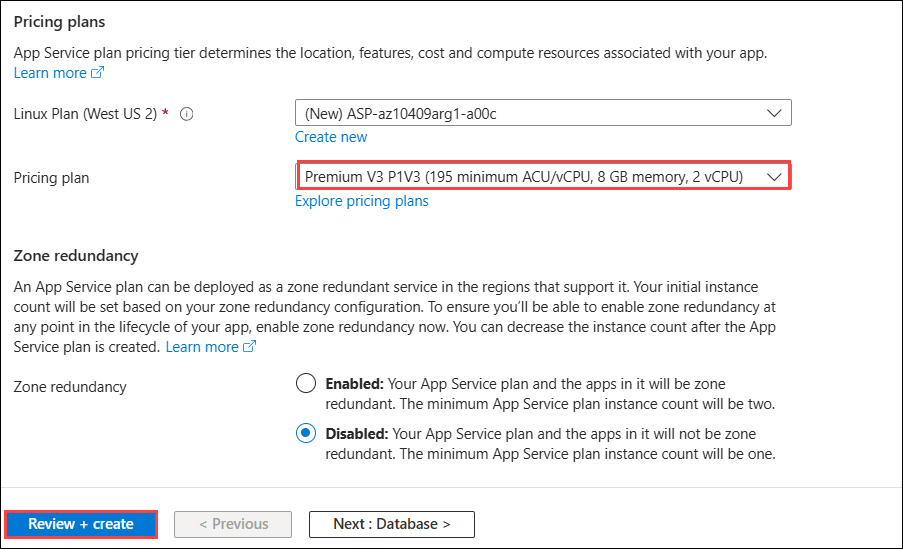     
   
1. On the **Review + create** tab of the **Create Web App** blade, ensure that the validation passed and click **Create**.

     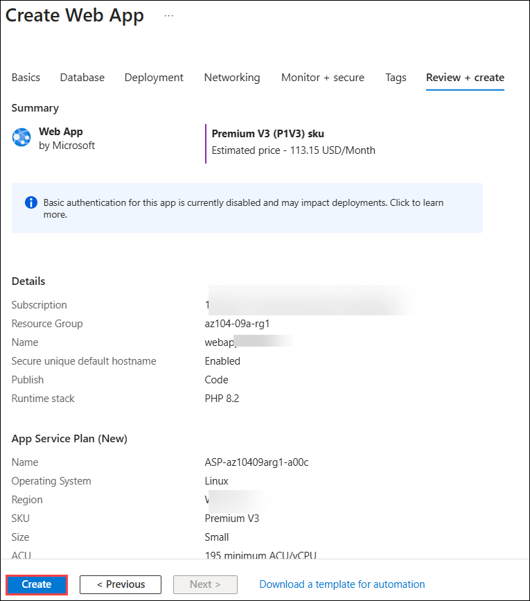

     >**Note:** Wait until the web app is created before you proceed to the next task. This should take about a minute.

     >**Note:** If the deployment fails, change to another region and try again. For example, switch to **East US 2 or Canada central**. 

1. On the deployment blade, click **Go to resource**.

     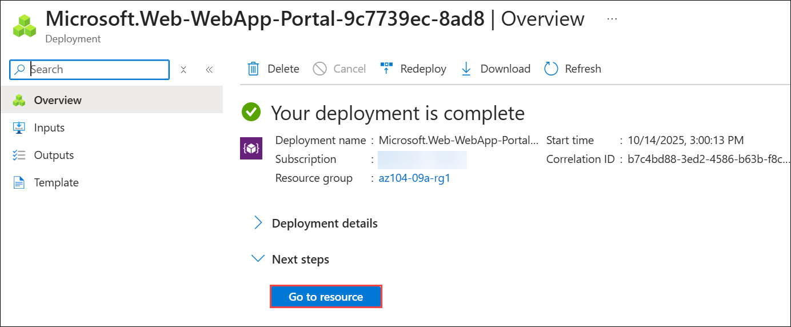

### Task 2: Create a staging deployment slot

In this task, you will create a staging deployment slot in Azure Web Apps, which allows you to test new versions of your web application in a production-like environment without affecting the live production app.

1. On the blade of the newly deployed web app, click the **Browse** tab to display the default web page in a new browser tab.

    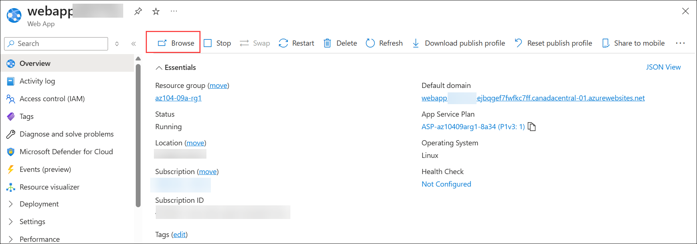

    >**Note:** While navigating to the link if you get an error,kindly try refreshing the browser window.
 
    >**Note:** **Please copy the URL and save it in Notepad**. You may need this link for Task 5.

     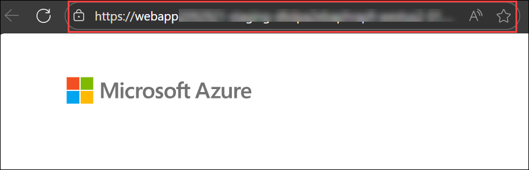    

1. Close the new browser tab and, back in the Azure portal, in the **Deployment** section in the left navigation pane of the web app blade, click **Deployment slots (1)**.

1. Click **Add slot (2)**, and add a new slot with the following settings then click on **Add (3)**. 

    | Setting | Value |
    | --- | ---|
    | Name | **staging (1)** |
    | Clone settings from | **Do not clone settings (2)**|

    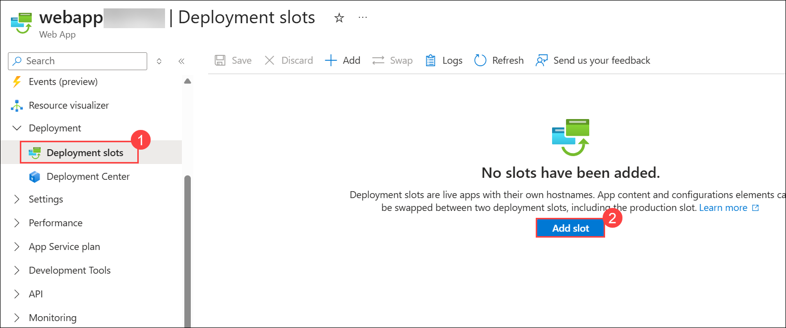

    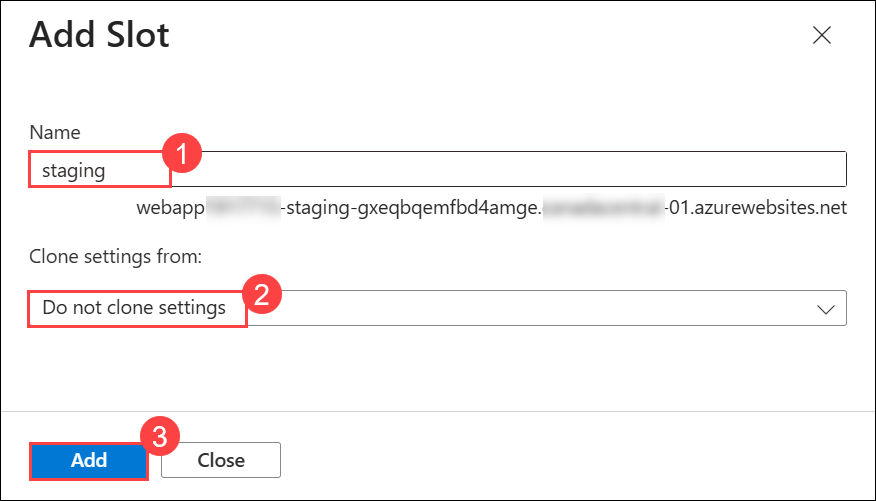

1. Once you see **Successfully created slot 'staging'** click on **Close**.
     
1. Back on the **Deployment slots** blade of the web app, click the entry representing the newly created staging slot.

     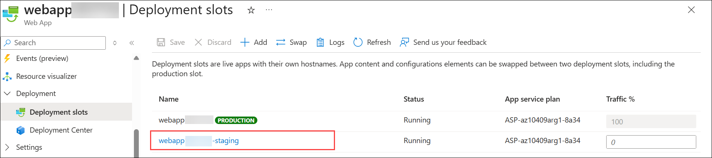

     >**Note:** This will open the blade displaying the properties of the staging slot.

1. Click on the **Browse** tab.

     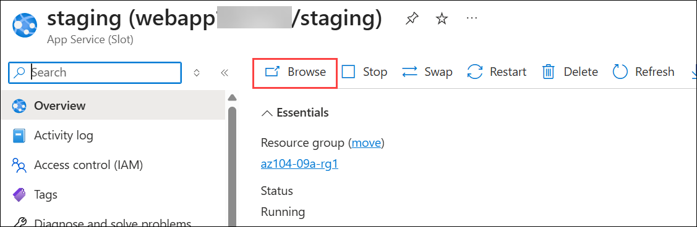

1. Review the staging slot blade and note that its URL differs from the one assigned to the production slot.

## Task 3: Configure Web App deployment settings

In this task, you will configure Web App deployment settings. Deployment settings allow for continuous deployment. This ensures that the app service has the latest version of the application.

1. In the staging slot, select **Deployment Center (1)** from the left navigation pane  and then select **Settings (2)**.

     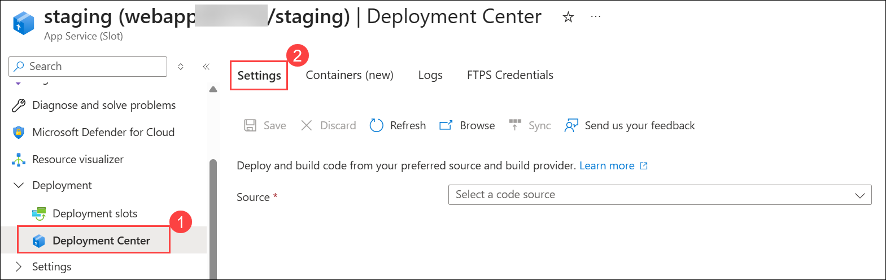

     >**Note:** Make sure you are on the staging slot blade (instead than the production slot).
    
1. In the **Source** drop-down list, select **External Git (1)**. Notice the other choices. 

1. In the repository field, enter `https://github.com/Azure-Samples/php-docs-hello-world` **(2)**

1. In the branch field, enter `master` **(3)**.

1. Select **Save (4)**.

     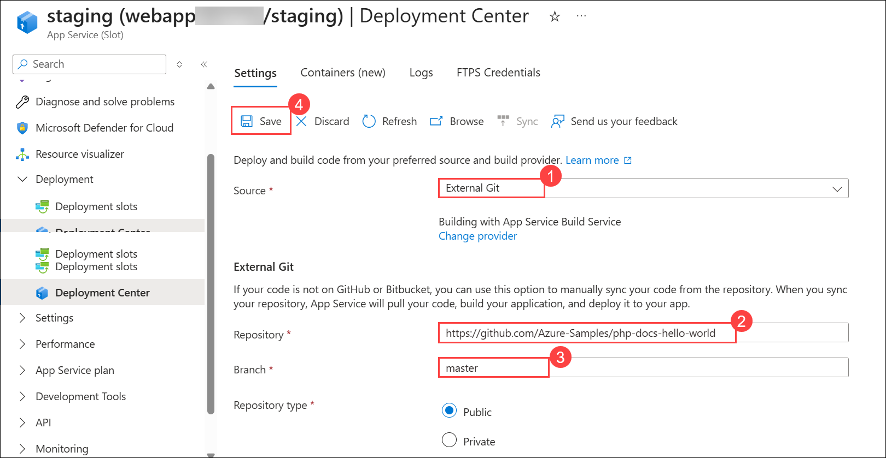

1. From the staging slot, select **Overview (1)**.

1. Select the **Default domain (2)** link, and open the URL in a new tab. 

    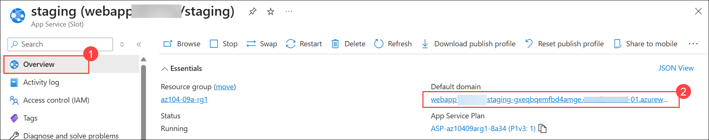

1. Verify that the staging slot displays **Hello World**.

     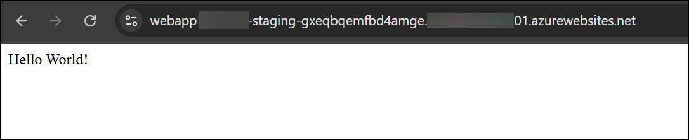
   
     >**Note:** The deployment may take a minute. Be sure to **Refresh** the application page.

### Task 4: Swap the staging slots

In this task, you will swap the staging slot with the production slot.

1. Navigate back to the **Azure Portal**.

1. In the **Deployment** section, click **Deployment slots (1)** and then, click **Swap (2)** toolbar icon.

1. On the **Swap** blade, review the default settings and click **Start Swap (3)**.

    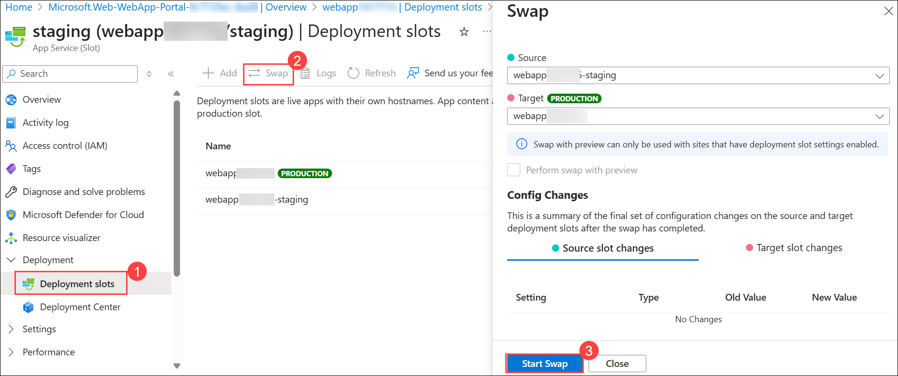

    >**Note:** Kindly Wait till Swap successfully complete.

1. Once you get **Successfully completed swap between slot 'staging' and slot 'production'** click on **Close**.

    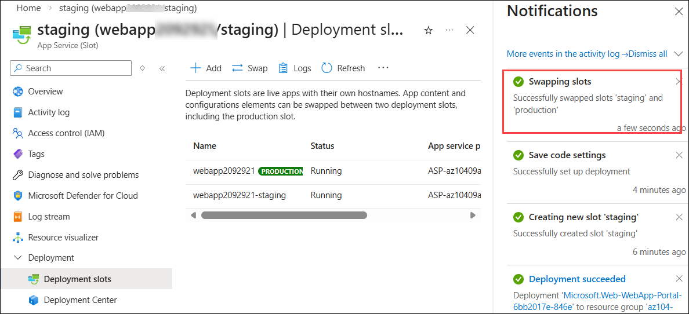
   
1. Click **Overview** on the production slot blade of the web app and then click the **URL** link to display the web site home page in a new browser tab.

     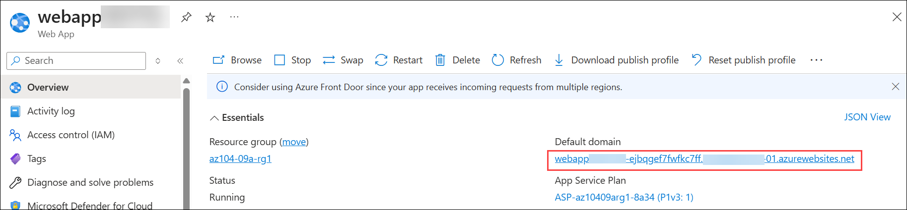

1. Verify the default web page has been replaced with the **Hello World!** page.

     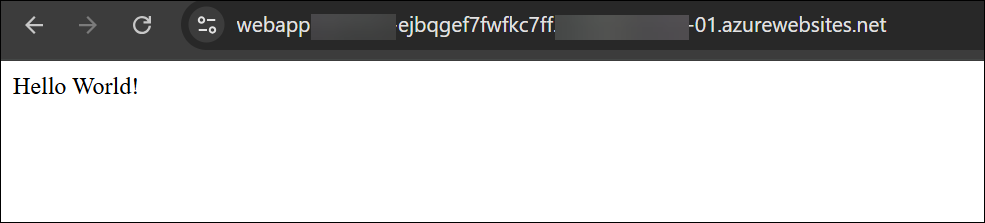

### Task 5: Configure and test autoscaling of the Azure web app

In this task, you will configure autoscaling of Azure Web App. Autoscaling enables you to maintain optimal performance for your web app when traffic to the web app increases. To determine when the app should scale you can monitor metrics like CPU usage, memory, or bandwidth.

1. From the left navigation pane, under the **App Service plan (1)** section, select **Scale out (2)**.

    >**Note:** Ensure you are working on the production slot not the staging slot.  

     - From the **Scaling** section, select **Automatic (3)**. Notice the **Rules Based** option. Rules based scaling can be configured for different app metrics. 

     - In the **Maximum burst** field, select **2 (4)**.

     - Select **Save (5)**.

       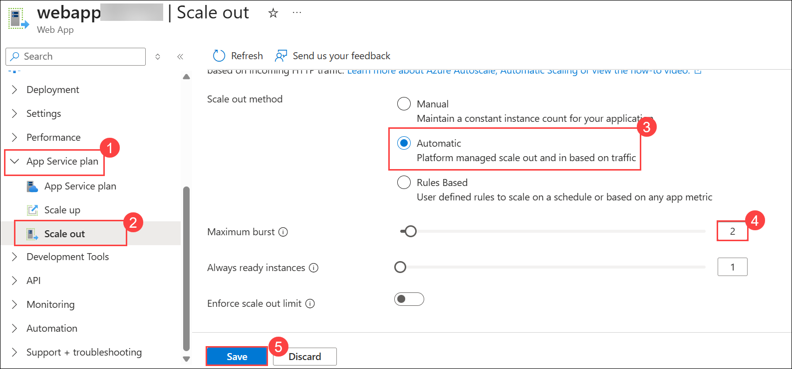

        >**Note:** Please disregard any scale-out errors and proceed with the subsequent steps.
   
1. Select **Diagnose and solve problems (1)** (left pane) and in the **Load Test your App** box, select **Create Load Test (2)**.

     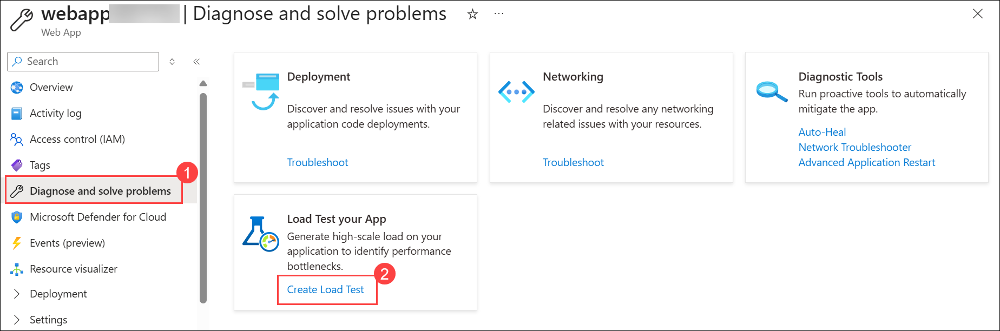

1. In the **Azure Load Testing** blade, select **+ Create** to start creating a new load testing resource.      

     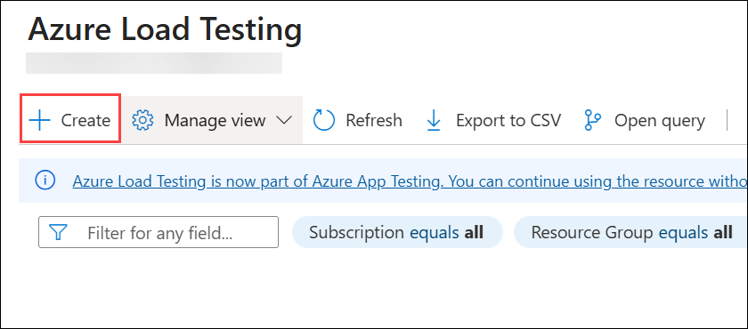

1. On **Create a load testing resource** blade specify the following and click  **Review + create (5)** .

    | Setting | Value |
    | --- | ---|
    | Subscription | the name of the Azure subscription you are using in this lab **(1)** |
    | Resource group | Select **az104-09a-rg1 (2)** |
    | load test name | **loadtest<inject key="DeploymentID" enableCopy="false" /> (3)**|
    |region  | Leave the region as default **(4)**|

     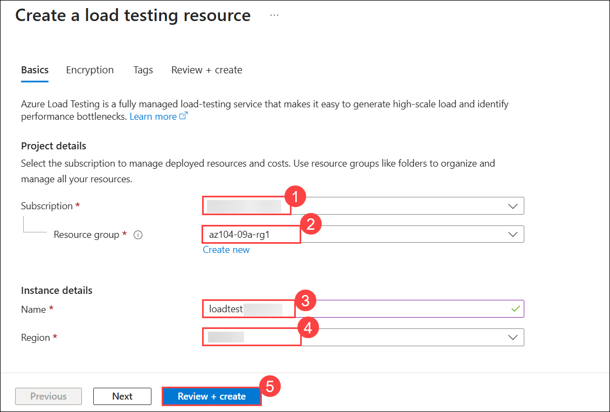
   
1. On the **Review + create** tab, verify the configuration details and select **Create** to deploy the load testing resource.  

     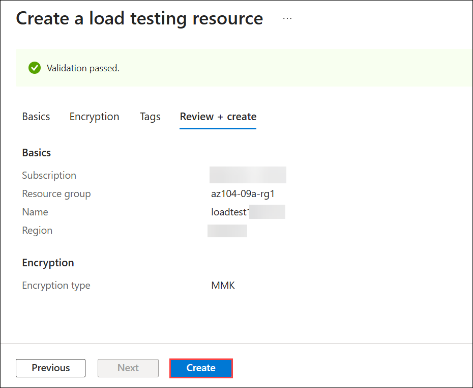

1. Wait for the load test to create, and then select **Go to resource**.

     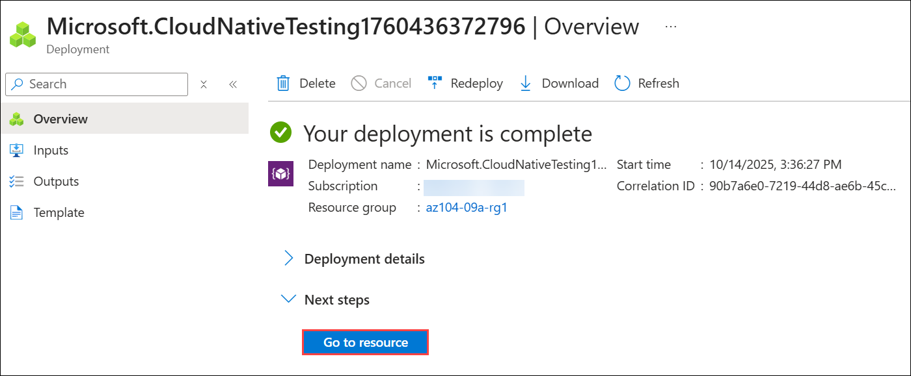

1. From the **Overview (1)**  of Azure load testing blade, under **create by adding HTTP requests**, select **Create (2)**.

    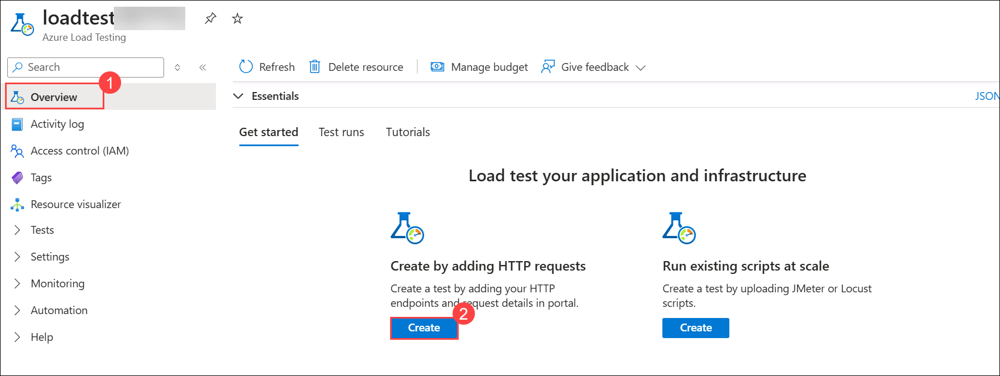

1. On the **Test plan (1)** tab, click **Add request (2)**. In the **URL field**, paste in your **Default domain (3)** URL we had copied in task 2 step number 1. Ensure this is properly formatted and begins with **https://** then click **Add (4)**.

    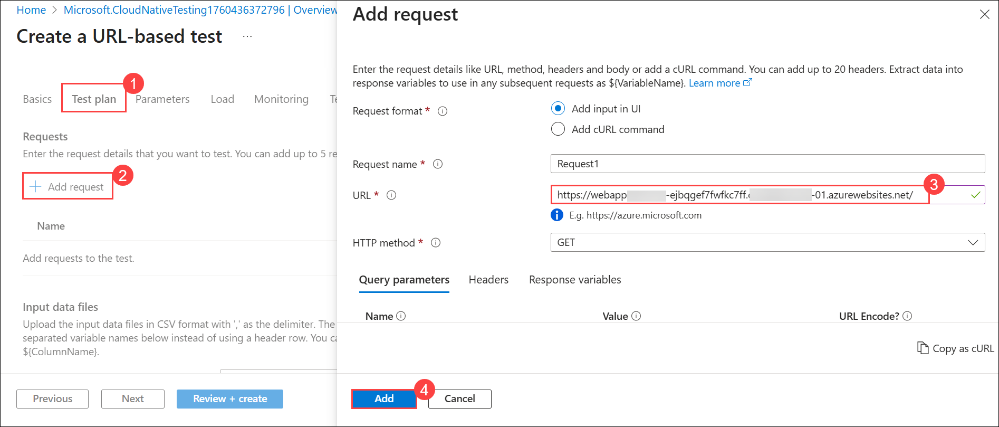

1. Select **Review + create** and **Create**.

    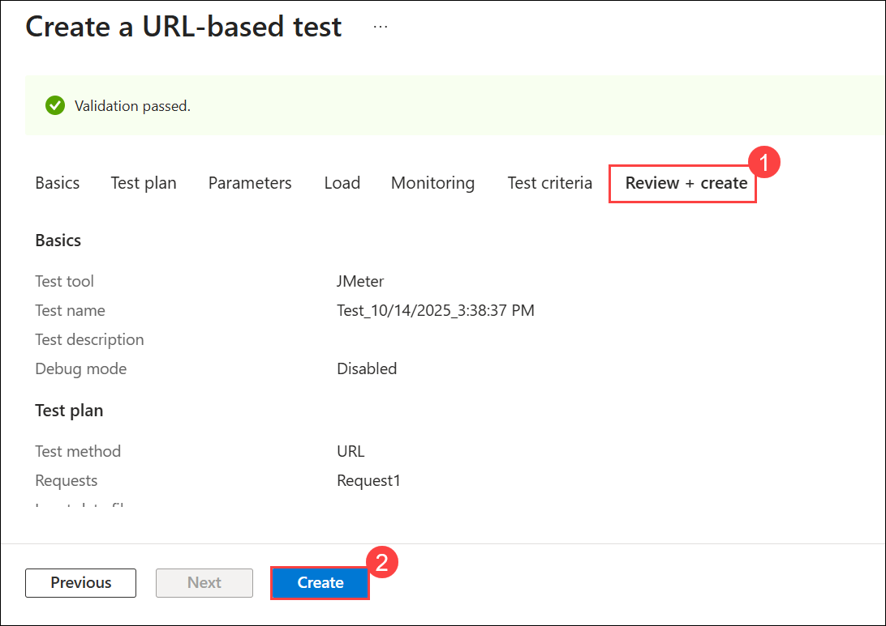

    >**Note:** It may take a couple of minutes to create the test. 

1. Select **Go to resources**.

1. Select **Test (1)** and then the name of the test **(2)**.

    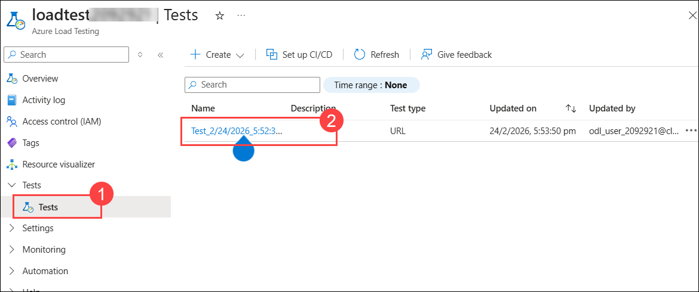

1. Select the Test run.

    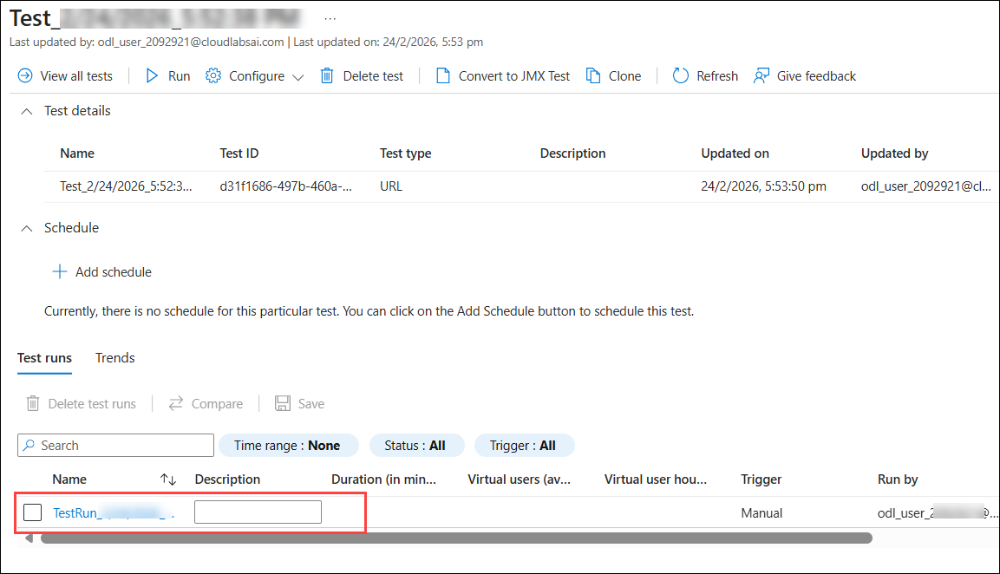

1. It may take a couple of minutes to process. Once it is done, review the test results including **Virtual users**, **Response time**, and **Requests/sec**.

     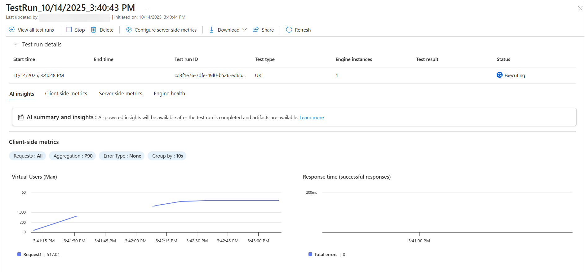

     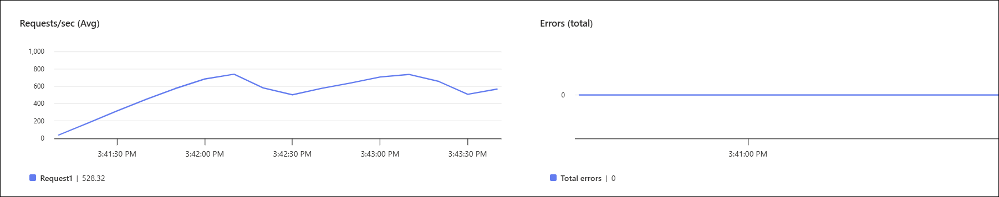

1. Select **Stop** to complete the test run.

     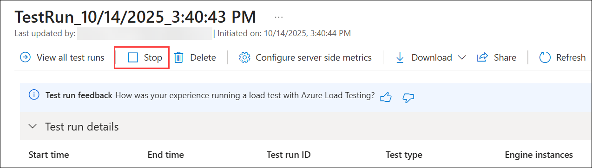

   > **Congratulations** on completing the task! Now, it's time to validate it. Here are the steps:
   > - Hit the Validate button for the corresponding task. If you receive a success message, you can proceed to the next task. 
   > - If not, carefully read the error message and retry the step, following the instructions in the lab guide.
   > - If you need any assistance, please contact us at cloudlabs-support@spektrasystems.com. We are available 24/7 to help
   
   <validation step="fce39619-3758-4efe-b6d4-7060319a2f49" />

### Review

In this lab, you have completed the following:

- Created an Azure web app: You set up an Azure web app to host your application, ensuring it is properly configured to run on Azure's platform with all necessary settings and environment configurations.
- Created a staging deployment slot: You created a staging deployment slot for testing new versions of your app. This allowed you to deploy updates without affecting the live production version of your app, providing a controlled environment for 
  validation before going live.
- Configured web app deployment settings: You configured various deployment settings for your web app, including specifying deployment methods and automating the deployment process to streamline updates.
- Deployed code to the staging deployment slot: You deployed a version of your code to the staging slot, allowing for testing and validation in a replica environment before pushing it to production.
- Swapped the staging slots: After successfully testing the changes in the staging environment, you swapped the staging slot with the production slot, ensuring a smooth transition of the updated code into the live environment with minimal downtime.
- Configured and tested autoscaling of the Azure web app: You configured autoscaling settings for your web app to automatically adjust resources based on traffic demand, and verified that the scaling mechanism works by simulating traffic surges and 
  monitoring performance.

## Extend your learning with Copilot
 Copilot can assist you in learning how to use the Azure scripting tools. Copilot can also assist in areas not covered in the lab or where you need more information. Open an Edge browser and choose Copilot (top right) or navigate to *copilot.microsoft.com*. Take a few minutes to try these prompts.

+ Summarize the steps to create and configure an Azure web app.
+ What are ways I can scale an Azure Web App?

## Learn more with self-paced training

+ [Stage a web app deployment for testing and rollback by using App Service deployment slots](https://learn.microsoft.com/training/modules/stage-deploy-app-service-deployment-slots/). Use deployment slots to streamline deployment and roll back a web app in Azure App Service.
+ [Scale an App Service web app to efficiently meet demand with App Service scale up and scale out](https://learn.microsoft.com/training/modules/app-service-scale-up-scale-out/). Respond to periods of increased activity by incrementally increasing the resources available and then, to reduce costs, decreasing these resources when activity drops.

## Key takeaways

Congratulations on completing the lab. Here are the main takeaways for this lab. 

+ Azure App Services lets you quickly build, deploy, and scale web apps.
+ App Service includes support for many developer environments including ASP.NET, Java, PHP, and Python.
+ Deployment slots allow you to create separate environments for deploying and testing your web app.
+ You can manually or automatically scale a web app to handle additional demand.
+ A wide variety of diagnostics and testing tools are available.

### You have successfully completed the lab
