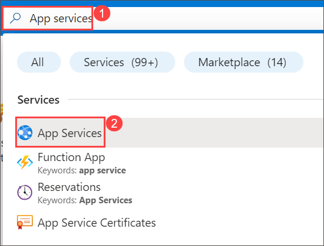
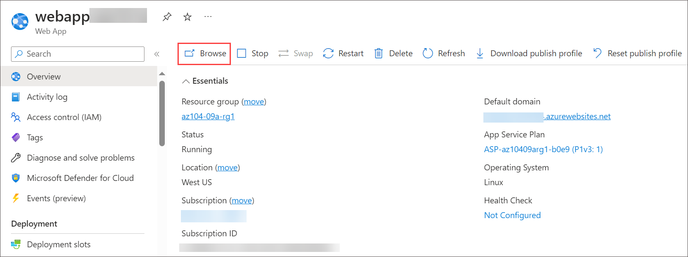
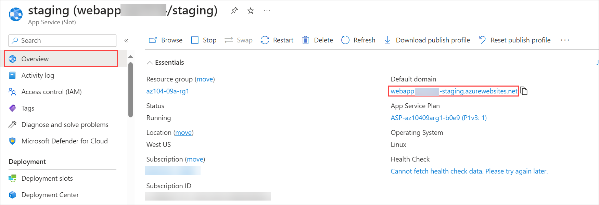
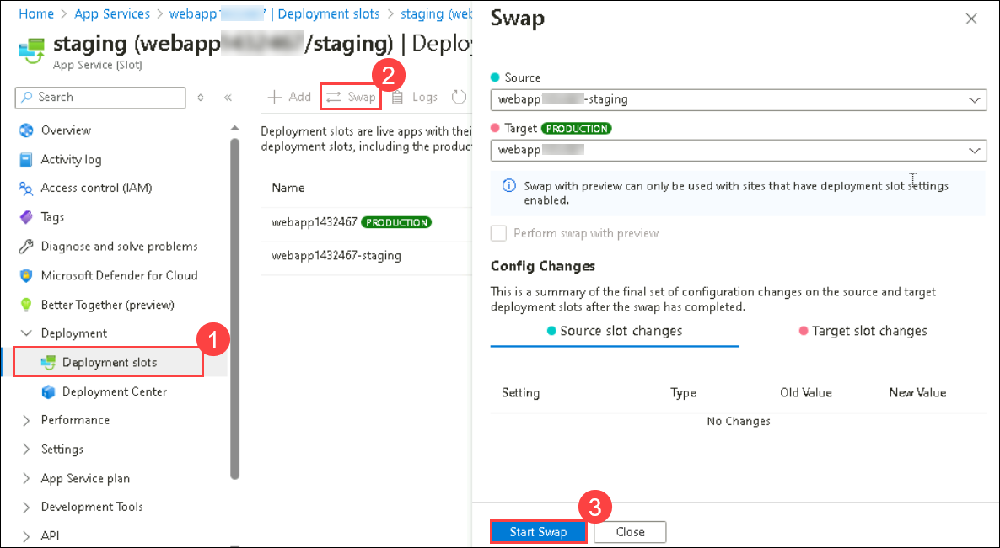
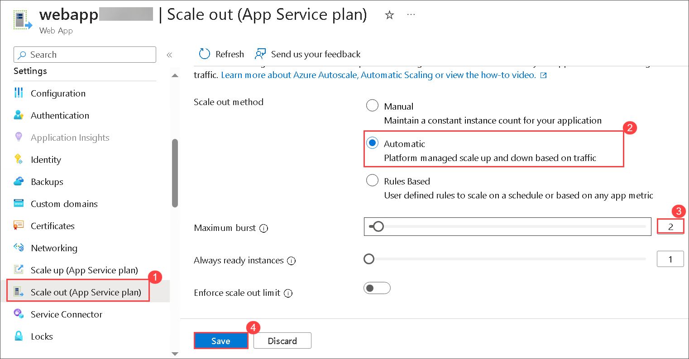
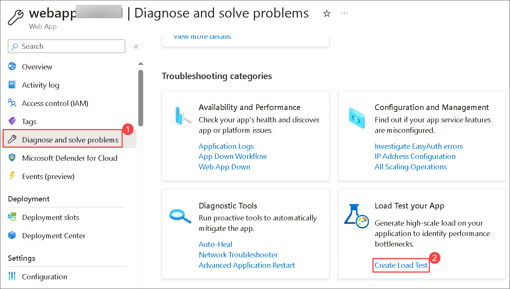
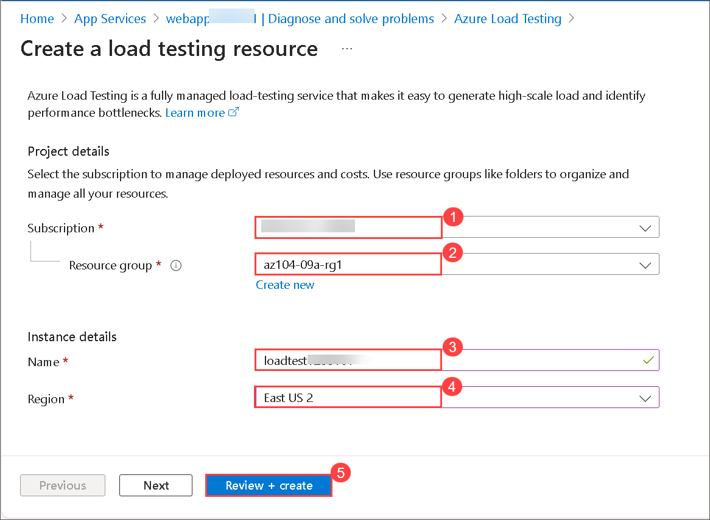

# Lab 03: Implement Web Apps, Container Instances and Container Apps

## Lab Overview

In this lab, you will learn to create and configure Azure Web Apps to host websites, including setting the runtime stack and application settings. 

## Lab objectives

In this lab, you will complete the following tasks:

+ Task 1: Create and configure an Azure web app.
+ Task 2: Create and configure a deployment slot.
+ Task 3: Configure web app deployment settings.
+ Task 4: Swap deployment slots.
+ Task 5: Configure and test autoscaling of the Azure web app.

## Exercise 1: Implement Web Apps

This exercise involves creating, configuring, and managing Azure Web Apps for hosting websites with continuous integration, delivery, and autoscaling capabilities.

### Task 1: Create an Azure web app

In this task, you will create an Azure Web App, which is a platform-as-a-service (PaaS) offering that allows you to deploy and manage web applications in a cloud environment. 

1. In the Azure portal, search for and select **App services**, and, on the **App Services** blade.

   

1. Click **+ Create** and choose **+ Web App**

   
   
1. On the **Basics** tab, specify the following settings (leave others with their default values):

    | Setting | Value |
    | --- | ---|
    | Subscription | the name of the Azure subscription you are using in this lab **(1)** |
    | Resource group | Select **az104-09a-rg1 (2)** |
    | Web app name | **webapp<inject key="DeploymentID" enableCopy="false" /> (3)** |
    | Publish | **Code (4)** |
    | Runtime stack | **PHP 8.2 (5)** |
    | Operating system | **Linux (6)** |
    | Region | **<inject key="Region" enableCopy="false"/> (7)** |
    | Pricing plans | **Premium V3 P1V3 (195 minimum ACU/vCPU, 8 GB memory, 2 vCPU)** |

    .png)
   
1. Click **Review + create (8)**. On the **Review + create** tab of the **Create Web App** blade, ensure that the validation passed and click **Create**.

    >**Note**: Wait until the web app is created before you proceed to the next task. This should take about a minute.

    >**Note**: If the deployment fails, change to another region and try again. For example, switch to **East US 2**. 

1. On the deployment blade, click **Go to resource**.

### Task 2: Create a staging deployment slot

In this task, you will create a staging deployment slot in Azure Web Apps, which allows you to test new versions of your web application in a production-like environment without affecting the live production app.

1. On the blade of the newly deployed web app, click the **Browse** tab to display the default web page in a new browser tab.

   

   >**Note**: While navigating to the link if you get an error,kindly try refreshing the browser window.
 
   >**Note**: Please copy the URL and save it in Notepad. You may need this link for Task 5.

1. Close the new browser tab and, back in the Azure portal, in the **Deployment** section in the left navigation pane of the web app blade, click **Deployment slots**.

    >**Note**: The web app, at this point, has a single deployment slot labeled **PRODUCTION**.

1. Click **Add slot**, and add a new slot with the following settings then click on **Add**. 

    | Setting | Value |
    | --- | ---|
    | Name | **staging** |
    | Clone settings from | **Do not clone settings**|

    

    

1. Once you see **Successfully created slot 'staging'** click on **Close**.
     
1. Back on the **Deployment slots** blade of the web app, click the entry representing the newly created staging slot.

    >**Note**: This will open the blade displaying the properties of the staging slot.

1. Click on the **Browse** tab.

1. Review the staging slot blade and note that its URL differs from the one assigned to the production slot.

## Task 3: Configure Web App deployment settings

In this task, you will configure Web App deployment settings. Deployment settings allow for continuous deployment. This ensures that the app service has the latest version of the application.

1. In the staging slot, select **Deployment Center (1)** from the left navigation pane  and then select **Settings**.

    >**Note:** Make sure you are on the staging slot blade (instead than the production slot).
    
1. In the **Source** drop-down list, select **External Git (2)**. Notice the other choices. 

1. In the repository field, enter `https://github.com/Azure-Samples/php-docs-hello-world` **(3)**.

1. In the branch field, enter `master` **(4)**.

1. Select **Save (5)**.

     

1. From the staging slot, select **Overview**.

1. Select the **Default domain** link, and open the URL in a new tab. 

    

1. Verify that the staging slot displays **Hello World**.

    
   
    >**Note:** The deployment may take a minute. Be sure to **Refresh** the application page.

### Task 4: Swap the staging slots

In this task, you will swap the staging slot with the production slot.

1. Navigate to the **App Service**, then proceed to select the web app you previously created, directing you to the blade showcasing the production slot of the web application.

1. In the **Deployment** section, click **Deployment slots (1)** and then, click **Swap (2)** toolbar icon.

1. On the **Swap** blade, review the default settings and click **Start Swap (3)**.

   >**Note**: Kindly Wait till Swap successfully complete.

   

1. Once you get **Successfully completed swap between slot 'staging' and slot 'production'** click on **Close**.
   
1. Click **Overview** on the production slot blade of the web app and then click the **URL** link to display the web site home page in a new browser tab.

1. Verify the default web page has been replaced with the **Hello World!** page.

### Task 5: Configure and test autoscaling of the Azure web app

In this task, you will configure autoscaling of Azure Web App. Autoscaling enables you to maintain optimal performance for your web app when traffic to the web app increases. To determine when the app should scale you can monitor metrics like CPU usage, memory, or bandwidth.

1. From the left navigation under the **Settings** section, select **Scale out (App Service plan) (1)**.

    >**Note:** Ensure you are working on the production slot not the staging slot.  

1. From the **Scaling** section, select **Automatic (2)**. Notice the **Rules Based** option. Rules based scaling can be configured for different app metrics. 

1. In the **Maximum burst** field, select **2 (3)**.

1. Select **Save (4)**.

   
   
1. Select **Diagnose and solve problems (1)** (left pane) and in the **Load Test your App** box, select **Create Load Test (2)**.

    

1. On **Create a load testing resource** blade specify the following:

    + Select **+ Create**  and leave the subscription (1) and resource group (2) option as default.
    + Give your load test name as **loadtest<inject key="DeploymentID" enableCopy="false" />** (3). The name must be unique.
    + Leave the region as default.(4)
    + Select **Review + create** (5) and then **Create**.

        
   
1. Wait for the load test to create, and then select **Go to resource**.

1. From the **Overview (1)**  of Azure load testing blade, under **Add HTTP requests**, select **Create (2)**.

    

1. On the **Test plan** tab, click **Add request**. In the **URL field**, paste in your **Default domain** URL we had copied in task 2 step number 1. Ensure this is properly formatted and begins with **https://** then click **Add**.

1. Select **Review + create** and **Create**.

    >**Note:** It may take a couple of minutes to create the test. 

1. Review the test results including **Virtual users**, **Response time**, and **Requests/sec**.

     

      

1. Select **Stop** to complete the test run.

   > **Congratulations** on completing the task! Now, it's time to validate it. Here are the steps:
   > - Hit the Validate button for the corresponding task. If you receive a success message, you can proceed to the next task. 
   > - If not, carefully read the error message and retry the step, following the instructions in the lab guide.
   > - If you need any assistance, please contact us at labs-support@spektrasystems.com. We are available 24/7 to help
   
   <validation step="fce39619-3758-4efe-b6d4-7060319a2f49" />

### Review

In this lab, you have completed the following:

- Created an Azure web app to host and configure your application on Azure’s platform.
- Set up a staging deployment slot for testing app updates without affecting production.
- Configured deployment settings, including methods and automation for streamlined updates.
- Deployed code to the staging slot for validation before production deployment.
- Swapped the staging slot with production after successful testing to ensure a smooth transition.
- Configured and tested autoscaling to adjust resources based on traffic demand, verifying performance under traffic surges.

### You have successfully completed the lab
