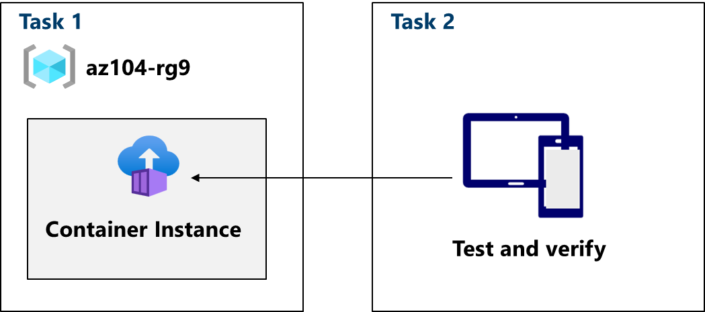
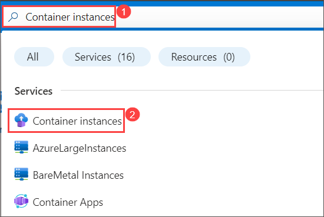
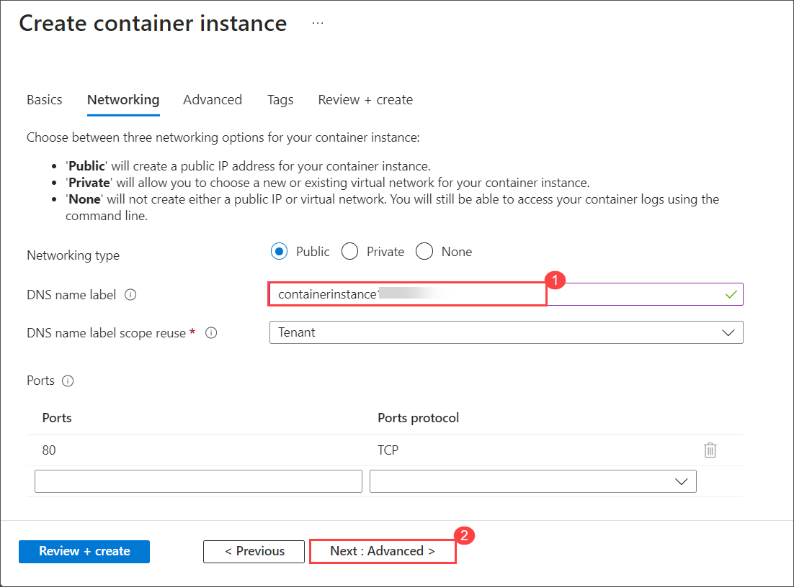

# Lab 09b - Implement Azure Container Instances

## Lab scenario
Contoso wants to find a new platform for its virtualized workloads. You identified a number of container images that can be leveraged to accomplish this objective. Since you want to minimize container management, you plan to evaluate the use of Azure Container Instances for the deployment of Docker images.

**Note:** An **[interactive lab simulation](https://mslabs.cloudguides.com/guides/AZ-104%20Exam%20Guide%20-%20Microsoft%20Azure%20Administrator%20Exercise%2014)** is available that allows you to click through this lab at your own pace. You may find slight differences between the interactive simulation and the hosted lab, but the core concepts and ideas being demonstrated are the same. 

## Lab objectives
In this lab, you will complete the following tasks:

- Task 1: Deploy an Azure Container Instance using a Docker image
- Task 2: Review the functionality of the Azure Container Instance

## Estimated timing: 20 minutes

## Architecture diagram

## Exercise 1

### Task 1: Deploy an Azure Container Instance using a Docker image
In this task, you will create a new container instance for the web application.

1. In the Azure portal, search for locate **Container instances**.

    
   
1. On the **Container instances** blade, click **+ Create**.

1. On the **Basics** tab of the **Create container instance** blade, specify the following settings (leave others with their default values) and Click **Next: Networking >**

    | Setting | Value |
    | ---- | ---- |
    | Subscription | the name of the Azure subscription you are using in this lab |
    | Resource group | Select **az104-09b-rg1** |
    | Container name | **az104-9b-c1** |
    | Region | the name of a region where you can provision Azure container instances |
    | Image Source | **Quickstart images** |
    | Image | **mcr.microsoft.com/azuredocs/aci-helloworld:latest (Linux)** |

    

1. On the **Networking** tab of the **Create container instance** blade, specify the following settings (leave others with their default values):

    | Setting | Value |
    | --- | --- |
    | DNS name label | any valid, globally unique DNS hostname |

    

    >**Note**: Your container will be publicly reachable at dns-name-label.region.azurecontainer.io. If you receive a **DNS name label not available** error message, specify a different value.

1. Click **Next: Advanced >**, review the settings on the **Advanced** tab of the **Create container instance** blade without making any changes, click **Review + Create**, ensure that the validation passed and click **Create**.

    >**Note**: Wait for the deployment to complete. This should take about 3 minutes.

    >**Note**: While you wait, you may be interested in viewing the [code behind the sample application](https://github.com/Azure-Samples/aci-helloworld). To view it, browse the \\app folder.

### Task 2: Review the functionality of the Azure Container Instance

In this task, you will review the deployment of the container instance.

1. On the deployment blade, click the **Go to resource** link.

1. On the **Overview** blade of the container instance, verify that **Status** is reported as **Running**.

   

1. Copy the value of the container instance **FQDN**, open a new browser tab, and navigate to the corresponding URL.

    

1. Verify that the **Welcome to Azure Container Instance** page is displayed.

    

1. Close the new browser tab, back in the Azure portal, in the **Settings** section of the container instance blade, click **Containers**, and then click **Logs**.

    

1. Verify that you see the log entries representing the HTTP GET request generated by displaying the application in the browser.

   > **Congratulations** on completing the task! Now, it's time to validate it. Here are the steps:
   > - Hit the Validate button for the corresponding task. If you receive a success message, you can proceed to the next task. Alternatively, you can navigate to the Lab Validation Page, from the upper right corner in the lab guide section.
   > - If not, carefully read the error message and retry the step, following the instructions in the lab guide. 
   > - If you need any assistance, please contact us at labs-support@spektrasystems.com. We are available 24/7 to help you out.

   <validation step="bc3f7679-1e22-449c-b128-1561d970a81d" />

## Key takeaways

Congratulations on completing the lab. Here are the main takeaways for this lab. 

+ Azure Container Instances (ACI) is a service that enables you to deploy containers on the Microsoft Azure public cloud.
+ ACI doesn't require you to provision or manage any underlying infrastructure.
+ ACI supports both Linux containers and Windows containers.
+ Workloads on ACI are usually started and stopped by some kind of process or trigger and are usually short-lived.

## Extend your learning with Copilot
Copilot can assist you in learning how to use the Azure scripting tools. Copilot can also assist in areas not covered in the lab or where you need more information. Open an Edge browser and choose Copilot (top right) or navigate to *copilot.microsoft.com*. Take a few minutes to try these prompts.

+ Summarize the steps to create and configure an Azure Container Instance.
+ What are the ways I can run a serverless container on Azure?

## Learn more with self-paced training

+ [Run container images in Azure Container Instances](https://learn.microsoft.com/training/modules/create-run-container-images-azure-container-instances/). Learn how Azure Container Instances can help you quickly deploy containers, how to set environment variables, and specify container restart policies.

### Review
In this lab, you have completed:
- Deployed a Docker image by using the Azure Container Instance
- Reviewed the functionality of the Azure Container Instance

### You have successfully completed the lab
