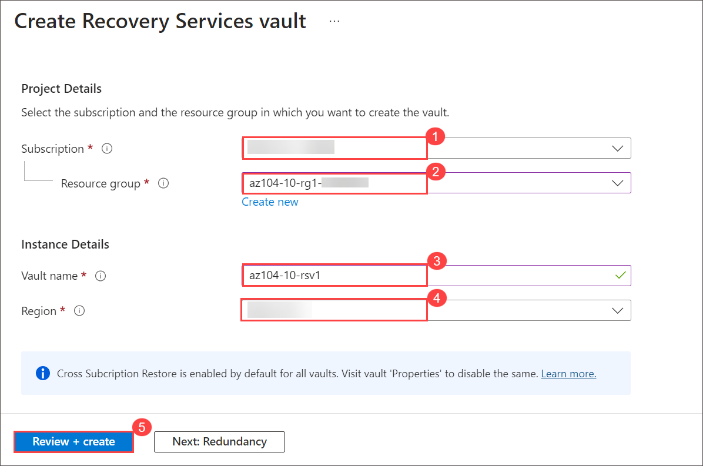
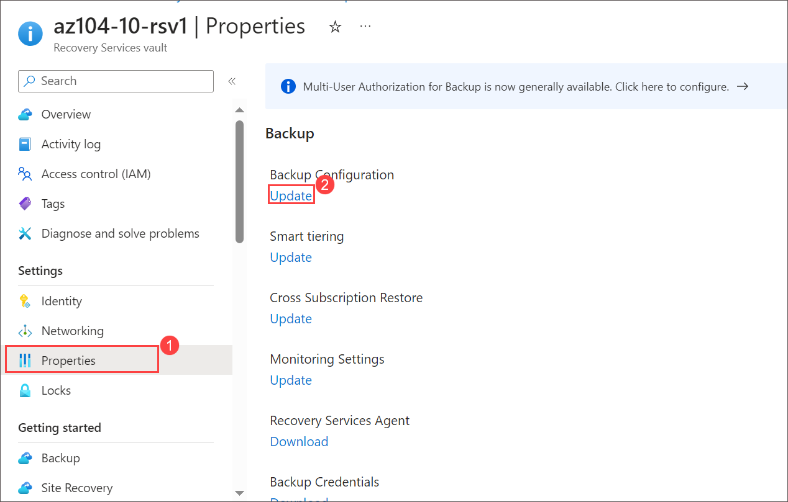
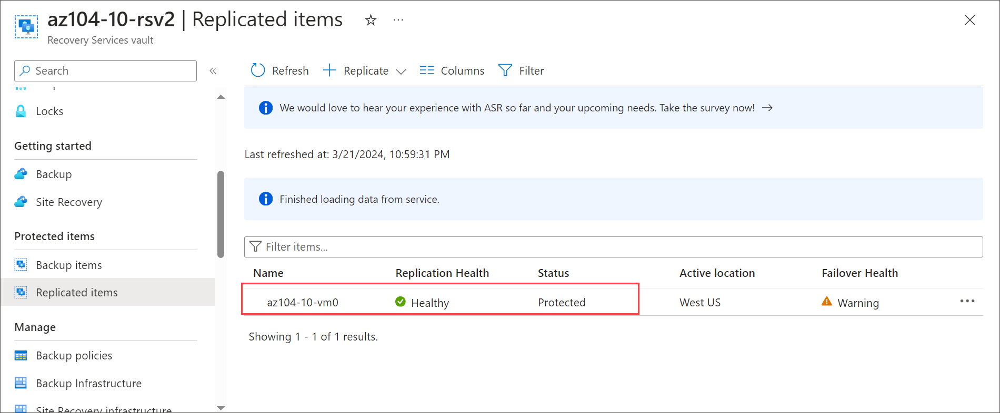

# Lab 10 - Implement Data Protection
## Lab introduction    

In this lab, you learn about backup and recovery of Azure virtual machines. You learn to create a Recovery Service vault and a backup policy for Azure virtual machines. You learn about disaster recovery with Azure Site Recovery. 

## Lab scenario

Your organization is evaluating how to backup and restore Azure virtual machines from accidental or malicious data loss. Additionally, the organization wants to explore using Azure Site Recovery for disaster recovery scenarios. 

## Interactive lab simulation

There is an interactive lab simulation that you might find useful for this topic. The simulation lets you to click through a similar scenario at your own pace. There are differences between the interactive simulation and this lab, but many of the core concepts are the same. An Azure subscription is not required.

+ **[Backup virtual machines and on-premises files.](https://mslabs.cloudguides.com/guides/AZ-104%20Exam%20Guide%20-%20Microsoft%20Azure%20Administrator%20Exercise%2016)**. Create a recovery services vault and implement an Azure virtual machine backup. Implement on-premises file and folder backup using the Microsoft Azure Recovery Services agent. On-premises backups are outside the scope of this lab but it might be helpful to view those steps. 

## Lab objectives
In this lab, you will complete the following tasks:
+ Task 1: Use a template to provision an infrastructure.
+ Task 2: Create and configure a Recovery Services vault.
+ Task 3: Configure Azure virtual machine-level backup.
+ Task 4: Monitor Azure Backup.
+ Task 5: Enable virtual machine replication.  

## Estimated timing: 50 minutes

## Architecture diagram

## Excercise 1: Backup virtual machines

### Task 1: Provision the lab environment
In this task, you will deploy two virtual machines that will be used to test different backup scenarios.

1. In the Azure portal search for and select `Deploy a custom template`.

1. On the custom deployment page, select **Build you own template in the editor**.

1. On the edit template page, select **Load file**.

1. Locate and select the **C:\AllFiles\AZ-104-MicrosoftAzureAdministrator-Lab-Files\Allfiles\Labs\10\az104-10-vms-edge-template.json** file and select **Open**.

   >**Note:** Take a moment to review the template. We are deploying a virtual network and virtual machine so we can demonstrate backup and recovery. 

1. **Save** your changes.

1. Select **Edit parameters** and then **Load file**.

1. Load and select the **C:\AllFiles\AZ-104-MicrosoftAzureAdministrator-Lab-Files\Allfiles\Labs\10\az104-10-vms-edge-parameters.json** file.

1. **Save** your changes.

1. Use the following information to complete the custom deployment fields, leaving all other fields with their default values:

    | Setting       | Value         | 
    | ---           | ---           |
    | Subscription  | Your Azure subscription |
    | Resource group| az104-10-rg1  |
    | Region        | **<inject key="Region" enableCopy="false"/>**    |
    | Admin Password      | Provide a complex password |

1. Select **Review + create**, then select **Create**.

    >**Note:** Wait for the template to deploy, then select **Go to resource**. You should have one virtual machine in one virtual network. 

### Task 2: Create a Recovery Services vault
In this task, you will create a recovery services vault.

1. On Azure Portal page, in **Search resources, services and docs (G+/)** box at the top of the portal, enter **Recovery Services vaults**, and then select **Recovery Services vaults** under services.

    

1. Click **+ Create**.

1. On the **Create Recovery Services vault** blade, specify the following settings and click **Review + create**.

    | Settings | Value |
    | --- | --- |
    | Subscription | the name of the Azure subscription you are using in this lab |
    | Resource group | Select resource group **az104-10-rg1** |
    | Vault Name | **az104-10-rsv1** |
    | Region | **<inject key="Region" enableCopy="false"/>**  |

    >**Note**: Make sure that you specify the same region into which you deployed virtual machines in the previous task.

    
     
1. Ensure that the validation has passed, and click **Create**.

    >**Note**: Wait for the deployment to complete. The deployment should take less than 1 minute.

1. When the deployment is completed, click **Go to Resource**.

1. On the **az104-10-rsv1** Recovery Services vault blade, in the **Settings** section, click **Properties**.

1. On the **az104-10-rsv1 - Properties** blade, click the **Update** link under **Backup Configuration** label.

    

1. On the **Backup Configuration** blade, review the choices for **Storage replication type**. Leave the default setting of **Geo-redundant** in place and close the blade.

    >**Note**: This setting can be configured only if there are no existing backup items.

1. Back on the **az104-10-rsv1 - Properties** blade, click the **Update** link under **Security Settings > Soft Delete and security settings** label.

1. On the **Security Settings** blade, note that **Soft Delete (For workload running in Azure)** is **Enabled**. Notice the **soft delete retention period** is **14** days. 

1. Return to the Recovery Services vault blade, select the **Overview** blade.

>**Did you know?** Azure has two types of vaults: Recovery Services vaults and Backup vaults. The main difference is the datasources that can be backed up. Learn more about [the differences](https://learn.microsoft.com/answers/questions/405915/what-is-difference-between-recovery-services-vault).

   > **Congratulations** on completing the task! Now, it's time to validate it. Here are the steps:
   > - Navigate to the Lab Validation Page, from the upper right corner in the lab guide section.
   > - Hit the Validate button for the corresponding task. If you receive a success message, you can proceed to the next task.
   > - If not, carefully read the error message and retry the step, following the instructions in the lab guide.
   > - If you need any assistance, please contact us at labs-support@spektrasystems.com. We are available 24/7 to help you out.

   <validation step="4a350ebe-5f23-43de-a6f0-6794d3d9e7cd" />

### Task 3: Implement Azure virtual machine-level backup
In this task, you will implement Azure virtual-machine level backup.

   >**Note**: Before you start this task, make sure that the deployment you initiated in the first task of this lab has successfully completed. You can check that by going to the respected resource group in the Azure portal and on the overview page of the resource group click on **Deployments**.

1. On the **az104-10-rsv1** Recovery Services vault blade, click **Overview**, then click **+ Backup**.

1. On the **Backup Goal** blade, specify the following settings:

    | Settings | Value |
    | --- | --- |
    | Where is your workload running? | **Azure** |
    | What do you want to backup? | **Virtual machine** |

1. On the **Backup Goal** blade, click **Backup**.

1. On **Configure backup** in Policy sub type click **Standard** review the options.
   
1. On **Configure backup** in **Backup policy**, review the **DefaultPolicy** settings and select **Create a new policy**.

1. Define a new backup policy with the following settings (leave others with their default values):

    | Setting | Value |
    | ---- | ---- |
    | Policy name | **az104-10-backup-policy** |
    | Frequency | **Daily** |
    | Time | **12:00 AM** |
    | Timezone | the name of your local time zone |
    | Retain instant recovery snapshot(s) for | **2** Days(s) |

1. Click **OK** to create the policy and then, in the **Virtual Machines** section, select **Add**.

1. On the **Select virtual machines** blade, select **az-104-10-vm0**, click **OK**, and, back on the **Backup** blade, click **Enable backup**.

    >**Note**: Wait for the backup to be enabled. This should take about 2 minutes.

1. Once deployment finish click on **Go to Resouces**.
   
1. Navigate back to the **az104-10-rsv1** Recovery Services vault blade, in the **Protected items** section, click **Backup items**, and then under Backup Management type select the **Azure virtual machines**  entry.

1. On the **Backup Items (Azure Virtual Machine)** blade, select the View details link for **az104-10-vm0**, and review the values of the Backup Pre-Check and Last Backup Status entries.

1. On the **az104-10-vm0** Backup Item blade, click **Backup now**, accept the default value in the **Retain Backup Till** drop-down list, and click **OK**.

    >**Note**: Do not wait for the backup to complete but instead proceed to the next task.

## Task 4: Monitor Azure Backup

In this task, you will deploy an Azure storage account. Then you will configure the vault to send the logs and metrics to the storage account. This repository can then be used with Log Analytics or other third-party monitoring solutions.

1. On Azure Portal page, in **Search resources, services and docs (G+/)** box at the top of the portal, enter **Storage accounts**, and then select **Storage accounts** under services.

1. On the Storage accounts page, select **+ Create**.

1. Use the following information to define the storage account and navigate to **Data protection** tab.

    | Settings | Value |
    | --- | --- | 
    | Subscription          | *Your subscription*    |
    | Resource group        | az104-10-rg1       |
    | Storage account name  | storage<inject key="DeploymentID" enableCopy="false"/>   |
    | Region                | **<inject key="Region" enableCopy="false"/>**  |

1. On **Data Protection** tab, uncheck the **Enable soft delete for blobs** check box then and select **Review + Create**.

    

1. On the Review + Create tab, select **Create**.

    >**Note**: Wait for the deployment to complete. It should take about a minute.

1. Search and select your Recovery Services vault.

1. From the left navigation pane,select **Diagnostic Settings** under monitoring and then select **Add diagnostic setting**.

1. Name the setting `Logs and Metrics to storage`.

1. Place a checkmark next to the following log and metric categories:

    - **Azure Backup Reporting Data**
    - **Addon Azure Backup Job Data**
    - **Addon Azure Backup Alert Data**
    - **Azure Site Recovery Jobs**
    - **Azure Site Recovery Events**
    - **Health**

1. In the Destination details, place a checkmark next to **Archive to a storage account**.

1. In the Storage account drop-down field, select the storage account that you deployed earlier in this task.

1. Select **Save**.

1. Return to your Recovery Services vault, in the **Monitoring** blade select **Backup jobs**.

1. Locate the backup operation for the **az104-10-vm0** virtual machine. 

1. Review the details of the backup job.

   > **Congratulations** on completing the task! Now, it's time to validate it. Here are the steps:
   > - Navigate to the Lab Validation Page, from the upper right corner in the lab guide section.
   > - Hit the Validate button for the corresponding task. If you receive a success message, you can proceed to the next task. 
   > - If not, carefully read the error message and retry the step, following the instructions in the lab guide.
   > - If you need any assistance, please contact us at labs-support@spektrasystems.com. We are available 24/7 to help you out.

   <validation step="9516efe5-7bb7-4459-944a-9ca93b16bebc" />

## Task 5: Enable virtual machine replication

1. On Azure Portal page, in **Search resources, services and docs (G+/)** box at the top of the portal, enter **Recovery Services vaults**, and then select **Recovery Services vaults** under services. click **+ Create**.

1. On the **Create Recovery Services vault** blade, specify the following settings:

    | Settings | Value |
    | --- | --- |
    | Subscription | the name of your Azure subscription |
    | Resource group |az104-10-rg1     |
    | Vault Name | **az104-10-rsv2**  |
    | Region | **West US 3** |

    >**Note**: Make sure that you specify a **different** region than the virtual machine.

1. Click **Review + create**, ensure that the validation passes and then click **Create**.

    >**Note**: Wait for the deployment to complete. The deployment should take a couple of minutes. 

1. Search for and select the `az104-10-vm0` virtual machine.

1. In the **Backup + disaster recovery** blade, select **Disaster recovery**. 

1. On the **Basics** tab, notice the **Target region**.

1. Move to the **Advanced settings** tab. Resource selections have been made for you. It is important to review them. 

1. Verify your subscription, vm resource group, virtual network, and availability (take the default) settings.

1. In **Storage settings** select **Show details**.

    | Setting | Value |
    | ---- | ---- |
    | Churn for the vm | **Normal churn**  |
    | Cache storage account | **storage<inject key="DeploymentID" enableCopy="false"/>**  |

   >**Note:** It is important that both of these settings be populated, or the validation will fail. If values are not present, try refreshing the page. If that doesn't work, create an empty storage account and then return to this page.

1. In **Replication settings** select **Show details**. Notice your recovery resources vault in region 2 was automatically selected.

1. Select **Review + Start replication** and then **Start replication**.

    >**Note**: Enabling replication will take a 10-15 minutes. Watch the notification messages in the upper right of the portal. While you wait, consider reviewing the self-paced training links at the end of this page.
    
1. Once the replication is complete, search for and locate your Recovery Services Vault, **az104-10-rsv2**. You may need to **Refresh** the page. 

1. In the **Protected items** section, select **Replicated items**.

1. Check that the virtual machine is showing as healthy for the replication health. Note that the status will show the synchronization (starting at 0%) status and ultimately show **Protected** after the initial synchronization completes.

   

1. Select the virtual machine to view more details.
   
>**Did you know?** It is a good practice to [test the failover of a protected VM](https://learn.microsoft.com/azure/site-recovery/tutorial-dr-drill-azure#run-a-test-failover-for-a-single-vm).

   > **Congratulations** on completing the task! Now, it's time to validate it. Here are the steps:
   > - Navigate to the Lab Validation Page, from the upper right corner in the lab guide section.
   > - Hit the Validate button for the corresponding task. If you receive a success message, you can proceed to the next task. 
   > - If not, carefully read the error message and retry the step, following the instructions in the lab guide.
   > - If you need any assistance, please contact us at labs-support@spektrasystems.com. We are available 24/7 to help you out.

   <validation step="3e780a0f-ab1a-48d9-a0a0-996c526c7c12" />

### Review
In this lab, you have completed:
+ Used a template to provision an infrastructure.
+ Created and configure a Recovery Services vault.
+ Configured Azure virtual machine-level backup.
+ Monitored Azure Backup.
+ Enabled virtual machine replication.

## Extend your learning with Copilot
Copilot can assist you in learning how to use the Azure scripting tools. Copilot can also assist in areas not covered in the lab or where you need more information. Open an Edge browser and choose Copilot (top right) or navigate to *copilot.microsoft.com*. Take a few minutes to try these prompts.

+ What products does Azure Backup support?
+ Summarize the steps for backing up and restoring an Azure virtual machine with Azure Backup.
+ How can I use Azure PowerShell or the CLI to check the status of an Azure Backup job.
+ Provide at least five best practices for configuring Azure virtual machine backups.

## Learn more with self-paced training

+ [Protect your virtual machines by using Azure Backup](https://learn.microsoft.com/training/modules/protect-virtual-machines-with-azure-backup/). Use Azure Backup to help protect on-premises servers, virtual machines, SQL Server, Azure file shares, and other workloads.
+ [Protect your Azure infrastructure with Azure Site Recovery](https://learn.microsoft.com/en-us/training/modules/protect-infrastructure-with-site-recovery/). Provide disaster recovery for your Azure infrastructure by customizing replication, failover, and failback of Azure virtual machines with Azure Site Recovery.

## Key takeaways

Congratulations on completing the lab. Here are the main takeaways for this lab. 

+ Azure Backup service provides simple, secure, and cost-effective solutions to back up and recover your data.
+ Azure Backup can protect on-premises and cloud resources including virtual machines and file shares.
+ Azure Backup policies configure the frequency of backups and the retention period for recovery points. 
+ Azure Site Recovery is a disaster recovery solution that provides protection for your virtual machines and applications.
+ Azure Site Recovery replicates your workloads to a secondary site, and in the event of an outage or disaster, you can failover to the secondary site and resume operations with minimal downtime.
+ A Recovery Services vault stores your backup data and minimizes management overhead.

### You have successfully completed the lab
