# Lab 11 - Implement Monitoring
## Lab scenario
You need to evaluate Azure functionality that would provide insight into the performance and configuration of Azure resources, focusing in particular on Azure virtual machines. To accomplish this, you intend to examine the capabilities of Azure Monitor, including Log Analytics.

## Lab objectives
In this lab, you will complete the following tasks:

+ Task 1: Use a template to provision an infrastructure.
+ Task 2: Create an alert.
+ Task 3: Configure action group notifications.
+ Task 4: Trigger an alert and confirm it is working.
+ Task 5: Configure an alert processing rule.
+ Task 6: Use Azure Monitor log queries.


## Estimated timing: 45 minutes

## Architecture diagram


## Task 1: Use a template to provision an infrastructure

In this task, you will deploy a virtual machine that will be used to test monitoring scenarios.

1. From the Azure portal, search for and select **Deploy a custom template**.

1. On the custom deployment page, select **Build you own template in the editor**.

1. On the edit template page, select **Load file**.

1. Locate and select the **C:\AllFiles\AZ-104-MicrosoftAzureAdministrator-Lab-Files\Allfiles\Labs\11\az104-11-vm-template.json** file and select **Open**.

1. Select **Save**.

1. Use the following information to complete the custom deployment fields, leaving all other fields with their default values:

    | Setting       | Value         | 
    | ---           | ---           |
    | Subscription  | Your Azure subscription (1) |
    | Resource group| **az104-11-rg1** (2)|
    | Region        |  **<inject key="Region" enableCopy="false" />** (3) |
    | Admin Username| **Student** (4)|
    | Password      | Provide a complex password  (5)|

    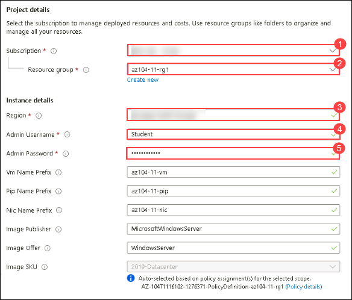
    
1. Select **Review + create**, then select **Create**.

1. Wait for the deployment to finish, then click **Go to resource group**.

1. Review what resources were deployed. There should be one virtual network with one virtual machine.

**Configure Azure Monitor for virtual machines (this will be used in the last task)**

1. In the portal, search for and select **Monitor**.

1. Take a minute to review all the insights, detection, triage, and diagnosis tools that are available.

1. Select **View** in the **VM Insights** box.

   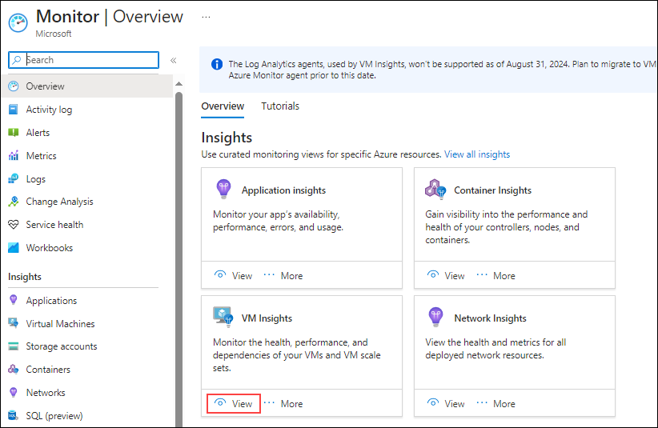

1. Now select **Configure Insights**.

1. Select your virtual machine, and then **Enable** (twice).

   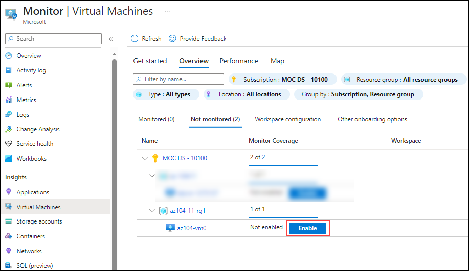

   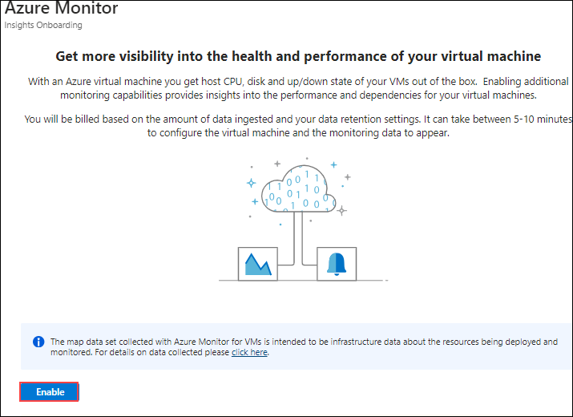

1. Take the defaults for subscription and data collection rules, then select **Configure**. 

1. It will take a few minutes for the virtual machine agent to install and configure, please proceed to the next step.

## Task 2: Create an alert

In this task, you create an alert for when a virtual machine is deleted. 

1. Continue on the **Monitor** page , select **Alerts**.

   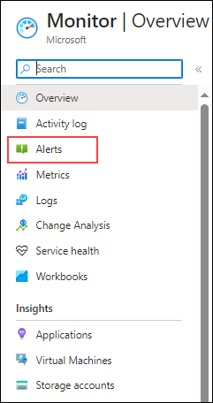

1. Select **+ Create** and select **Alert rule**.

   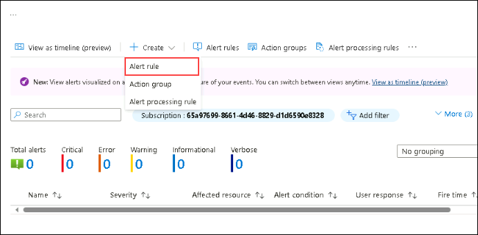

1. Select the check box for the **az104-11-rg1** resource group, then select **Apply**. This alert will apply to any virtual machines in the resource group. Alternatively, you could just specify one particular machine. 

1. Select the **Condition** tab and then select the **See all signals** link.

   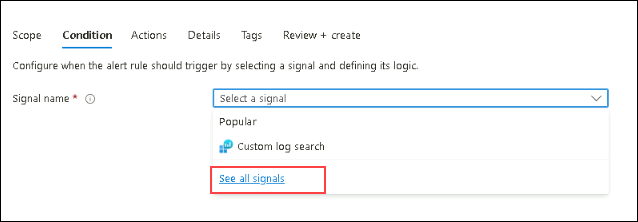

1. Search for and select **Delete Virtual Machine (Virtual Machines)**. Notice the other built-in signals. Select **Apply**

   

1. In the **Alert logic** area (scroll down), review the **Event level** selections. Leave the default of **All selected**.

1. Review the **Status** selections. Leave the default of **All selected**.

1. Leave the **Create an alert rule** pane open for the next task.

## Task 3: Configure action group notifications

In this task, if the alert is triggered send an email notification to the operations team. 

1. Continue working on your alert. Select **Next: Actions >**, and select **Use action groups** check box and then select **+ Create action group**.

    >**Did you know?** You can add up to five action groups to an alert rule. Action groups are executed concurrently, in no specific order. Multiple alert rules can use the same action group. 

1. On the **Basics** tab, enter the following values for each setting.

    | Setting | Value |
    |---------|---------|
    | **Project details** |
    | Subscription | your subscription (1) |
    | Resource group | **az104-11-rg1** (2) |
    | Region | **Global** (default) (3) |
    | **Instance details** |
    | Action group name | `Alert the operations team` (must be unique in the resource group) (4) |
    | Display name | `AlertOpsTeam` (5) |

    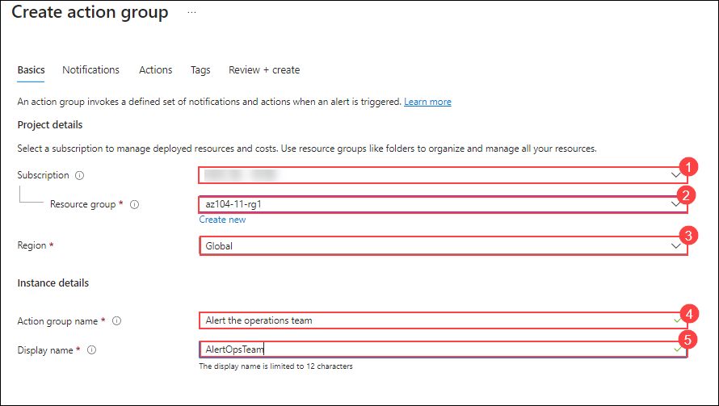

1. Select **Next: Notifications >** and enter the following values for each setting.

    | Setting | Value |
    |---------|---------|
    | Notification type | Select **Email/SMS message/Push/Voice** |
    | Name | `VM was deleted` |

1. Select **Email**, and in the **Email** box, enter your email address, and then select **OK** and select **Review + create** and subsequently click on **Create**. 

   

   >**Note:** You should receive an email notification saying you were added to an action group. There may be a few minutes delay, but that is a sure sign the rule has deployed.

1. Once the action group is created move to the **Next: Details >** tab and enter the following values for each setting.

    | Setting | Value |
    |---------|---------|
    | Alert rule name | `VM was deleted` |
    | Alert rule description | `A VM in your resource group was deleted` |

1. Select **Review + create** to validate your input, then select **Create**.

   <validation step="ae54adf6-d387-4188-9258-f8399c34d338" />

   > **Congratulations** on completing the task! Now, it's time to validate it. Here are the steps:
   > - Hit the Validate button for the corresponding task. If you receive a success message, you can proceed to the next task. 
   > - If not, carefully read the error message and retry the step, following the instructions in the lab guide.
   > - If you need any assistance, please contact us at labs-support@spektrasystems.com. We are available 24/7 to help you out.

   <validation step="ae54adf6-d387-4188-9258-f8399c34d338" />


## Task 4: Trigger an alert and confirm it is working

In this task, you trigger the alert and confirm a notification is sent. 

>**Note:** If you delete the virtual machine before the alert rule deploys, the alert rule might not be triggered. 

1. In the portal, search for and select **Virtual machines**.

1. Check the box for the **az104-11-vm0** virtual machine.

1. Select **Delete** from the menu bar.

    

1. Check the box for **Apply force delete**. Enter `delete` to confirm and then select **Delete**. In the **Delete confirmation** pop-up window, click **Delete**.

1. In the title bar, select the **Notifications** icon and wait until **vm0** is successfully deleted.

1. You should receive a notification email that reads, **Important notice: Azure Monitor alert VM was deleted was activated...** If not, open your email program and look for an email from azure-noreply@microsoft.com.

   
   
1. On the Azure portal resource menu, select **Monitor**, and then select **Alerts** in the menu on the left.

1. You should get the verbose alerts that were generated by deleting **vm0**.

   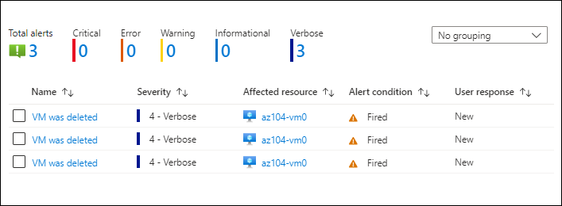
   
    >**Note:** It can take a few minutes for the alert email to be sent and for the alerts to be updated in the portal. If you don't want to wait, continue to the next task and then return. 

1. Select the name of one of the alerts (For example, **VM was deleted**). An **Alert details** pane appears that shows more details about the event.


   > **Congratulations** on completing the task! Now, it's time to validate it. Here are the steps:
   > - Hit the Validate button for the corresponding task. If you receive a success message, you can proceed to the next task. 
   > - If not, carefully read the error message and retry the step, following the instructions in the lab guide.
   > - If you need any assistance, please contact us at labs-support@spektrasystems.com. We are available 24/7 to help you out.

   <validation step="6a69dc7c-0e66-40e8-a20d-4e24335b885e" />

## Task 5: Configure an alert processing rule

In this task, you create an alert rule to suppress notifications during a maintenance period. 

1. Continue in the **Alerts** blade, select **Alert processing rules** and then **+ Create**.

   
   
1. Select your **resource group**, then select **Apply**.

   
   
1. Select **Next: Rule settings >**, then select **Suppress notifications**.
   
1. Select **Next: Scheduling >**.
   
1. By default, the rule works all the time, unless you disable it or configure a schedule. You are going to define a rule to suppress notifications during overnight maintenance.
Enter these settings for the scheduling of the alert processing rule:

    | Setting | Value |
    |---------|---------|
    | Apply the rule | At a specific time |
    | Start | Enter today's date at 10 pm. |
    | End | Enter tomorrow's date at 7 am. |
    | Time zone | Select the local timezone. |

    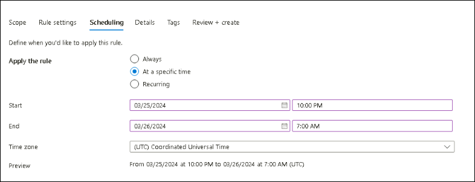

1. Select **Next: Details >** and enter these settings:

    | Setting | Value |
    |---------|---------|
    | Resource group | **az104-11-rg1** |
    | Rule name | `Planned Maintenance` |
    | Description | `Suppress notifications during planned maintenance.` |

1. Select **Review + create** to validate your input, then select **Create**.

## Task 6: Use Azure Monitor log queries

In this task, you will use Azure Monitor to query the data captured from the virtual machine.

1. In the Azure portal, search for and select `Monitor` blade, click **Logs**.

1. If necessary close the splash screen. 

1. Select a scope, ****az104-11-rg1****. Select **Apply**. 

1. In the **Queries** tab, select **Virtual machines** (left pane).

1. Review the queries that are available. Double-click the **Count heartbeats** query and select **Run**.

    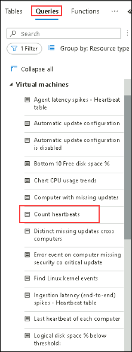

1. You should receive a heartbeat count for when the virtual machine was running.

    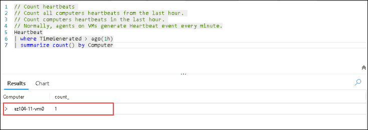

1. Review the query. This query uses the *heartbeat* table. 

1. Replace the query with this one, and then click **Run**. Review the resulting chart. 

   ```
    InsightsMetrics
    | where TimeGenerated > ago(1h)
    | where Name == "UtilizationPercentage"
    | summarize avg(Val) by bin(TimeGenerated, 5m), Computer //split up by computer
    | render timechart
   ```
    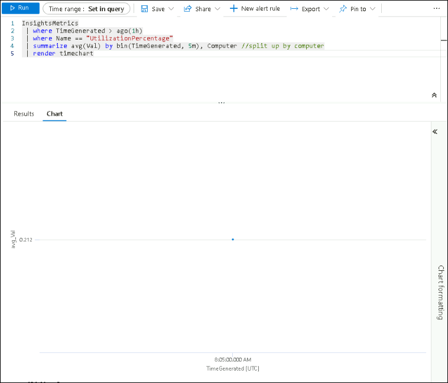

     >**Did you know?**: If you want to practice with other queries, there is a [Log Analytics Demo Environment](https://learn.microsoft.com/azure/azure-monitor/logs/log-analytics-tutorial#open-log-analytics).
    
     >**Did you know?**: Once you find a query you like, you can create an alert from it. 

### Review
In this lab, you have completed:

- Used a template to provision an infrastructure.
- Created an alert.
- Configured action group notifications.
- Triggered an alert and confirmed if  it is working.
- Configured an alert processing rule.
- Used Azure Monitor log queries.


### You have successfully completed the lab


## Extend your learning with Copilot
Copilot can assist you in learning how to use the Azure scripting tools. Copilot can also assist in areas not covered in the lab or where you need more information. Open an Edge browser and choose Copilot (top right). Take a few minutes to try these prompts.

+ What are the basic configuration steps to be alerted in Azure when a virtual machine is down?
+ How can I be notified when an Azure alert is triggered?
+ Construct an Azure Monitor query to provide virtual machine CPU performance information.

## Learn more with self-paced training

+ [Improve incident response with alerting on Azure](https://learn.microsoft.com/en-us/training/modules/incident-response-with-alerting-on-azure/). Respond to incidents and activities in your infrastructure through alerting capabilities in Azure Monitor.
+ [Monitor your Azure virtual machines with Azure Monitor](https://learn.microsoft.com/en-us/training/modules/monitor-azure-vm-using-diagnostic-data/). Monitor your Azure VMs by using Azure Monitor to collect and analyze VM host and client metrics and logs.
