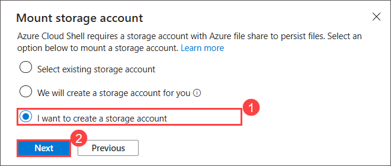
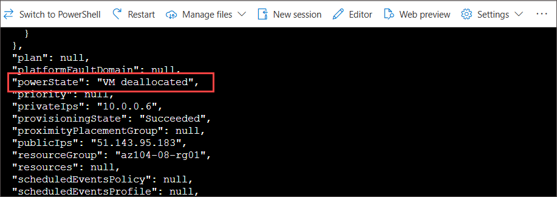

# Lab 01 a - Manage Azure Resources Using PowerShell

## Lab Overview

This lab focuses on managing Azure Resources Using PowerShell which involves automating and managing Azure services and infrastructure via PowerShell cmdlets.

## Lab objectives

In this lab, you will complete the following tasks:

+ Task 1: Create a virtual machine using Azure PowerShell .
+ Task 2: Create a virtual machine using the CLI.

## Exercise 1: Administer Azure resources with PowerShell.

In this exercise, you will learn how to administer Azure resources with PowerShell by automating tasks such as provisioning, configuring, and managing services.

## Task 1: Create a virtual machine using Azure PowerShell 

1. On the Azure portal, select the **Cloud shell** (**[>_]**)  button at the top of the page to the right of the search box. This opens a cloud shell pane at the bottom of the portal.

   

1. The first time you open the Cloud Shell, you may be prompted to choose the type of shell you want to use (*Bash* or *PowerShell*). If so, select **PowerShell**.

     
   
1. On **Getting started** window choose **Mount storage account (1)** then under **Storage account subscription** select your **Available subscription (2)** from the dropdown and click on **Apply (3)**.

     

1. Within the Mount storage account pane, select **I want to create a storage account (1)** and click **Next (2)**. 

      
   
    >**Note:** As you work with the Cloud Shell a storage account and file share is required. 

1. Specify the following then click on **Create (5)**.
   
    | Settings | Values |
    |  -- | -- |
    | Resource Group | **az104-08-rg01 (1)** |
    | Region         | **<inject key="Region" enableCopy="false"/> (2)** |
    | Storage account name | **str<inject key="DeploymentID" enableCopy="false" />** **(3)** |
    | File share  | **none** **(4)** |

     

1. Run the following command to create a virtual machine. When prompted, provide a **username** and **password** for the VM. While you wait check out the [New-AzVM](https://learn.microsoft.com/powershell/module/az.compute/new-azvm?view=azps-11.1.0) command reference for all the parameters associated with creating a virtual machine.

    ```powershell
    New-AzVm `
    -ResourceGroupName 'az104-08-rg01' `
    -Name 'myPSVM' `
    -Location 'East US' `
    -Image 'Win2019Datacenter' `
    -Zone '1' `
    -Size 'Standard_D2s_v3' ` 
    -Credential (Get-Credential)
    ```

   >**Note**: You can give Admin password as **Password.1!!**.

1. Once the command completes, use **Get-AzVM** to list the virtual machines in your resource group.

    ```powershell
    Get-AzVM `
    -ResourceGroupName 'az104-08-rg01' `
    -Status
    ```

1. Verify your new virtual machine is listed and the **Status** is **Running**.

    

1. Use **Stop-AzVM** to deallocate your virtual machine. Type **Yes** to confirm.

    ```powershell
    Stop-AzVM `
    -ResourceGroupName 'az104-08-rg01' `
    -Name 'myPSVM' 
    ```

1. Use **Get-AzVM** with the **-Status** parameter to verify the machine is **deallocated**.

    >**Did you know?** When you use Azure to stop your virtual machine, the status is *deallocated*. This means that any non-static public IPs are released, and you stop paying for the VM’s compute costs.

## Task 2: Create a virtual machine using the CLI 

1. Select the icon (top left ) **Switch to bash** and Confirm when prompted.

   

   

1. Run the following command to create a virtual machine. When prompted, provide a username and password for the VM. While you wait check out the [az vm create](https://learn.microsoft.com/cli/azure/vm?view=azure-cli-latest#az-vm-create) command reference for all the parameters associated with creating a virtual machine.

    ```sh
    az vm create --name myCLIVM --resource-group az104-08-rg01 --image Win2019Datacenter --admin-username localadmin --generate-ssh-keys
    ```
   >**Note**: Give Admin password as **Password.1!!** and Password will be not visible
   
1. Once the command completes, use **az vm show** to verify your machine was created.

    ```sh
    az vm show --name  myCLIVM --resource-group az104-08-rg01 --show-details
    ```

1. Verify the **powerState** is **VM Running**.

    

1. Use **az vm deallocate** to deallocate your virtual machine.

    ```sh
   az vm deallocate --resource-group az104-08-rg01 --name myCLIVM
    ```

1. Use **az vm show** to ensure the **powerState** is **VM deallocated**.

    ```sh
    az vm show --name  myCLIVM --resource-group az104-08-rg01 --show-details
    ```

    
   
    >**Did you know?** When you use Azure to stop your virtual machine, the status is *deallocated*. This means that any non-static public IPs are released, and you stop paying for the VM’s compute costs.

## Review

In this lab we have provisioned Azure resources using powershell and CLI.


### You have successfully completed the lab


