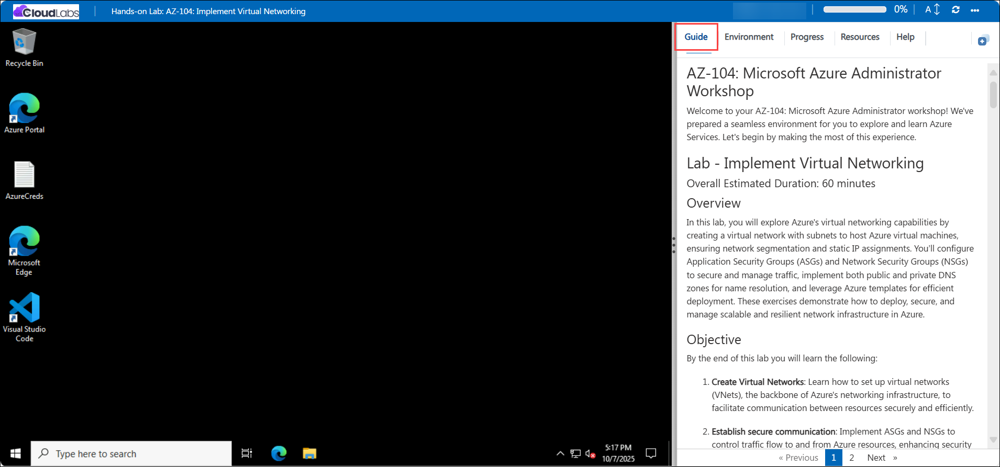
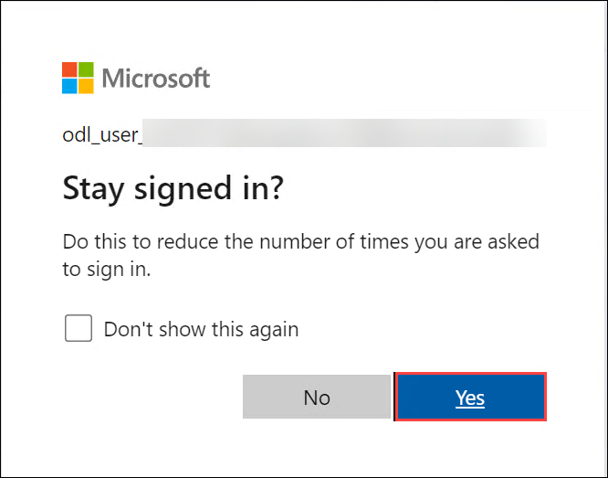

# AZ-104: Microsoft Azure Administrator Workshop

## Getting Started with the Lab
 
Welcome to your AZ-104: Microsoft Azure Administrator  workshop! We've prepared a seamless environment for you to explore and learn Azure Services. Let's begin by making the most of this experience:

## Overview

This AZ-104: Microsoft Azure Administrator workshop is a hands-on lab series covering the core responsibilities of an Azure Administrator. Across these labs, you will manage identities and governance, provision and organize resources using multiple tools, build and secure virtual networks, manage storage, deploy and scale virtual machines and containerized workloads, and protect and monitor your Azure environment. You will work directly in the Azure Portal, Azure Cloud Shell, Azure PowerShell, Azure CLI, and ARM templates/Bicep to provision, configure, secure, and operate real Azure resources, building the practical skills validated by the AZ-104 certification.

## Objectives

By the end of these labs, you will be able to:

1. **Manage Microsoft Entra ID identities:** Create and configure standard and guest user accounts, and create and manage security groups.

2. **Manage subscriptions, RBAC, and governance:** Implement management groups, assign built-in and custom Azure RBAC roles, monitor role assignments using the Activity Log, enforce tagging and compliance with Azure Policy, and configure resource locks.

3. **Manage Azure resources using multiple tools:** Provision, organize, and move resources between resource groups, and deploy resources using the Azure Portal, ARM templates, Azure Bicep, Azure PowerShell, and Azure CLI.

4. **Implement virtual networking:** Create virtual networks and subnets, configure Network Security Groups (NSGs) and Application Security Groups (ASGs), and configure public and private Azure DNS zones.

5. **Implement intersite connectivity:** Configure virtual network peering, test connectivity using Network Watcher, and create custom (user-defined) routes.

6. **Implement network traffic management:** Configure Azure Load Balancer and Azure Application Gateway to distribute and route traffic across backend resources.

7. **Manage Azure Storage:** Create and secure storage accounts, blob containers (including SAS tokens and immutability policies), and Azure Files shares, and apply lifecycle management rules.

8. **Manage virtual machines:** Deploy zone-resilient virtual machines, scale VM compute and storage, and create and scale Virtual Machine Scale Sets with autoscaling rules.

9. **Implement web apps and containerized workloads:** Create and configure Azure Web Apps with deployment slots and autoscaling, and deploy containers using Azure Container Instances and Azure Container Apps.

10. **Implement data protection:** Configure a Recovery Services vault, set up Azure Backup policies for virtual machines, and enable VM replication with Azure Site Recovery.

11. **Implement monitoring:** Configure Azure Monitor alerts, action groups, and alert processing rules, and query logs using Kusto Query Language (KQL) in Azure Monitor Logs.

## Pre-requisites

- Basic understanding of Azure fundamentals, including subscriptions, resource groups, and the Azure Portal.
- Familiarity with core networking concepts (IP addressing, DNS, and firewalls) is helpful.
- Prior exposure to Windows Server and/or Linux administration is recommended.
- Basic command-line familiarity with PowerShell or Bash will help with the Cloud Shell, Azure PowerShell, and Azure CLI labs.
- Familiarity with JSON is helpful for the ARM template and Azure Bicep labs, though no prior coding experience is required.

## Architecture

Each lab builds directly on the resources created before it, so the environment grows step-by-step into a working Azure administration setup:

**Manage Microsoft Entra ID Identities, Manage Subscriptions and RBAC, and Manage Governance via Azure Policy:** You start in Microsoft Entra ID by creating user, guest, and group accounts. On top of that identity base, you organize subscriptions with management groups, assign built-in and custom RBAC roles to the groups you created, and use Azure Policy and resource locks to enforce tagging and prevent unwanted deletion of the resource groups you'll use throughout the course.

**Manage Azure Resources by Using the Azure Portal, ARM Templates, Azure PowerShell, and Azure CLI:** Using the resource groups now governed by policy and RBAC, you provision and move resources (managed disks) through four different methods so the same deployment task can be repeated consistently from any tool.

**Implement Virtual Networking:** Inside a resource group, you build a virtual network with multiple subnets, attach Network Security Groups and Application Security Groups to control traffic between them, and add public and private Azure DNS zones so resources can resolve custom domain names.

**Implement Intersite Connectivity:** You deploy virtual machines into two separate virtual networks, use Network Watcher to confirm they can't yet communicate, then configure VNet peering and a custom route table so traffic flows correctly between the sites.

**Implement Network Traffic Management:** A template provisions a virtual network with multiple VMs behind it, and you place an Azure Load Balancer and an Azure Application Gateway in front of them to distribute traffic and route requests by path to the correct backend pool.

**Manage Azure Storage:** You create a storage account inside the resource group, then layer Blob Storage (with containers, SAS tokens, and immutability policies) and Azure Files on top of it, and restrict access using virtual network service endpoints so only your virtual network can reach it.

**Manage Virtual Machines:** You deploy zone-resilient virtual machines and managed disks directly into the resource group, then scale that same workload out using a Virtual Machine Scale Set with its own load balancer and autoscale rules driven by CPU utilization.

**Implement Web Apps, Azure Container Instances, and Azure Container Apps:** In parallel resource groups, you host the same kind of workload three ways — an Azure Web App with deployment slots and autoscaling, a single container running in Azure Container Instances, and a managed containerized app running in Azure Container Apps with its own Log Analytics workspace.

**Implement Data Protection:** A template deploys a virtual network and VM, which you then protect by creating a Recovery Services vault, applying a VM backup policy, and enabling Azure Site Recovery so the same VM can fail over to a secondary region.

**Implement Monitoring:** A final template deploys a virtual network and VM, and you close the loop by enabling Azure Monitor insights on it, creating an alert rule and action group that notify you when the VM is deleted, adding an alert processing rule to suppress noise during maintenance, and querying its logs with KQL.

## Explanation of Components

1. **Microsoft Entra ID:** Manages users, guest users, and groups, serving as the identity foundation for RBAC and access control across the labs.

2. **Management Groups & Azure RBAC:** Organize subscriptions hierarchically and control who can perform which actions, using built-in and custom roles.

3. **Azure Policy & Resource Locks:** Enforce organizational standards such as tagging and compliance, and protect resources from accidental deletion or modification.

4. **Resource Groups:** Logical containers used to organize, move, and manage related Azure resources together.

5. **ARM Templates & Azure Bicep:** Provide declarative, repeatable infrastructure-as-code deployment of Azure resources.

6. **Azure Cloud Shell, Azure PowerShell & Azure CLI:** Command-line tools used to script, automate, and manage the creation and configuration of Azure resources.

7. **Virtual Networks, Subnets, NSGs & ASGs:** Provide isolated, segmented, and secured network boundaries for Azure resources.

8. **Azure DNS (Public & Private Zones):** Resolve custom domain names for resources inside and outside the virtual network.

9. **Network Watcher & VNet Peering:** Diagnose connectivity issues and enable secure communication between separate virtual networks.

10. **Route Tables (User-Defined Routes):** Control how traffic is routed between subnets, virtual networks, and other networks.

11. **Azure Load Balancer & Application Gateway:** Distribute and route incoming traffic across multiple backend instances for scalability and availability.

12. **Storage Accounts, Blob Storage & Azure Files:** Store unstructured data, files, and shares securely, with configurable redundancy, access tiers, and lifecycle policies.

13. **Virtual Machines & Managed Disks:** Provide the compute and persistent storage building blocks for workloads, including zone-resilient deployments.

14. **Virtual Machine Scale Sets:** Automatically scale identical VM instances in or out based on demand.

15. **Azure App Service (Web Apps):** Hosts web applications with deployment slots, Git-based deployment, and autoscaling.

16. **Azure Container Instances & Azure Container Apps:** Run containerized workloads without managing the underlying infrastructure, from simple single containers to managed, scalable container environments.

17. **Recovery Services Vault, Azure Backup & Azure Site Recovery:** Protect virtual machines with scheduled backups and enable cross-region disaster recovery replication.

18. **Azure Monitor, Alerts, Action Groups & Log Analytics:** Collect telemetry, trigger notifications on defined conditions, and query logs using KQL to monitor environment health.

## Accessing Your Lab Environment
 
Once you're ready to dive in, your virtual machine and **Guide** will be right at your fingertips within your web browser.
 

### Virtual Machine & Lab Guide
 
Your virtual machine is your workhorse throughout the workshop. The lab guide is your roadmap to success.
 
## Exploring Your Lab Resources
 
To get a better understanding of your lab resources and credentials, navigate to the **Environment** tab.
 

 
## Utilizing the Split Window Feature
 
For convenience, you can open the lab guide in a separate window by selecting the **Split Window** button from the top right corner.
 

 
## Utilizing the Zoom In/Out Feature

To adjust the zoom level for the environment page, click the A↕ : 100% icon located next to the timer in the lab environment.

## Managing Your Virtual Machine
 
Feel free to **Start, Stop, or Restart (2)** your virtual machine as needed from the **Resources (1)** tab. Your experience is in your hands!
 

## Track Your Progress

Click on the **Progress** tab to track your progress in the lab. The percentage increases as you complete each validation and reaches 100% when all validations are successfully completed.    

## Lab Duration Extension

1. To extend the duration of the lab, kindly click the **Hourglass** icon in the top right corner of the lab environment. 

    

    >**Note:** You will get the **Hourglass** icon when 10 minutes are remaining in the lab.

2. Click **OK** to extend your lab duration.
 
   

3. If you have not extended the duration prior to when the lab is about to end, a pop-up will appear, giving you the option to extend. Click **OK** to proceed.
 
## Let's Get Started with Azure Portal
 
1. On your virtual machine, click on the Azure Portal icon as shown below:
 
    
 
2. You'll see the **Sign into Microsoft Azure** tab. Here, enter your credentials:
 
   - **Email/Username:** <inject key="AzureAdUserEmail"></inject>
 
      
 
3. Next, provide your password:
 
   - **Password:** <inject key="AzureAdUserPassword"></inject>
 
      
      
1. If prompted to Stay signed in, you can click **Yes.**
 
   

1. If a **Welcome to Microsoft Azure** pop-up window appears, simply click "Maybe Later" to skip the tour.

   

## Support Contact

The CloudLabs support team is available 24/7, 365 days a year, via email and live chat to ensure seamless assistance at any time. We offer dedicated support channels tailored specifically for both learners and instructors, ensuring that all your needs are promptly and efficiently addressed.

   Learner Support Contacts:

   - Email Support: cloudlabs-support@spektrasystems.com
   - Live Chat Support: https://cloudlabs.ai/labs-support

Now, click on Next from the lower right corner to move on to the next page.
   
   

## Happy Learning!!
