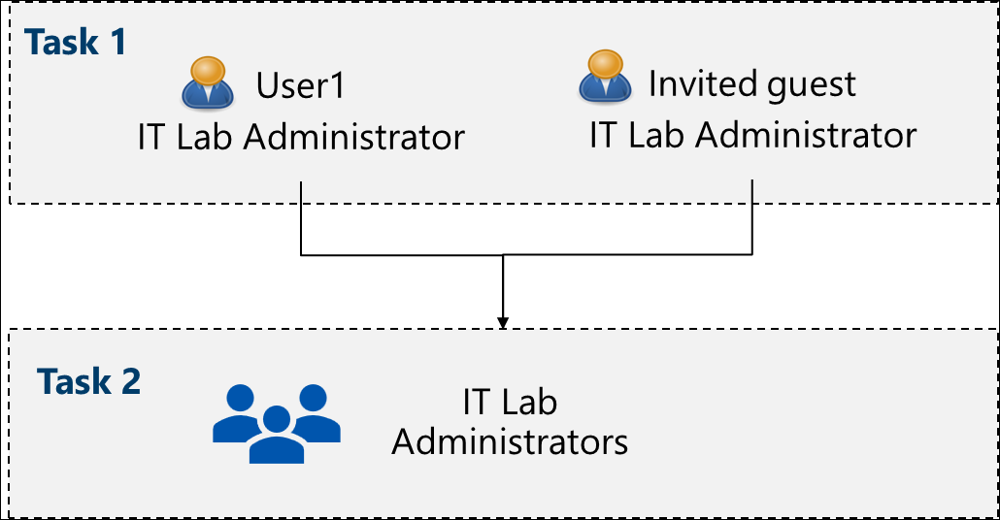
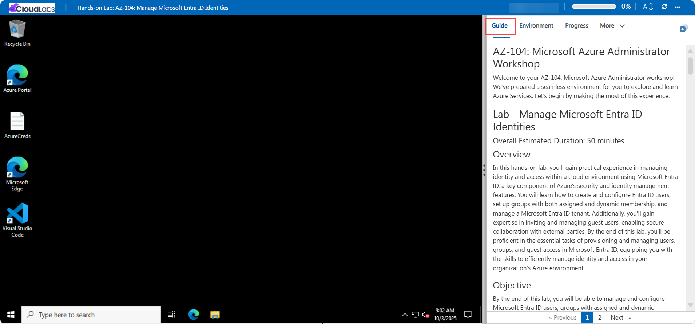
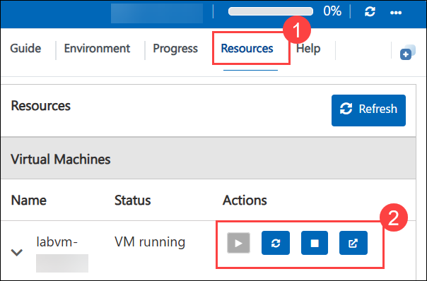
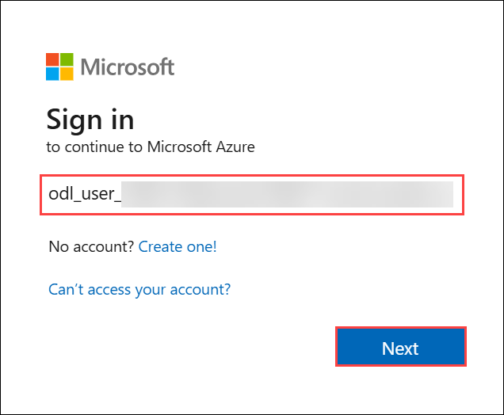

# AZ-104: Microsoft Azure Administrator Workshop

Welcome to your AZ-104: Microsoft Azure Administrator workshop! We've prepared a seamless environment for you to explore and learn Azure Services. Let's begin by making the most of this experience.

# Lab - Manage Microsoft Entra ID Identities

### Overall Estimated Duration: 30 Minutes

## Overview

In this hands-on lab, you will gain practical experience in managing identities within Microsoft Entra ID, the core identity and access management service in Azure. You’ll learn how to create and configure both standard and guest users, set essential properties such as job title, department, and usage location, and organize access through security groups with assigned membership. By the end of this lab, you’ll understand how Microsoft Entra ID enables secure user management and structured access control in a cloud environment.

## Objective

By the end of this lab, you will be able to manage and configure Microsoft Entra ID users, guest users, and groups with assigned membership.

1. **Create and configure Entra ID users:** You will learn how to create and configure Microsoft Entra ID user accounts in the Azure portal, including both standard and guest users. You will define key properties such as job title, d
2. **Create Entra ID groups with assigned membership:** Create and configure security groups in Microsoft Entra ID using assigned membership to manually manage owners and members for organizing access and permissions.

## Pre-requisites

Fundamental knowledge in managing identity and access within cloud environment using Microsoft Entra ID, a key element of Azure's security and identity management capabilities.

## Architecture

In this hands-on lab, the architecture flow includes several essential components.

1. **Creating and Configuring Entra ID Users:** You will create both a standard user and an invited guest user in Microsoft Entra ID. Each user is configured with essential properties such as job title, department, and usage location to define identity attributes.

1. **Creating Groups with Assigned Membership:** You will create a security group named IT Lab Administrators and manually assign members (both the standard and guest users) to it. This group centralizes access and simplifies management within the directory.

## Architecture Diagram

   

## Explanation of Components

1. **Microsoft Entra ID:** Microsoft Entra ID (formerly Azure Active Directory) is Microsoft’s cloud-based identity and access management service. It allows organizations to securely create, manage, and authenticate user identities, ensuring controlled access to cloud resources and applications.

2. **Entra ID groups:** Entra ID groups are used to organize users and simplify access management within Microsoft Entra ID. In this lab, you will work with Assigned Membership Groups, where users are manually added or removed by an administrator. This approach is ideal for managing static user sets such as departmental teams or lab administrators.

# Getting Started with the Lab
 
Welcome to your AZ-104: Microsoft Azure Administrator  workshop! We've prepared a seamless environment for you to explore and learn Azure Services. Let's begin by making the most of this experience:
 
## Accessing Your Lab Environment
 
Once you're ready to dive in, your virtual machine and **Guide** will be right at your fingertips within your web browser.
 

### Virtual Machine & Lab Guide
 
Your virtual machine is your workhorse throughout the workshop. The lab guide is your roadmap to success.
 
## Exploring Your Lab Resources
 
To get a better understanding of your lab resources and credentials, navigate to the **Environment** tab.
 

 
## Utilizing the Split Window Feature
 
For convenience, you can open the lab guide in a separate window by selecting the **Split Window** button from the top right corner.
 

 
## Utilizing the Zoom In/Out Feature

To adjust the zoom level for the environment page, click the A↕ : 100% icon located next to the timer in the lab environment.

## Managing Your Virtual Machine
 
Feel free to **Start, Stop, or Restart (2)** your virtual machine as needed from the **Resources (1)** tab. Your experience is in your hands!
 

## **Lab Duration Extension**

1. To extend the duration of the lab, kindly click the **Hourglass** icon in the top right corner of the lab environment. 

    

    >**Note:** You will get the **Hourglass** icon when 10 minutes are remaining in the lab.

2. Click **OK** to extend your lab duration.
 
   

3. If you have not extended the duration prior to when the lab is about to end, a pop-up will appear, giving you the option to extend. Click **OK** to proceed.
 
## Let's Get Started with Azure Portal
 
1. On your virtual machine, click on the **Azure Portal** icon as shown below:
 
    
 
2. You'll see the **Sign into Microsoft Azure** tab. Here, enter your credentials:
 
   - **Email/Username:** <inject key="AzureAdUserEmail"></inject>
 
      
 
3. Next, provide your password:
 
   - **Password:** <inject key="AzureAdUserPassword"></inject>
 
      
      
1. If prompted to **Stay signed in**, you can click **No**.
 
1. If a **Welcome to Microsoft Azure** pop-up window appears, simply click "Maybe Later" to skip the tour.

## Support Contact

The CloudLabs support team is available 24/7, 365 days a year, via email and live chat to ensure seamless assistance at any time. We offer dedicated support channels tailored specifically for both learners and instructors, ensuring that all your needs are promptly and efficiently addressed.

   Learner Support Contacts:

   - Email Support: cloudlabs-support@spektrasystems.com
   - Live Chat Support: https://cloudlabs.ai/labs-support

Now, click on Next from the lower right corner to move on to the next page.
   
   

## Happy Learning!!

