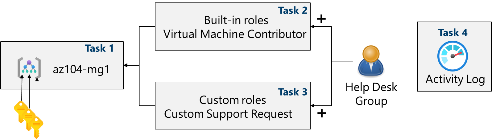
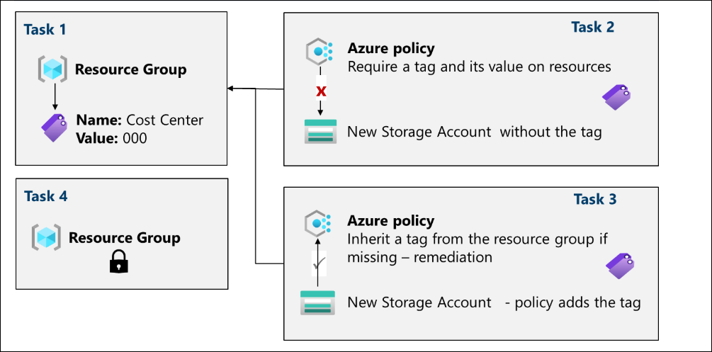
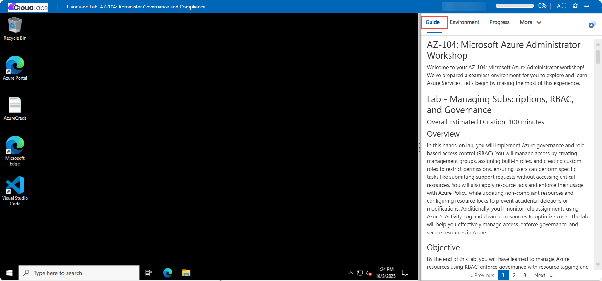

# AZ-104: Microsoft Azure Administrator Workshop

Welcome to your AZ-104: Microsoft Azure Administrator workshop! We've prepared a seamless environment for you to explore and learn Azure Services. Let's begin by making the most of this experience.

# Lab - Managing Subscriptions, RBAC, and Governance

### Overall Estimated Duration: 120 Minutes

## Overview

In this hands-on lab, you will implement Azure governance and role-based access control (RBAC) to securely manage and organize resources. You’ll create management groups, assign built-in and custom roles, and apply Azure Policies with tags to enforce compliance and consistency. You’ll also configure resource locks to prevent accidental deletions or modifications and use the Azure Activity Log to monitor role changes. By the end of this lab, you’ll have a complete governance framework that enhances security, control, and operational efficiency across Azure.

## Objectives

By the end of this lab, you will have learned to manage Azure resources using RBAC, enforce governance with resource tagging and locks, and remediate non-compliant resources for optimized management and security.

- **Implement and Manage Role-Based Access Control (RBAC):** Organize subscriptions with management groups, assign built-in roles, and create custom roles to ensure users can perform necessary tasks while maintaining least-privilege access.
- **Monitor Access and Ensure Security:** Use Azure Activity Logs to track role assignments and user actions, providing visibility and accountability for access management.
- **Enforce Governance and Tagging Compliance:** Apply and enforce resource tagging through Azure Policy to organize and categorize resources. Remediate non-compliant resources automatically to ensure alignment with organizational standards.
- **Protect Resources and Optimize Costs:** Set up resource locks to prevent accidental modifications or deletions and clean up unused resources to avoid unnecessary charges, maintaining both security and cost efficiency in your Azure environment.

## Pre-requisites

Basic understanding of Azure concepts, and familiarity with RBAC, resource tagging, and Azure Policy management.

## Architecture

## Lab 1a: Manage Subscriptions and RBAC

1. Create Management Groups and Assign Built-in Roles: Create and configure management groups to organize Azure subscriptions, enabling centralized governance and consistent access control across your environment.

2. Review and Assign Built-in Roles:
Explore Azure’s built-in roles and assign the Virtual Machine Contributor role to a helpdesk group, granting limited permissions for managing virtual machines.

3. Create a Custom RBAC Role: Develop a custom role by cloning and modifying the Support Request Contributor role to remove unnecessary permissions, following the principle of least privilege.

4. Assign Roles to Users: Assign both built-in and custom RBAC roles to users, ensuring they can only perform allowed actions within the scope defined by the roles.

## Architecture diagram

   

## Explanation of Components

1. **Microsoft Entra ID:** Microsoft Entra ID (formerly Azure Active Directory) is a cloud-based identity and access management service from Microsoft. It helps organizations manage user identities, control access to resources, and ensure secure authentication across various cloud-based and on-premises applications.

2. **Management Groups:** Management Groups are a way to organize and manage your Azure subscriptions at scale. They allow you to group multiple subscriptions together for easier management of policies, role-based access control (RBAC), and compliance across your organization.

3. **Custom RBAC:** Role-Based Access Control refers to the ability to create tailored roles with specific permissions to meet the unique needs of your organization. Unlike built-in roles that come with predefined permissions, custom RBAC roles allow you to define exactly what actions a user or group can perform on Azure resources. 

## Lab 1b: Manage Governance via Azure Policy

1. **Tagging and Policy Enforcement:** Create and assign tags to resources for better metadata management and reporting and enforce mandatory tagging on new resources using Azure Policy to ensure compliance.

2. **Resource Compliance and Remediation:** Use Azure Policy to apply and inherit tags for existing resources and remediate non-compliance.

3. **Resource Locks for Protection:** Configure resource locks to prevent accidental deletions or modifications and test the effectiveness of locks and their ability to override user permissions.

## Architecture diagram

## Explanation of Components

1.  **Azure Tags:** Tags can also be enforced using Azure Policy to ensure compliance with organizational standards.Tags are key-value pairs that add metadata to Azure resources, enabling better organization and reporting.

2.  **Azure Policy:** Azure Policy helps enforce rules and compliance at scale. It defines governance conditions and actions to be taken if the conditions are not met.Policies also include built-in definitions, such as Require a tag and its value or Inherit a tag from the resource group if missing, ensuring governance consistency across resources.

3.  **Resource Locks:** Resource locks prevent accidental modifications or deletions of resources.Locks are configurable at different levels, such as subscriptions, resource groups, or individual resources, ensuring critical resources remain secure.

# Getting Started with the Lab
 
Welcome to your AZ-104: Microsoft Azure Administrator  workshop! We've prepared a seamless environment for you to explore and learn Azure Services. Let's begin by making the most of this experience:
 
## Accessing Your Lab Environment
 
Once you're ready to dive in, your virtual machine and **Guide** will be right at your fingertips within your web browser.
 

### Virtual Machine & Lab Guide
 
Your virtual machine is your workhorse throughout the workshop. The lab guide is your roadmap to success.
 
## Exploring Your Lab Resources
 
To get a better understanding of your lab resources and credentials, navigate to the **Environment** tab.
 

 
## Utilizing the Split Window Feature
 
For convenience, you can open the lab guide in a separate window by selecting the **Split Window** button from the top right corner.
 

 
## Utilizing the Zoom In/Out Feature

To adjust the zoom level for the environment page, click the A↕ : 100% icon located next to the timer in the lab environment.

## Managing Your Virtual Machine
 
Feel free to **Start, Stop, or Restart (2)** your virtual machine as needed from the **Resources (1)** tab. Your experience is in your hands!
 

## Track Your Progress

Click on the **Progress** tab to track your progress in the lab. The percentage increases as you complete each validation and reaches 100% when all validations are successfully completed.    

## Lab Duration Extension

1. To extend the duration of the lab, kindly click the **Hourglass** icon in the top right corner of the lab environment. 

    

    >**Note:** You will get the **Hourglass** icon when 10 minutes are remaining in the lab.

2. Click **OK** to extend your lab duration.
 
   

3. If you have not extended the duration prior to when the lab is about to end, a pop-up will appear, giving you the option to extend. Click **OK** to proceed.
 
## Let's Get Started with Azure Portal
 
1. On your virtual machine, click on the **Azure Portal** icon as shown below:
 
   
 
2. You'll see the **Sign into Microsoft Azure** tab. Here, enter your credentials:
 
   - **Email/Username:** <inject key="AzureAdUserEmail"></inject>
 
      
 
3. Next, provide your password:
 
   - **Password:** <inject key="AzureAdUserPassword"></inject>
 
      

1. If prompted to stay signed in, you can click **No.**
 
1. If a **Welcome to Microsoft Azure** pop-up window appears, simply click "Maybe Later" to skip the tour.

## Support Contact

The CloudLabs support team is available 24/7, 365 days a year, via email and live chat to ensure seamless assistance at any time. We offer dedicated support channels tailored specifically for both learners and instructors, ensuring that all your needs are promptly and efficiently addressed.

   Learner Support Contacts:

   - Email Support: cloudlabs-support@spektrasystems.com
   - Live Chat Support: https://cloudlabs.ai/labs-support

Now, click on Next from the lower right corner to move on to the next page.

   
## Happy Learning!!
