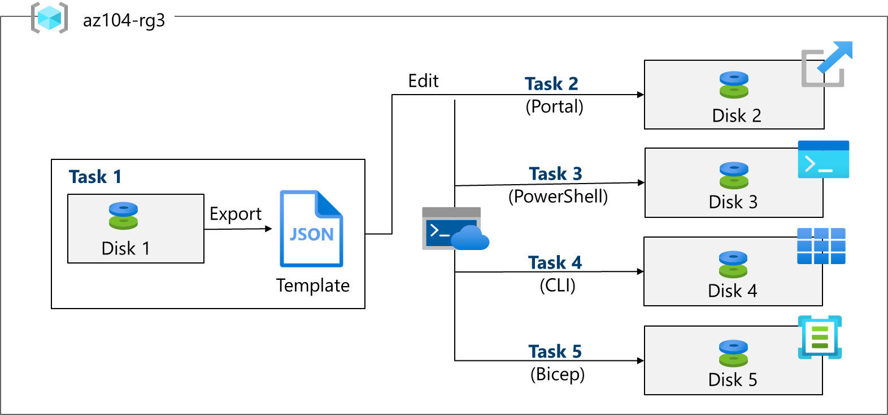
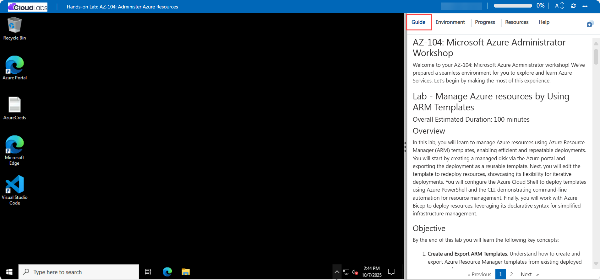

# AZ-104: Microsoft Azure Administrator Workshop

Welcome to your AZ-104: Microsoft Azure Administrator workshop! We've prepared a seamless environment for you to explore and learn Azure Services. Let's begin by making the most of this experience.

# Lab - Manage Azure resources by using Azure Resource Manager Templates

### Overall Estimated Duration: 60 Minutes

## Overview

In this lab, you will learn to manage Azure resources using Azure Resource Manager (ARM) templates, enabling efficient and repeatable deployments. You will start by creating a managed disk via the Azure portal and exporting the deployment as a reusable template. Next, you will edit the template to redeploy resources, showcasing its flexibility for iterative deployments. You will configure the Azure Cloud Shell to deploy templates using Azure PowerShell and the CLI, demonstrating command-line automation for resource management. Finally, you will work with Azure Bicep to deploy resources, leveraging its declarative syntax for simplified infrastructure management.

## Objectives

By the end of this lab you will learn the following key concepts:

By the end of this lab you will learn the following key concepts:

1. **Create and Export ARM Templates:** Learn how to create Azure resources in the portal and export them as Azure Resource Manager (ARM) templates for reuse and automation.

1. **Edit and Redeploy ARM Templates:** Understand how to modify template parameters and resource definitions, then redeploy them to consistently provision new resources.

1. **Deploy Templates Using Azure PowerShell:** Configure Azure Cloud Shell and use Azure PowerShell commands to deploy ARM templates at the resource group scope.

1. **Deploy Templates Using Azure CLI:** Use Azure CLI commands in Cloud Shell to automate and manage ARM template deployments efficiently.

1. **Deploy Resources with Azure Bicep:** Gain hands-on experience with Azure Bicep to define and deploy Azure resources using a modern, declarative Infrastructure-as-Code approach.

## Pre-requisites

 Understanding of Azure Resource Manager (ARM) concepts, such as templates, parameters, and deployments, will be helpful.

 ## Architecture

In this hands-on lab, the architecture flow includes several essential components.

1. **Creating and Managing Resources with ARM Templates:** Create and deploy resources using Azure Resource Manager (ARM) templates and explore how templates simplify resource deployment and management.

2. **Editing and Redeploying Templates:** Edit existing ARM templates to modify resource configurations and redeploy them, ensuring easy resource management and repeatability.

3. **Deploying Resources via Cloud Shell and PowerShell:** Configure Azure Cloud Shell and use Azure PowerShell to deploy ARM templates, giving you hands-on experience with scripting and automation.

4. **Exploring Azure Bicep for Resource Deployment:** Explore Azure Bicep, a declarative language used to define and deploy Azure resources, providing a more streamlined alternative to ARM templates.

## Architecture diagram

## Explanation of Components

1. **Azure Resource Manager (ARM) Templates:** ARM templates are JSON files used to define the structure of your resources in Azure. They allow for the declarative deployment and management of resources in a repeatable manner.

2. **Cloud Shell:** Azure Cloud Shell is an integrated, browser-accessible command-line interface (CLI) that allows you to manage your Azure resources directly from the portal, offering both Bash and PowerShell environments.

3. **Azure PowerShell:** Azure PowerShell is a set of cmdlets used for managing Azure resources through scripts. In this lab, it’s used to deploy ARM templates, making resource management more efficient and automated.

4. **Azure Bicep:** Azure Bicep is a domain-specific language that simplifies the authoring of Azure ARM templates. It provides a more concise syntax while maintaining full compatibility with ARM templates for resource deployment.

# Getting Started with the Lab
 
Welcome to your AZ-104: Microsoft Azure Administrator  workshop! We've prepared a seamless environment for you to explore and learn Azure Services. Let's begin by making the most of this experience:
 
## Accessing Your Lab Environment
 
Once you're ready to dive in, your virtual machine and **Guide** will be right at your fingertips within your web browser.
 

### Virtual Machine & Lab Guide
 
Your virtual machine is your workhorse throughout the workshop. The lab guide is your roadmap to success.
 
## Exploring Your Lab Resources
 
To get a better understanding of your lab resources and credentials, navigate to the **Environment** tab.
 

 
## Utilizing the Split Window Feature
 
For convenience, you can open the lab guide in a separate window by selecting the **Split Window** button from the top right corner.
 

 
## Utilizing the Zoom In/Out Feature

To adjust the zoom level for the environment page, click the A↕ : 100% icon located next to the timer in the lab environment.

## Managing Your Virtual Machine
 
Feel free to **Start, Stop, or Restart (2)** your virtual machine as needed from the **Resources (1)** tab. Your experience is in your hands!
 

## **Lab Duration Extension**

1. To extend the duration of the lab, kindly click the **Hourglass** icon in the top right corner of the lab environment. 

    

    >**Note:** You will get the **Hourglass** icon when 10 minutes are remaining in the lab.

2. Click **OK** to extend your lab duration.
 
   

3. If you have not extended the duration prior to when the lab is about to end, a pop-up will appear, giving you the option to extend. Click **OK** to proceed.
 
## Let's Get Started with Azure Portal
 
1. On your Virtual machine, click on the **Azure Portal** icon as shown below:
 
    
 
2. You'll see the **Sign into Microsoft Azure** tab. Here, enter your credentials:
 
   - **Email/Username:** <inject key="AzureAdUserEmail"></inject>
 
      
 
3. Next, provide your password:
 
   - **Password:** <inject key="AzureAdUserPassword"></inject>
 
      

1. If prompted to stay signed in, you can click **No.**
 
1. If a **Welcome to Microsoft Azure** pop-up window appears, simply click "Maybe Later" to skip the tour.

## Support Contact

The CloudLabs support team is available 24/7, 365 days a year, via email and live chat to ensure seamless assistance at any time. We offer dedicated support channels tailored specifically for both learners and instructors, ensuring that all your needs are promptly and efficiently addressed.

   Learner Support Contacts:

   - Email Support: cloudlabs-support@spektrasystems.com
   - Live Chat Support: https://cloudlabs.ai/labs-support

Now, click on Next from the lower right corner to move on to the next page.
   
   
## Happy Learning!!
