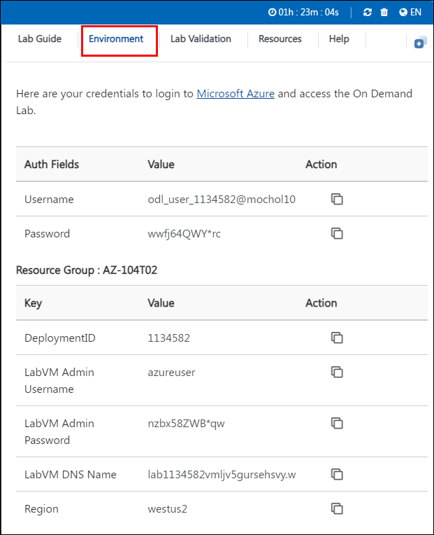

# AZ-104: Microsoft Azure Administrator Workshop

### Overall Estimated Duration: 30 minutes

## Overview

In this hands-on lab, you'll learn how to connect virtual networks across different regions, similar to how companies connect their offices. You'll set up virtual machines in different networks, connect them, and make sure they can communicate with each other. You'll also create custom routes to control how network traffic flows. you'll know how to manage network connections between different locations in Azure.

## Objective

By the end of this lab, you will be able to configure virtual network peering, test network connections, and manage network traffic routing across multiple Azure regions.

**Provision the Lab Environment**: Deploy three virtual machines in separate virtual networks, with two in the same Azure region and one in a different region, to set up your network environment.

**Use Network Watcher to Test the Connection**: Verify that the virtual machines in your networks can communicate with each other by using Network Watcher to test the connections.

**Configure Local and Global Virtual Network Peering**: Set up local peering between virtual networks in the same region and global peering between networks in different regions to ensure connectivity.

**Test Intersite Connectivity**: Check the connectivity between the virtual machines across different networks to confirm that your peering configurations are working correctly.

**Create a Custom Route**: Set up a custom route to direct network traffic through a specific virtual network appliance, controlling how traffic flows between subnets.

## Pre-requisites

Fundamental knowledge in configuring and managing virtual networks, including understanding virtual network peering and network traffic routing, essential for establishing intersite connectivity in Azure.

## Architecture

In this lab, you will set up and manage a network environment with three virtual networks and three virtual machines, simulating a multi-site connectivity scenario. The architecture includes configuring local peering for networks within the same region and global peering for networks in different regions to ensure seamless communication. You’ll also create custom routes to control network traffic and use Network Watcher to verify connectivity between the virtual machines, providing a comprehensive understanding of managing intersite network connectivity in Azure.

## Architecture Diagram

## Explanation of Components

**Virtual Networks**: Virtual networks (VNets) in Azure are isolated networks that enable communication between resources such as virtual machines (VMs). They allow you to define private IP address ranges and segment your network into subnets.

**Virtual Machines**: VMs are computing resources that run your applications and services. In this lab, you'll deploy VMs within different VNets to test and validate connectivity.

**Peering**: Peering connects VNets to allow resources in different VNets to communicate. Local peering is used for VNets in the same region, while global peering connects VNets across different regions. This enables seamless and secure connectivity between resources.

**Network Watcher**: This tool helps monitor and diagnose network issues. In this lab, Network Watcher is used to test connectivity between VMs, ensuring that network peering is correctly configured and that VMs can communicate as expected.

**Custom Routing**: Custom routes are used to direct network traffic through specific paths, such as a network virtual appliance (NVA). This allows you to control traffic flow and ensure it passes through designated points for security or monitoring.

# Getting Started with the lab
 
Once the environment is provisioned, a virtual machine (JumpVM) and lab guide will get loaded in your browser. Use this virtual machine throughout the workshop to perform the lab. You can see the number on the bottom of the Lab guide to switch to different exercises of the lab guide.
 
## Accessing Your Lab Environment
 
Once you're ready to dive in, your virtual machine and lab guide will be right at your fingertips within your web browser.
 

### Virtual Machine & Lab Guide
 
Your virtual machine is your workhorse throughout the workshop. The lab guide is your roadmap to success.
 
## Exploring Your Lab Resources
 
To get a better understanding of your lab resources and credentials, navigate to the **Environment** tab.
 

 
## Utilizing the Split Window Feature
 
For convenience, you can open the lab guide in a separate window by selecting the **Split Window** button from the top right corner.
 

 
## Managing Your Virtual Machine
 
Feel free to start, stop, or restart your virtual machine as needed from the **Resources** tab. Your experience is in your hands!
 

## **Lab Duration Extension**

1. To extend the duration of the lab, kindly click the **Hourglass** icon in the top right corner of the lab environment. 

    

    >**Note:** You will get the **Hourglass** icon when 10 minutes are remaining in the lab.

2. Click **OK** to extend your lab duration.
 
   

3. If you have not extended the duration prior to when the lab is about to end, a pop-up will appear, giving you the option to extend. Click **OK** to proceed.
 
## Let's Get Started with Azure Portal
 
1. On your virtual machine, click on the Azure Portal icon as shown below:
 
    
 
2. You'll see the **Sign into Microsoft Azure** tab. Here, enter your credentials:
 
   - **Email/Username:** <inject key="AzureAdUserEmail"></inject>
 
      
 
3. Next, provide your password:
 
   - **Password:** <inject key="AzureAdUserPassword"></inject>
 
      

1. If you see the pop-up **Action Required**, click **Ask Later**.
   
     

1. First-time users are often prompted to Stay Signed In, if you see any such pop-up, click on No.

1. If a **Welcome to Microsoft Azure** popup window appears, click **Cancel** to skip the tour.
    
     

1. Click **Next** from the bottom right corner to embark on your Lab journey!
 
    

   In this hands-on lab, you'll learn to implement intersite connectivity in Azure, including provisioning virtual networks and virtual machines, configuring local and global peering, and setting up custom routing. This will equip you with essential skills to efficiently manage and troubleshoot network connectivity across multiple Azure regions.

## Support Contact

1. The CloudLabs support team is available 24/7, 365 days a year, via email and live chat to ensure seamless assistance at any time. We offer dedicated support channels tailored specifically for both learners and instructors, ensuring that all your needs are promptly and efficiently addressed.

   Learner Support Contacts:

   - Email Support: labs-support@spektrasystems.com
   - Live Chat Support: https://cloudlabs.ai/labs-support

1. Now, click on Next from the lower right corner to move on to the next page.
   
## Happy Learning!!
