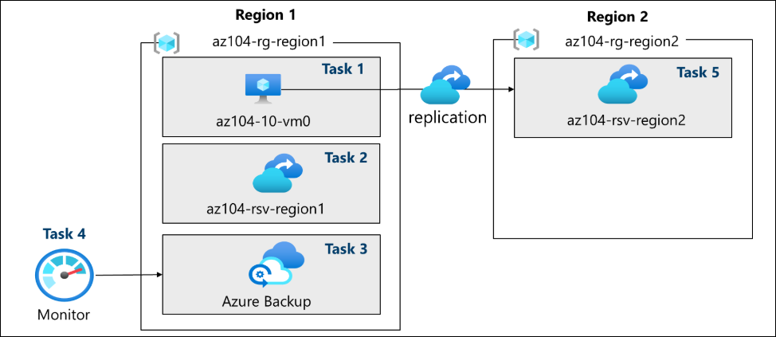
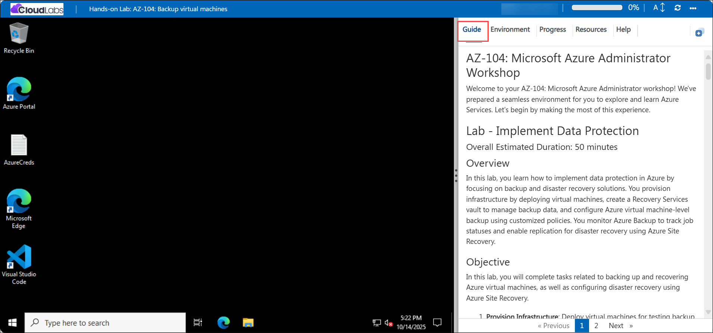

# AZ-104: Microsoft Azure Administrator Workshop

Welcome to your AZ-104: Microsoft Azure Administrator workshop! We've prepared a seamless environment for you to explore and learn Azure Services. Let's begin by making the most of this experience.

# Lab - Implement Data Protection

### Overall Estimated Duration: 75 Minutes

## Overview

In this lab, you learn how to implement data protection in Azure by focusing on backup and disaster recovery solutions. You provision infrastructure by deploying virtual machines, create a Recovery Services vault to manage backup data, and configure Azure virtual machine-level backup using customized policies. You monitor Azure Backup to track job statuses and enable replication for disaster recovery using Azure Site Recovery.

## Objective

In this lab, you will complete tasks related to backing up and recovering Azure virtual machines, as well as configuring disaster recovery using Azure Site Recovery.

1. **Provision Infrastructure:** Deploy virtual machines for testing backup and recovery scenarios.

2. **Create and Configure Recovery Services Vault:** Set up a Recovery Services vault to manage backup and recovery operations for Azure virtual machines. 

3. **Implement Azure Virtual Machine-Level Backup:** Configure backup policies for Azure virtual machines and perform a backup operation.

4. **Enable Virtual Machine Replication for Disaster Recovery:** Set up and enable virtual machine replication using Azure Site Recovery to protect against potential disasters.

## Pre-requisites

Basic understanding of backup and disaster recovery concepts: Awareness of backup policies, data protection strategies, and disaster recovery solutions.

## Architecture

1. **Configuring Azure Backup:** Creating and configuring backup policies to define backup frequency, retention, and recovery options.

2. **Enabling Azure Virtual Machine Backup:** Monitoring the backup status and ensuring that backup jobs are successfully completed.

3. **Restoring Data:** Testing the backup process by initiating a restore operation for Azure VMs, ensuring that data can be recovered from the backup points.

4. **Implementing Disaster Recovery:** Performing a failover operation to test the disaster recovery setup, ensuring business continuity in case of a failure.

## Architecture diagram

## Explanation of Components

1. **Azure Recovery Services Vault:** A management entity in Azure that stores recovery data, such as backups and replication data.

2. **Backup Policies:** Define the rules and schedules for automating the backup process.

3. **Azure Site Recovery (ASR):** A disaster recovery solution that ensures business continuity by replicating workloads across different Azure regions or on-premises to Azure.

4. **Recovery Points:** Snapshots or versions of your data captured during a backup.They act as checkpoints from which you can restore a VM or its data in case of data loss or corruption.

# Getting Started with the Lab
 
Welcome to your AZ-104: Microsoft Azure Administrator  workshop! We've prepared a seamless environment for you to explore and learn Azure Services. Let's begin by making the most of this experience:
 
## Accessing Your Lab Environment
 
Once you're ready to dive in, your virtual machine and **Guide** will be right at your fingertips within your web browser.
 

### Virtual Machine & Lab Guide
 
Your virtual machine is your workhorse throughout the workshop. The lab guide is your roadmap to success.
 
## Exploring Your Lab Resources
 
To get a better understanding of your lab resources and credentials, navigate to the **Environment** tab.
 

 
## Utilizing the Split Window Feature
 
For convenience, you can open the lab guide in a separate window by selecting the **Split Window** button from the top right corner.
 

 
## Utilizing the Zoom In/Out Feature

To adjust the zoom level for the environment page, click the A↕ : 100% icon located next to the timer in the lab environment.

## Managing Your Virtual Machine
 
Feel free to **Start, Stop, or Restart (2)** your virtual machine as needed from the **Resources (1)** tab. Your experience is in your hands!
 

## Track Your Progress

Click on the **Progress** tab to track your progress in the lab. The percentage increases as you complete each validation and reaches 100% when all validations are successfully completed.    

## Lab Duration Extension

1. To extend the duration of the lab, kindly click the **Hourglass** icon in the top right corner of the lab environment. 

    

    >**Note:** You will get the **Hourglass** icon when 10 minutes are remaining in the lab.

2. Click **OK** to extend your lab duration.
 
   

3. If you have not extended the duration prior to when the lab is about to end, a pop-up will appear, giving you the option to extend. Click **OK** to proceed.
 
## Let's Get Started with Azure Portal
 
1. On your virtual machine, click on the **Azure Portal** icon as shown below:
 
    
 
2. You'll see the **Sign into Microsoft Azure** tab. Here, enter your credentials:
 
   - **Email/Username:** <inject key="AzureAdUserEmail"></inject>
 
      
 
3. Next, provide your password:
 
   - **Temporary Access Pass:** <inject key="AzureAdUserPassword"></inject>
 
       
      
1. If prompted to **Stay signed in,** you can click **No**.
 
1. If a **Welcome to Microsoft Azure** pop-up window appears, simply click "Maybe Later" to skip the tour.

## Support Contact

The CloudLabs support team is available 24/7, 365 days a year, via email and live chat to ensure seamless assistance at any time. We offer dedicated support channels tailored specifically for both learners and instructors, ensuring that all your needs are promptly and efficiently addressed.

   Learner Support Contacts:

   - Email Support: cloudlabs-support@spektrasystems.com
   - Live Chat Support: https://cloudlabs.ai/labs-support

Now, click on Next from the lower right corner to move on to the next page.
   

## Happy Learning!!

