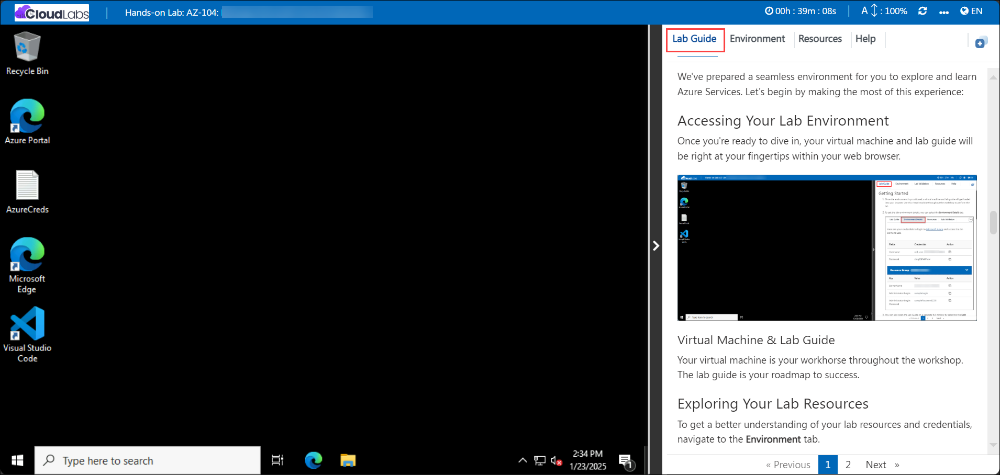
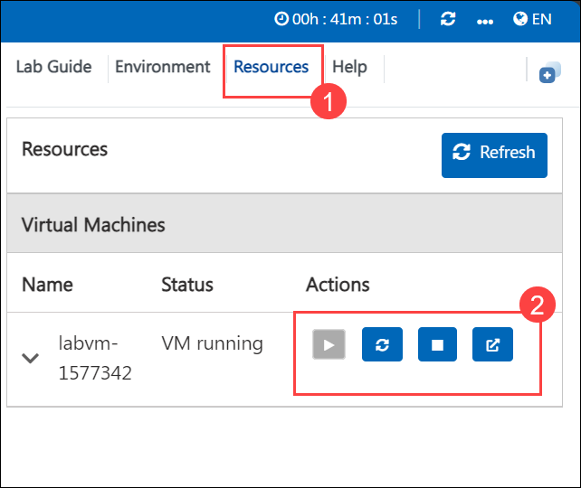

# AZ-104: Microsoft Azure Administrator Workshop

Welcome to your AZ-104: Microsoft Azure Administrator workshop! We've prepared a seamless environment for you to explore and learn Azure Services. Let's begin by making the most of this experience.

# Lab 11 - Implement Monitoring

### Overall Estimated Duration: 45 minutes

## Overview

In this lab, you explore Azure's monitoring capabilities to gain insights into the performance and configuration of Azure resources, particularly virtual machines. By leveraging Azure Monitor and Log Analytics, you set up and validate alerts, notifications, and log queries to monitor and respond to resource changes effectively. The hands-on tasks include provisioning an infrastructure using a template, configuring and triggering alerts, creating action group notifications, setting up alert processing rules, and executing log queries to analyze data from monitored resources. This lab equips you with essential skills for proactive monitoring and incident response within Azure environments.

## Objective

In this lab, you will explore various Azure Monitor capabilities to enhance the visibility, monitoring, and management of Azure resources, particularly virtual machines.

1. **Provision Infrastructure Using Templates**: Learn to deploy and configure virtual machines and associated resources using custom Azure Resource Manager templates for monitoring purposes.

2. **Implement Alerting Mechanisms**: Configure and validate Azure Monitor alerts to detect critical resource events, such as virtual machine deletions, ensuring timely issue identification.

3. **Set Up Notifications and Processing Rules**: Create action groups to notify stakeholders via email or other channels and implement alert processing rules to manage alert behavior during specific scenarios like maintenance periods.

4. **Analyze Resource Metrics and Logs**: Use Azure Monitor log queries to gather insights into resource performance, including virtual machine utilization and activity trends, for better decision-making.

## Pre-requisites

Basic knowledge of Azure Monitor and its functionalities for monitoring and alerting.

## Architecture  

1. **Infrastructure Provisioning Using Templates**: You will use custom templates to deploy infrastructure resources such as virtual machines and networks in Azure, simplifying the process of replicating and scaling resources.

2. **Azure Monitor and VM Insights**: Azure Monitor is a central platform for monitoring the performance and health of Azure resources. You will configure VM Insights to gather detailed metrics and logs from virtual machines for monitoring purposes.

3. **Alerts and Action Groups**: You will create and configure alerts in Azure to monitor specific events (e.g., deletion of a virtual machine). Action groups are used to trigger notifications (email, SMS, etc.) when these alerts are activated.

4. **Log Queries and Data Analysis**: Azure Monitor enables querying collected log data using Kusto Query Language (KQL). In this lab, you will create custom queries to analyze virtual machine metrics such as CPU usage, providing insights into system performance.

## Architecture diagram

## Explanation of Components

1. **Custom Template for Infrastructure Provisioning**:  A custom template in Azure is a pre-defined configuration written in JSON format that automates the creation and deployment of Azure resources, such as virtual machines, networks, and storage. 

2. **Azure Monitor and VM Insights**: Azure Monitor is a comprehensive monitoring service in Azure that helps track the performance and health of resources

3. **Alert Creation and Configuration**: Azure alerts are automated notifications triggered based on specific conditions or thresholds defined within the Azure environment.

4. **Log Query and Data Analysis**: Azure Monitor’s log query feature allows users to query and analyze log data generated by Azure resources.

# Getting Started with the Lab
 
Welcome to your AZ-104: Microsoft Azure Administrator  workshop! We've prepared a seamless environment for you to explore and learn Azure Services. Let's begin by making the most of this experience:
 
## Accessing Your Lab Environment
 
Once you're ready to dive in, your virtual machine and lab guide will be right at your fingertips within your web browser.
 

### Virtual Machine & Lab Guide
 
Your virtual machine is your workhorse throughout the workshop. The lab guide is your roadmap to success.
 
## Exploring Your Lab Resources
 
To get a better understanding of your lab resources and credentials, navigate to the **Environment** tab.
 

 
## Utilizing the Split Window Feature
 
For convenience, you can open the lab guide in a separate window by selecting the **Split Window** button from the top right corner.
 

 
## Utilizing the Zoom In/Out Feature

To adjust the zoom level for the environment page, click the A↕ : 100% icon located next to the timer in the lab environment.

## Managing Your Virtual Machine
 
Feel free to start, stop, or restart your virtual machine as needed from the **Resources** tab. Your experience is in your hands!
 

## **Lab Duration Extension**

1. To extend the duration of the lab, kindly click the **Hourglass** icon in the top right corner of the lab environment. 

    

    >**Note:** You will get the **Hourglass** icon when 10 minutes are remaining in the lab.

2. Click **OK** to extend your lab duration.
 
   

3. If you have not extended the duration prior to when the lab is about to end, a pop-up will appear, giving you the option to extend. Click **OK** to proceed.
 
## Let's Get Started with Azure Portal
 
1. On your virtual machine, click on the Azure Portal icon as shown below:
 
    
 
2. You'll see the **Sign into Microsoft Azure** tab. Here, enter your credentials:
 
   - **Email/Username:** <inject key="AzureAdUserEmail"></inject>
 
      
 
3. Next, provide your password:
 
   - **Password:** <inject key="AzureAdUserPassword"></inject>
 
      

1. If you see the pop-up **Action Required**, click **Ask Later**.
   
     

1. First-time users are often prompted to Stay Signed In, if you see any such pop-up, click on No.

1. If a **Welcome to Microsoft Azure** popup window appears, click **Cancel** to skip the tour.
    
        

1. Click **Next** from the bottom right corner to embark on your Lab journey!
 
    

In this hands-on lab, you'll learn to manage identity and access using Microsoft Entra ID, including creating and configuring users, groups, and tenants, and managing guest users. This will equip you with essential skills to efficiently handle identity and access in Azure.

## Support Contact

1. The CloudLabs support team is available 24/7, 365 days a year, via email and live chat to ensure seamless assistance at any time. We offer dedicated support channels tailored specifically for both learners and instructors, ensuring that all your needs are promptly and efficiently addressed.

   Learner Support Contacts:

   - Email Support: labs-support@spektrasystems.com
   - Live Chat Support: https://cloudlabs.ai/labs-support

1. Now, click on Next from the lower right corner to move on to the next page.
   
## Happy Learning!!
